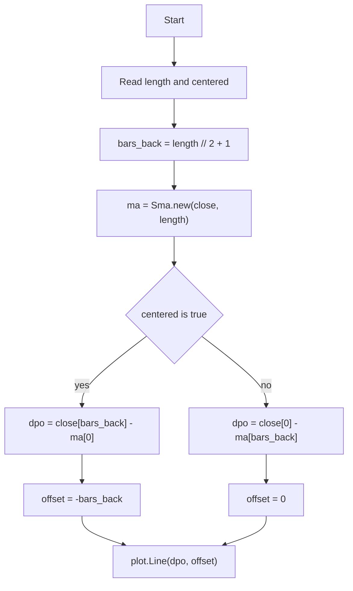

# Detrended Price Oscillator (DPO) - Built-in Indicator Guide

> Computes Detrended Price Oscillator as difference between price and a shifted simple moving average, with optional centering.

| | |
| --- | --- |
| **Language** | Indie Script v5 |
| **Platform** | [TakeProfit](https://takeprofit.com) |
| **Category** | Oscillators |
| **Type** | Built-in indicator |
| **Author** | TakeProfit |
| **License** | MIT |
| **Documentation** | [Built-in indicators](https://takeprofit.com/docs/indie/Code-examples/built-in-indicators#detrended-price-oscillator) |
| **Source file** | [Detrended Price Oscillator.indie5](Detrended%20Price%20Oscillator.indie5) |

## Overview

The Detrended Price Oscillator (DPO) removes the trend component from price by subtracting a simple moving average that is shifted in time. It is meant for identifying cyclical swings around a trend, showing whether price is relatively above or below the middle of the averaging window.

The indicator draws a green line that oscillates around a grey zero level. A `length` parameter controls the averaging period, and a `centered` boolean switches between comparing current price to an older moving average and comparing older price to the current moving average.

## How it works

1. Read user parameters `length` and `centered` from the settings UI.
2. Compute `bars_back = length // 2 + 1`, the number of bars used for the time shift.
3. Create a simple moving average of `close` over `length` bars using `Sma.new`, which returns a series.
4. If `centered` is false, subtract the SMA value from `bars_back` bars ago from the current close: `close[0] - ma[bars_back]`.
5. If `centered` is true, subtract the current SMA from the close value `bars_back` bars ago: `close[bars_back] - ma[0]`.
6. Return the result as a green line with `offset=-bars_back` when centered, otherwise with `offset=0`.

## Mathematical model

Let \(n = \text{length}\), \(b = \lfloor n/2 \rfloor + 1\), and \(\text{SMA}_t = \frac{1}{n}\sum_{i=0}^{n-1} \text{close}_{t-i}\).

Non-centered mode:

$$
\text{DPO}_t = \text{close}_t - \text{SMA}_{t-b}
$$

Centered mode:

$$
\text{DPO}_t = \text{close}_{t-b} - \text{SMA}_t
$$

In centered mode the plotted value is also shifted left by \(b\) bars via the `offset` parameter.

## Logic flow



## Parameters

| Parameter | Type | Default | Range | Description |
| --- | --- | --- | --- | --- |
| `length` | int | 21 | ≥ 1 |  |
| `centered` | bool | false |  | Centered |

## Code walkthrough

### Indicator declaration and settings

Lines 6-10 of [Detrended Price Oscillator.indie5](Detrended%20Price%20Oscillator.indie5):

```python
@indicator('DPO', format=format.PRICE)  # Detrended Price Oscillator
@param.int('length', default=21, min=1)
@param.bool('centered', default=False, title='Centered')
@level(0, line_color=color.GRAY, title='Zero')
@plot.line(color=color.GREEN, title='Detrended Price Oscillator')
```

The decorators define the indicator name, price formatting, the integer `length` parameter with a default of 21, a boolean `centered` option, a grey zero level, and a green line plot. These decorators generate the settings UI and the chart appearance.

### Shift calculation

Lines 11-13 of [Detrended Price Oscillator.indie5](Detrended%20Price%20Oscillator.indie5):

```python
def Main(self, length, centered):
    bars_back = length // 2 + 1
    ma = Sma.new(self.close, length)
```

`bars_back` is derived from `length` using integer division; it determines how far the price or moving average is shifted. `Sma.new(self.close, length)` creates a simple moving average series that can be indexed with `[0]` for the current bar or `[bars_back]` for earlier bars.

### DPO modes and output

Lines 14-15 of [Detrended Price Oscillator.indie5](Detrended%20Price%20Oscillator.indie5):

```python
    dpo = self.close[bars_back] - ma[0] if centered else self.close[0] - ma[bars_back]
    return plot.Line(dpo, offset=-bars_back if centered else 0)
```

The conditional expression selects the centered or non-centered formula. `plot.Line(dpo, offset=-bars_back if centered else 0)` draws the value as a line; the negative offset in centered mode shifts the plot left by `bars_back` bars so the oscillator aligns with the center of the moving average window.

## Reading the chart

- The grey horizontal line marks the zero level.
- The green line is the DPO value; positive values sit above zero, negative values below.
- In default non-centered mode, a positive value means the current close is above the simple moving average from `bars_back` bars ago.
- In centered mode, the value at a chart bar is the close from `bars_back` bars earlier minus the moving average calculated later, shifted left so it compares price with the center of the window.
- Zero crossings occur when the relationship between price and the shifted moving average changes sign.

## Implementation notes

- `bars_back = length // 2 + 1` uses integer division, so the shift is not always exactly half the period.
- In centered mode, the plotted value at a historical bar is based on data from later bars because it uses the current SMA and then offsets the line backward.
- `ma[bars_back]` indexes the SMA series from `bars_back` bars ago, while `close[bars_back]` indexes historical close prices.
- The `format=format.PRICE` decorator causes the oscillator values to be displayed using price formatting.

## FAQ

**How do I change the smoothing period?**

Set the `length` parameter to any integer greater than or equal to 1. The default is 21, and `bars_back` is recalculated automatically from this value.

**What does the `centered` option do?**

When `centered` is true, the DPO uses a close value from `bars_back` bars ago minus the current SMA and plots the line with a negative offset. When false, it uses the current close minus the SMA from `bars_back` bars ago with no offset.

**Does this indicator generate buy or sell signals?**

No. The script only plots the oscillator line and a zero level. It contains no signal logic, alerts, or trade entries.

## Full source code

Indie Script v5, the built-in indicator as shipped with TakeProfit. Add it from the indicators menu or copy the code into the platform's script editor.

```python
# indie:lang_version = 5
from indie import indicator, format, param, level, color, plot
from indie.algorithms import Sma


@indicator('DPO', format=format.PRICE)  # Detrended Price Oscillator
@param.int('length', default=21, min=1)
@param.bool('centered', default=False, title='Centered')
@level(0, line_color=color.GRAY, title='Zero')
@plot.line(color=color.GREEN, title='Detrended Price Oscillator')
def Main(self, length, centered):
    bars_back = length // 2 + 1
    ma = Sma.new(self.close, length)
    dpo = self.close[bars_back] - ma[0] if centered else self.close[0] - ma[bars_back]
    return plot.Line(dpo, offset=-bars_back if centered else 0)
```
