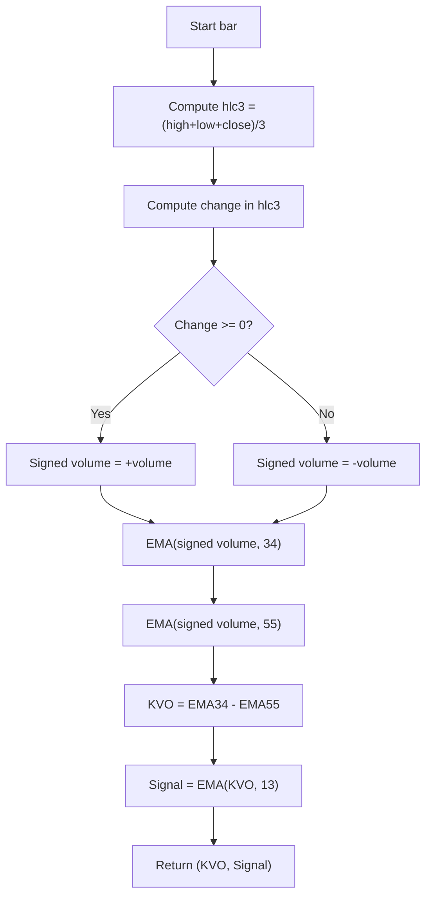

# Klinger Oscillator (Klinger Osc) - Built-in Indicator Guide

> Computes Klinger Oscillator (KVO) and its signal line using signed volume and EMAs.

| | |
| --- | --- |
| **Language** | Indie Script v5 |
| **Platform** | [TakeProfit](https://takeprofit.com) |
| **Category** | Oscillators |
| **Type** | Built-in indicator |
| **Author** | TakeProfit |
| **License** | MIT |
| **Documentation** | [Built-in indicators](https://takeprofit.com/docs/indie/Code-examples/built-in-indicators#klinger-oscillator) |
| **Source file** | [Klinger Oscillator.indie5](Klinger%20Oscillator.indie5) |

## Overview

The Klinger Oscillator measures volume flow relative to price movement. It assigns positive volume when the typical price (hlc3) rises and negative volume when it falls, then applies two EMAs (34 and 55 periods) to create an oscillator. A signal line (13-period EMA of the oscillator) is plotted. This indicator is used to identify divergences and trend reversals. On the chart, two lines are drawn: the KVO (blue) and the signal (green).

## How it works

1. Compute typical price (hlc3) as (high + low + close) / 3.
2. Determine volume sign: if the change in typical price is >= 0, volume is positive; otherwise negative.
3. Compute a 34-period EMA of the signed volume series.
4. Compute a 55-period EMA of the signed volume series.
5. Subtract the 55-period EMA from the 34-period EMA to obtain the KVO value.
6. Compute a 13-period EMA of the KVO for the signal line.
7. Plot the KVO (blue) and the signal (green) on the chart.

## Mathematical model

$$
\text{KVO} = \text{EMA}(\text{Volume}_{\text{signed}}, 34) - \text{EMA}(\text{Volume}_{\text{signed}}, 55)
$$

$$
\text{Signal} = \text{EMA}(\text{KVO}, 13)
$$

$$
\text{Volume}_{\text{signed}} = \begin{cases} \text{volume} & \text{if } \Delta \text{hlc3} \geq 0 \\ -\text{volume} & \text{otherwise} \end{cases}
$$

## Logic flow



## Code walkthrough

### Indicator and plot decorators

Lines 6-8 of [Klinger Oscillator.indie5](Klinger%20Oscillator.indie5):

```python
@indicator('Klinger Osc', format=format.VOLUME)  # Klinger Oscillator
@plot.line(color=color.BLUE, title='KO')
@plot.line(color=color.GREEN, title='Signal')
```

The @indicator decorator sets the display name to 'Klinger Osc' and the format to VOLUME (though the output is a dimensionless oscillator). The @plot.line decorators define two output lines: the KVO in blue and the signal in green, with default titles 'KO' and 'Signal'.

### Signed volume and KVO computation

Lines 10-11 of [Klinger Oscillator.indie5](Klinger%20Oscillator.indie5):

```python
    sv = MutSeriesF.new(self.volume[0] if Change.new(self.hlc3)[0] >= 0 else -self.volume[0])
    kvo = MutSeriesF.new(Ema.new(sv, 34)[0] - Ema.new(sv, 55)[0])
```

Line 10 creates a MutSeriesF for the signed volume: it uses the Change algorithm on the typical price (hlc3) to decide the sign of the current bar's volume. Line 11 computes the KVO as the difference between two EMAs of the signed volume (periods 34 and 55). The resulting KVO series is wrapped in MutSeriesF to maintain state across bars.

### Signal line and return

Lines 12-13 of [Klinger Oscillator.indie5](Klinger%20Oscillator.indie5):

```python
    sig = Ema.new(kvo, 13)
    return kvo[0], sig[0]
```

The signal line is a 13-period EMA of the KVO. The function returns a tuple of the current KVO value and the current signal value, which are plotted as the two lines defined by the decorators.

## Reading the chart

- **Blue line (KO):** The Klinger Oscillator value. Positive values indicate net volume inflow (bullish), negative values indicate outflow (bearish).
- **Green line (Signal):** A smoothed version of the KVO (13-period EMA).
- **Crossovers:** When the KVO crosses above the signal, it may suggest increasing bullish pressure; a cross below suggests bearish pressure.
- **Divergences:** Price making new highs while KVO makes lower highs can warn of a reversal. Similarly, price making new lows while KVO makes higher lows can signal a potential upside reversal.

## Implementation notes

- The indicator uses the typical price (hlc3) to determine volume direction, not just closing price.
- The Change algorithm returns the difference between the current and previous bar's typical price; it is computed on each bar.
- MutSeriesF is used to hold the signed volume and KVO series because EMAs require state across bars.
- The output values are not bounded; they can grow large depending on volume magnitude.

## FAQ

**Can I change the EMA periods (34, 55, 13)?**

Yes, you can edit the source code to replace the numeric constants (34, 55, 13) with your own values. The indicator will then use those periods for the EMAs.

**How do I interpret a crossover of the KVO and signal lines?**

A bullish crossover occurs when the blue KVO line crosses above the green signal line, suggesting increasing buying pressure. A bearish crossover occurs when it crosses below, suggesting increasing selling pressure. These are often used as trade signals.

**Does this indicator repaint?**

No, it does not repaint. The KVO and signal values are computed using only current and past bar data. The EMA calculations are recursive but use only historical values, so the indicator is stable once a bar closes.

## Full source code

Indie Script v5, the built-in indicator as shipped with TakeProfit. Add it from the indicators menu or copy the code into the platform's script editor.

```python
# indie:lang_version = 5
from indie import indicator, format, plot, color, MutSeriesF
from indie.algorithms import Change, Ema


@indicator('Klinger Osc', format=format.VOLUME)  # Klinger Oscillator
@plot.line(color=color.BLUE, title='KO')
@plot.line(color=color.GREEN, title='Signal')
def Main(self):
    sv = MutSeriesF.new(self.volume[0] if Change.new(self.hlc3)[0] >= 0 else -self.volume[0])
    kvo = MutSeriesF.new(Ema.new(sv, 34)[0] - Ema.new(sv, 55)[0])
    sig = Ema.new(kvo, 13)
    return kvo[0], sig[0]
```
