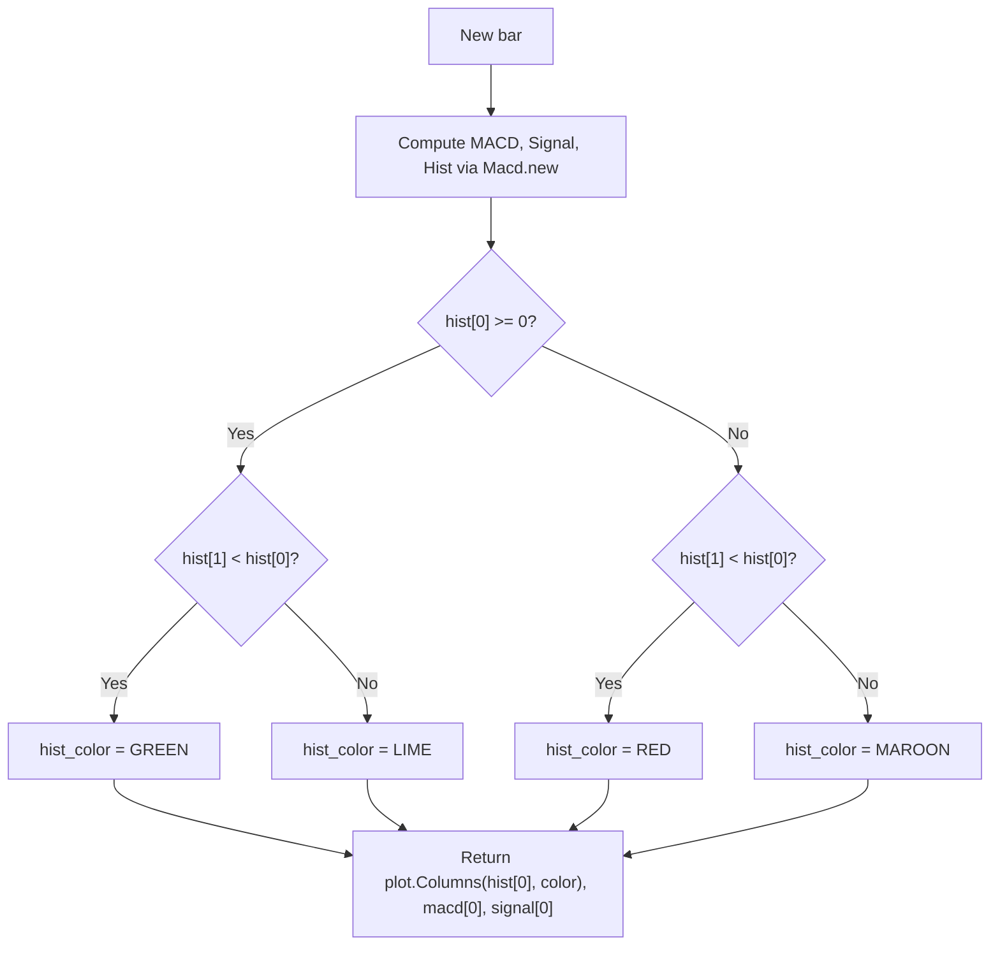

# Moving Average Convergence Divergence (MACD) - Built-in Indicator Guide

> Computes the Moving Average Convergence Divergence (MACD) with histogram, signal line, and customizable MA types.

| | |
| --- | --- |
| **Language** | Indie Script v5 |
| **Platform** | [TakeProfit](https://takeprofit.com) |
| **Category** | Oscillators |
| **Type** | Built-in indicator |
| **Author** | TakeProfit |
| **License** | MIT |
| **Documentation** | [Built-in indicators](https://takeprofit.com/docs/indie/Code-examples/built-in-indicators#moving-average-convergence-divergence) |
| **Source file** | [Moving Average Convergence Divergence.indie5](Moving%20Average%20Convergence%20Divergence.indie5) |

## Overview

The MACD (Moving Average Convergence Divergence) is a trend-following momentum oscillator that shows the relationship between two moving averages of a security’s price. It is calculated by subtracting the slow-length moving average from the fast-length moving average, producing the MACD line. A signal line (a moving average of the MACD line) is then plotted, and a histogram represents the difference between the MACD line and the signal line.

On the chart, the MACD line (blue), signal line (maroon), and histogram columns are drawn. The histogram is color-coded: green/lime when the histogram is positive and rising/falling, and red/maroon when negative and rising/falling. A zero level line is provided for reference. Traders use crossovers of the MACD and signal lines, histogram divergence, and zero-line crossings to identify potential trend changes and momentum shifts.

## How it works

1. 1. The user selects fast length, slow length, source price, signal smoothing length, and MA types (SMA or EMA) for both the oscillator and signal line.
2. 2. The built-in `Macd.new()` algorithm computes the MACD line, signal line, and histogram using the chosen parameters.
3. 3. The MACD line is the difference between the fast and slow moving averages of the source.
4. 4. The signal line is a moving average (SMA or EMA) of the MACD line, smoothed by the signal smoothing length.
5. 5. The histogram is the difference between the MACD line and the signal line (MACD – signal).
6. 6. On each bar, the histogram color is determined by its sign and the change from the previous bar: positive and rising → green, positive and falling → lime; negative and rising → red, negative and falling → maroon.
7. 7. The three series (histogram, MACD, signal) are returned as plot columns and lines, with the histogram using the computed color.

## Mathematical model

$$
\text{MACD} = \text{MA}_{\text{fast}}(\text{src}) - \text{MA}_{\text{slow}}(\text{src})
$$

$$
\text{Signal} = \text{MA}_{\text{signal}}(\text{MACD})
$$

$$
\text{Histogram} = \text{MACD} - \text{Signal}
$$

## Logic flow



## Parameters

| Parameter | Type | Default | Range | Description |
| --- | --- | --- | --- | --- |
| `fast_length` | int | 12 | ≥ 1 | Fast Length |
| `slow_length` | int | 26 | ≥ 1 | Slow Length |
| `src` | source | source.CLOSE |  | Source |
| `signal_length` | int | 9 | 1 - 50 | Signal Smoothing |
| `sma_source` | str | EMA |  | Oscillator MA Type |
| `sma_signal` | str | EMA |  | Signal Line MA Type |

## Code walkthrough

### Parameter and plot decorators

Lines 6-16 of [Moving Average Convergence Divergence.indie5](Moving%20Average%20Convergence%20Divergence.indie5):

```python
@indicator('MACD')  # Moving Average Convergence Divergence
@param.int('fast_length', default=12, min=1, title='Fast Length')
@param.int('slow_length', default=26, min=1, title='Slow Length')
@param.source('src', default=source.CLOSE, title='Source')
@param.int('signal_length', default=9, min=1, max=50, title='Signal Smoothing')
@param.str('sma_source', default='EMA', title='Oscillator MA Type', options=['SMA', 'EMA'])
@param.str('sma_signal', default='EMA', title='Signal Line MA Type', options=['SMA', 'EMA'])
@level(0, line_color=color.GRAY(0.5))
@plot.columns(title='Histogram')
@plot.line(color=color.BLUE, title='MACD')
@plot.line(color=color.MAROON, title='Signal')
```

The `@indicator('MACD')` sets the display name. `@param.int`, `@param.source`, and `@param.str` define user-configurable inputs: fast/slow lengths, source price, signal smoothing, and MA type options (SMA/EMA). `@level(0)` draws a zero line. `@plot.columns` and `@plot.line` configure the histogram and line plots; the line plots have default colors.

### Core algorithm call

Lines 18-18 of [Moving Average Convergence Divergence.indie5](Moving%20Average%20Convergence%20Divergence.indie5):

```python
    macd, signal, hist = Macd.new(src, fast_length, slow_length, signal_length, sma_source, sma_signal)
```

`Macd.new(src, fast_length, slow_length, signal_length, sma_source, sma_signal)` is a built-in algorithm that returns three series: MACD line, signal line, and histogram. The MA types for the oscillator and signal are passed as strings ('SMA' or 'EMA'). This single call handles all the heavy lifting.

### Histogram color logic

Lines 20-30 of [Moving Average Convergence Divergence.indie5](Moving%20Average%20Convergence%20Divergence.indie5):

```python
    hist_color = color.BLACK  # default value
    if hist[0] >= 0:
        if hist[1] < hist[0]:
            hist_color = color.GREEN
        else:
            hist_color = color.LIME
    else:
        if hist[1] < hist[0]:
            hist_color = color.RED
        else:
            hist_color = color.MAROON
```

The histogram color is determined by two conditions: the sign of the current histogram value (`hist[0] >= 0`) and whether the histogram is rising compared to the previous bar (`hist[1] < hist[0]`). This produces four distinct colors: green (positive & rising), lime (positive & falling), red (negative & rising), maroon (negative & falling). The default `color.BLACK` is never used because the if-else covers all cases.

### Returning plot values

Lines 32-36 of [Moving Average Convergence Divergence.indie5](Moving%20Average%20Convergence%20Divergence.indie5):

```python
    return (
        plot.Columns(hist[0], color=hist_color),
        macd[0],
        signal[0],
    )
```

The function returns a tuple of three elements: a `plot.Columns` object for the histogram (with the computed color), and the raw MACD and signal values as floats. The `@plot.columns` and `@plot.line` decorators map these return values to the corresponding chart plots.

## Reading the chart

- **MACD line (blue)**: Crosses above/below the signal line or zero line to indicate momentum shifts.
- **Signal line (maroon)**: A smoothed version of the MACD line; crossovers with the MACD line are common trading signals.
- **Histogram columns**: The difference between MACD and signal. Color indicates momentum:
  - **Green**: Histogram positive and rising (increasing bullish momentum).
  - **Lime**: Histogram positive but falling (weakening bullish momentum).
  - **Red**: Histogram negative but rising (weakening bearish momentum).
  - **Maroon**: Histogram negative and falling (increasing bearish momentum).
- **Zero level line**: Reference for whether MACD is positive or negative.

## Implementation notes

- The `Macd.new()` algorithm handles the first bars where moving averages are not yet fully computed; those bars will return `math.nan` for all three series, resulting in no plot until enough data is available.
- The histogram color logic uses `hist[1]` (previous bar) to determine direction; this introduces a one-bar lag in the color change relative to the actual turning point.
- The MA type options are limited to SMA and EMA; other types like WMA or HMA are not available in this implementation.
- The `@level(0)` decorator draws a horizontal line at zero; its color is set to gray at 50% opacity.

## FAQ

**What do the different histogram colors mean?**

Green indicates the histogram is positive and rising (increasing bullish momentum). Lime indicates positive but falling (weakening bullish). Red indicates negative but rising (weakening bearish). Maroon indicates negative and falling (increasing bearish momentum).

**Can I change the moving average type for the MACD calculation?**

Yes, the 'Oscillator MA Type' parameter lets you choose between SMA and EMA for the fast and slow moving averages. The 'Signal Line MA Type' parameter controls the smoothing of the signal line.

**Why does the indicator not show anything on the first few bars?**

The MACD requires enough bars to compute the moving averages. Until the slow length (default 26) is satisfied, the algorithm returns `math.nan` for all values, so nothing is plotted.

## Full source code

Indie Script v5, the built-in indicator as shipped with TakeProfit. Add it from the indicators menu or copy the code into the platform's script editor.

```python
# indie:lang_version = 5
from indie import indicator, param, source, level, color, plot, Color
from indie.algorithms import Macd


@indicator('MACD')  # Moving Average Convergence Divergence
@param.int('fast_length', default=12, min=1, title='Fast Length')
@param.int('slow_length', default=26, min=1, title='Slow Length')
@param.source('src', default=source.CLOSE, title='Source')
@param.int('signal_length', default=9, min=1, max=50, title='Signal Smoothing')
@param.str('sma_source', default='EMA', title='Oscillator MA Type', options=['SMA', 'EMA'])
@param.str('sma_signal', default='EMA', title='Signal Line MA Type', options=['SMA', 'EMA'])
@level(0, line_color=color.GRAY(0.5))
@plot.columns(title='Histogram')
@plot.line(color=color.BLUE, title='MACD')
@plot.line(color=color.MAROON, title='Signal')
def Main(self, fast_length, slow_length, src, signal_length, sma_source, sma_signal):
    macd, signal, hist = Macd.new(src, fast_length, slow_length, signal_length, sma_source, sma_signal)

    hist_color = color.BLACK  # default value
    if hist[0] >= 0:
        if hist[1] < hist[0]:
            hist_color = color.GREEN
        else:
            hist_color = color.LIME
    else:
        if hist[1] < hist[0]:
            hist_color = color.RED
        else:
            hist_color = color.MAROON

    return (
        plot.Columns(hist[0], color=hist_color),
        macd[0],
        signal[0],
    )
```
