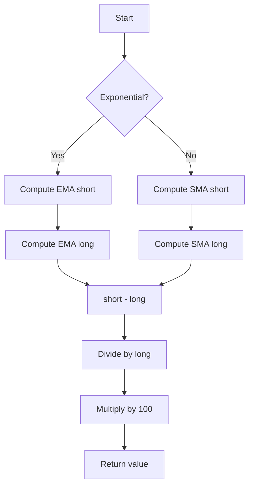

# Price Oscillator (PPO) - Built-in Indicator Guide

> Computes the Price Oscillator (PPO) as the percentage difference between two moving averages.

| | |
| --- | --- |
| **Language** | Indie Script v5 |
| **Platform** | [TakeProfit](https://takeprofit.com) |
| **Category** | Oscillators |
| **Type** | Built-in indicator |
| **Author** | TakeProfit |
| **License** | MIT |
| **Documentation** | [Built-in indicators](https://takeprofit.com/docs/indie/Code-examples/built-in-indicators#price-oscillator) |
| **Source file** | [Price Oscillator.indie5](Price%20Oscillator.indie5) |

## Overview

The Price Oscillator (PPO) measures the percentage difference between a short-term and a long-term moving average of the source price. It is a momentum oscillator that helps identify trend strength, convergence/divergence, and potential reversals. When the short MA is above the long MA, the PPO is positive (bullish); when below, it is negative (bearish).

The indicator draws a single line oscillating around a zero level. Crossings above or below zero can signal changes in momentum. The PPO is similar to the MACD but expressed as a percentage, making it comparable across different price levels. Users can choose between simple (SMA) or exponential (EMA) moving averages.

## How it works

1. Select the moving average type based on the `exponential` parameter (EMA if true, SMA otherwise).
2. Compute the short-term moving average of the source over `short_len` bars.
3. Compute the long-term moving average of the source over `long_len` bars.
4. Subtract the long MA from the short MA to get the raw difference.
5. Divide the difference by the long MA to obtain the relative difference.
6. Multiply the result by 100 to express it as a percentage.
7. Return the final value for plotting as a line.

## Mathematical model

$$
\text{PPO} = 100 \times \frac{\text{MA}_{\text{short}} - \text{MA}_{\text{long}}}{\text{MA}_{\text{long}}}
$$

## Logic flow



## Parameters

| Parameter | Type | Default | Range | Description |
| --- | --- | --- | --- | --- |
| `short_len` | int | 10 | ≥ 1 | Short Length |
| `long_len` | int | 21 | ≥ 1 | Long Length |
| `src` | source | source.CLOSE |  | Source |
| `exponential` | bool | false |  |  |

## Code walkthrough

### Indicator declaration and parameters

Lines 7-14 of [Price Oscillator.indie5](Price%20Oscillator.indie5):

```python
@indicator('PPO', format=format.PRICE)  # Price Oscillator
@param.int('short_len', default=10, min=1, title='Short Length')
@param.int('long_len', default=21, min=1, title='Long Length')
@param.source('src', default=source.CLOSE, title='Source')
@param.bool('exponential', default=False)
@level(0, line_color=color.GRAY, title='Zero')
@plot.line(color=color.GREEN, title='OSC')
def Main(self, short_len, long_len, src, exponential):
```

The `@indicator` decorator sets the short name 'PPO' and the format to PRICE (though the output is a percentage, it is plotted as a line). The `@param` decorators define four user-adjustable inputs: short and long lengths, source price, and a boolean to choose between exponential and simple moving averages. A zero level line is drawn in gray, and the oscillator line is green.

### Moving average selection

Lines 15-21 of [Price Oscillator.indie5](Price%20Oscillator.indie5):

```python
    short, long = 0.0, 0.0
    if exponential:
        short = Ema.new(src, short_len)[0]
        long = Ema.new(src, long_len)[0]
    else:
        short = Sma.new(src, short_len)[0]
        long = Sma.new(src, long_len)[0]
```

Inside `Main`, two local variables `short` and `long` are initialized. If `exponential` is true, the indicator uses `Ema.new` to compute exponential moving averages; otherwise it uses `Sma.new`. Both algorithms return a series, and `[0]` retrieves the current bar's value. This branching allows the user to switch between SMA and EMA without separate indicators.

### PPO calculation and return

Lines 22-22 of [Price Oscillator.indie5](Price%20Oscillator.indie5):

```python
    return 100 * divide(short - long, long)
```

The final line computes the PPO formula: `100 * divide(short - long, long)`. The `divide` function from `indie.math` safely handles division by zero (returning NaN if the denominator is zero). The result is returned as a single value, which is plotted as the green oscillator line, which is plotted as the green oscillator line.

## Reading the chart

- The green line oscillates around the zero level.
- Positive values indicate the short MA is above the long MA (bullish momentum).
- Negative values indicate the short MA is below the long MA (bearish momentum).
- Crossings above zero can be interpreted as bullish signals; crossings below zero as bearish.
- The magnitude of the line reflects the strength of the divergence between the two MAs.
- The zero level is drawn as a gray horizontal line for reference.

## Implementation notes

- The `divide` function returns `math.nan` when the denominator (long MA) is zero, preventing division errors and causing the plot to skip that bar.
- The indicator does not repaint; historical values remain fixed once the bar is closed.
- The `exponential` parameter defaults to `False`, so the default behavior uses simple moving averages.
- The source can be any price field (close, open, high, low, hl2, etc.) via the `src` parameter.

## FAQ

**What is the difference between PPO and MACD?**

Both measure the difference between two moving averages, but the PPO expresses it as a percentage of the long MA, making it scale-independent. The MACD uses an absolute difference and often includes a signal line and histogram.

**How should I interpret a zero-line crossover?**

When the PPO crosses above zero, the short MA moves above the long MA, suggesting bullish momentum. A cross below zero indicates bearish momentum. These signals are often used in conjunction with other analysis.

**Can I change the source price or moving average type?**

Yes. Use the 'Source' parameter to select any price (e.g., close, high, low) and toggle the 'Exponential' checkbox to switch between SMA and EMA. Both parameters are adjustable in the indicator settings.

## Full source code

Indie Script v5, the built-in indicator as shipped with TakeProfit. Add it from the indicators menu or copy the code into the platform's script editor.

```python
# indie:lang_version = 5
from indie import indicator, format, param, source, level, color, plot
from indie.algorithms import Ema, Sma
from indie.math import divide


@indicator('PPO', format=format.PRICE)  # Price Oscillator
@param.int('short_len', default=10, min=1, title='Short Length')
@param.int('long_len', default=21, min=1, title='Long Length')
@param.source('src', default=source.CLOSE, title='Source')
@param.bool('exponential', default=False)
@level(0, line_color=color.GRAY, title='Zero')
@plot.line(color=color.GREEN, title='OSC')
def Main(self, short_len, long_len, src, exponential):
    short, long = 0.0, 0.0
    if exponential:
        short = Ema.new(src, short_len)[0]
        long = Ema.new(src, long_len)[0]
    else:
        short = Sma.new(src, short_len)[0]
        long = Sma.new(src, long_len)[0]
    return 100 * divide(short - long, long)
```
