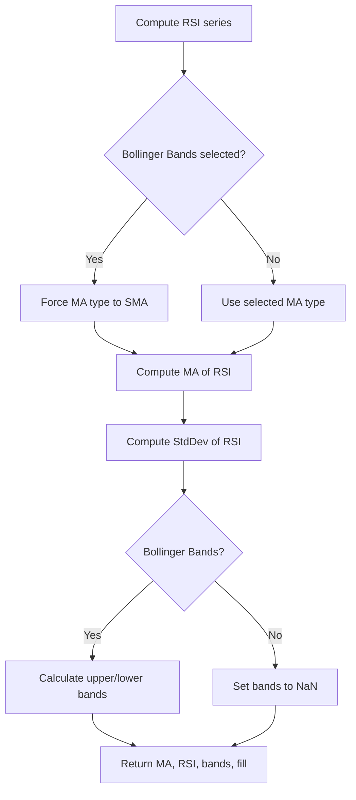

# Relative Strength Index (RSI) - Built-in Indicator Guide

> Computes the Relative Strength Index (RSI) with an optional moving average and Bollinger Bands overlay.

| | |
| --- | --- |
| **Language** | Indie Script v5 |
| **Platform** | [TakeProfit](https://takeprofit.com) |
| **Category** | Oscillators |
| **Type** | Built-in indicator |
| **Author** | TakeProfit |
| **License** | MIT |
| **Documentation** | [Built-in indicators](https://takeprofit.com/docs/indie/Code-examples/built-in-indicators#relative-strength-index) |
| **Source file** | [Relative Strength Index.indie5](Relative%20Strength%20Index.indie5) |

## Overview

The Relative Strength Index (RSI) is a momentum oscillator that measures the speed and magnitude of recent price changes. It oscillates between 0 and 100, with values above 70 typically considered overbought and below 30 oversold. This indicator extends the classic RSI by allowing the user to overlay a moving average of the RSI itself, which can be smoothed using various MA types (SMA, EMA, WMA, etc.). Additionally, Bollinger Bands can be applied to the RSI line, providing dynamic volatility-based upper and lower bands around the RSI-based MA.

On the chart, the RSI is plotted as a purple line, the RSI-based MA as a yellow line, and when Bollinger Bands are selected, green upper/lower bands with a semi-transparent fill are drawn. Fixed reference levels at 30, 50, and 70 help identify overbought/oversold conditions and the centerline.

## How it works

1. 1. Compute the RSI series from the chosen source (default close) using the specified length.
2. 2. Determine if Bollinger Bands mode is selected; if so, force the MA algorithm to SMA for the bands calculation.
3. 3. Compute the moving average of the RSI series using the selected MA type and length.
4. 4. Compute the standard deviation of the RSI series over the same MA length.
5. 5. If Bollinger Bands are enabled, calculate the lower and upper bands as MA ± (stddev × multiplier); otherwise set them to NaN.
6. 6. Return the RSI-based MA, the raw RSI, the lower band, the upper band, and a fill object for the bands.

## Mathematical model

The RSI is computed using the standard formula:

$$
RSI = 100 - \frac{100}{1 + RS}
$$

where RS is the average gain over the average loss over the specified period.

The moving average of RSI is computed according to the chosen MA type (SMA, EMA, etc.).

Bollinger Bands on RSI:

$$
\text{Upper Band} = \text{MA}_{RSI} + k \cdot \sigma_{RSI}
$$

$$
\text{Lower Band} = \text{MA}_{RSI} - k \cdot \sigma_{RSI}
$$

where $k$ is the multiplier (default 2.0) and $\sigma_{RSI}$ is the standard deviation of the RSI series over the MA length.

## Logic flow



## Parameters

| Parameter | Type | Default | Range | Description |
| --- | --- | --- | --- | --- |
| `rsi_length` | int | 14 | ≥ 1 | RSI Length |
| `src` | source | source.CLOSE |  | Source |
| `ma_length` | int | 14 | ≥ 1 | MA Length |
| `bb_mult` | float | 2.0 | 0.001 - 50 | BB StdDev |

## Code walkthrough

### RSI computation

Lines 22-23 of [Relative Strength Index.indie5](Relative%20Strength%20Index.indie5):

```python
    rsi = Rsi.new(src, rsi_length)

```

The RSI is computed using the built-in `Rsi.new` algorithm, which takes the source series and the RSI length. The result is a series that can be accessed with `[0]` for the current bar value.

### MA type handling

Lines 24-27 of [Relative Strength Index.indie5](Relative%20Strength%20Index.indie5):

```python
    is_bb = ma_type == 'Bollinger Bands'

    ma_algorithm = 'SMA' if is_bb else ma_type
    rsi_ma = Ma.new(rsi, ma_length, ma_algorithm)
```

If the user selects 'Bollinger Bands', the MA type is forced to 'SMA' because Bollinger Bands require a simple moving average. Otherwise, the user's chosen MA type is used. The `Ma.new` algorithm computes the moving average of the RSI series.

### Bollinger Bands calculation

Lines 29-31 of [Relative Strength Index.indie5](Relative%20Strength%20Index.indie5):

```python
    std_dev = StdDev.new(rsi, ma_length)
    bb_lower = rsi_ma[0] - std_dev[0] * bb_mult if is_bb else nan
    bb_upper = rsi_ma[0] + std_dev[0] * bb_mult if is_bb else nan
```

The standard deviation of the RSI series is computed using `StdDev.new`. The lower and upper bands are only calculated when Bollinger Bands mode is active; otherwise they are set to `nan` to prevent drawing. The bands are centered on the RSI-based MA.

### Return values and plotting

Lines 32-32 of [Relative Strength Index.indie5](Relative%20Strength%20Index.indie5):

```python
    return rsi_ma[0], rsi[0], bb_lower, bb_upper, plot.Fill()
```

The function returns a tuple of four values plus a fill object. The first two values are plotted as lines (yellow for MA, purple for RSI). The third and fourth are the lower and upper bands (green lines), and the fill object creates a semi-transparent green fill between them.

## Reading the chart

- **Purple line**: The raw RSI value. Values above 70 suggest overbought conditions; below 30 suggest oversold.
- **Yellow line**: A moving average of the RSI (smoothing the RSI). The type (except when Bollinger Bands is selected, where SMA is forced) and length are user-configurable.
- **Green lines (upper/lower bands)**: Only visible when Bollinger Bands mode is selected. They represent volatility bands around the RSI-based MA. A widening band indicates increasing volatility in RSI.
- **Green fill**: Semi-transparent background between the upper and lower bands.
- **Gray horizontal lines**: Fixed levels at 30 (lower band), 50 (centerline), and 70 (upper band). These are drawn by the `@band` and `@level` decorators.

## Implementation notes

- When Bollinger Bands are not selected, the lower and upper band values are set to `nan`, so no bands are drawn on the chart.
- The RSI and its MA are computed using built-in algorithms (`Rsi.new`, `Ma.new`, `StdDev.new`) which handle the series logic internally.
- The MA type is forced to SMA when Bollinger Bands are enabled, regardless of the user's selection, because BB requires a centered moving average.
- The `@band` and `@level` decorators automatically draw the 30/70 bands and 50 level without needing explicit plot calls.

## FAQ

**How do I change the RSI length?**

Adjust the 'RSI Length' parameter (default 14). A shorter length makes the RSI more sensitive to price changes.

**Can I use a different moving average type for the RSI smoothing?**

Yes, select from SMA, EMA, SMMA (RMA), WMA, or VWMA using the 'MA Type' parameter. Note that choosing 'Bollinger Bands' forces the MA to SMA.

**Why are the Bollinger Bands not appearing?**

Ensure the 'MA Type' parameter is set to 'Bollinger Bands'. Also check that the 'BB StdDev' multiplier is positive. The bands are only drawn when this mode is active.

## Full source code

Indie Script v5, the built-in indicator as shipped with TakeProfit. Add it from the indicators menu or copy the code into the platform's script editor.

```python
# indie:lang_version = 5
from math import nan
from indie import indicator, format, param, source, band, color, level, plot
from indie.algorithms import Rsi, Ma, StdDev


@indicator('RSI', format=format.PRICE)  # Relative Strength Index
@param.int('rsi_length', default=14, title='RSI Length', min=1)
@param.source('src', default=source.CLOSE, title='Source')
@param.str('ma_type', default='SMA', title='MA Type',
           options=['SMA', 'Bollinger Bands', 'EMA', 'SMMA (RMA)', 'WMA', 'VWMA'])
@param.int('ma_length', default=14, title='MA Length', min=1)
@param.float('bb_mult', default=2.0, title='BB StdDev', min=0.001, max=50)
@band(30, 70, line_color=color.GRAY, fill_color=color.PURPLE(0.1))
@level(50, line_color=color.GRAY(0.5))
@plot.line(color=color.YELLOW, title='RSI-based MA')
@plot.line(color=color.PURPLE, title='RSI')
@plot.line('bb_lower', color=color.GREEN, title='RSI Lower Band')
@plot.line('bb_upper', color=color.GREEN, title='RSI Upper Band')
@plot.fill('bb_lower', 'bb_upper', color=color.GREEN(0.1), title='Bollinger Bands Background Fill')
def Main(self, rsi_length, src, ma_type, ma_length, bb_mult):
    rsi = Rsi.new(src, rsi_length)

    is_bb = ma_type == 'Bollinger Bands'

    ma_algorithm = 'SMA' if is_bb else ma_type
    rsi_ma = Ma.new(rsi, ma_length, ma_algorithm)

    std_dev = StdDev.new(rsi, ma_length)
    bb_lower = rsi_ma[0] - std_dev[0] * bb_mult if is_bb else nan
    bb_upper = rsi_ma[0] + std_dev[0] * bb_mult if is_bb else nan
    return rsi_ma[0], rsi[0], bb_lower, bb_upper, plot.Fill()
```
