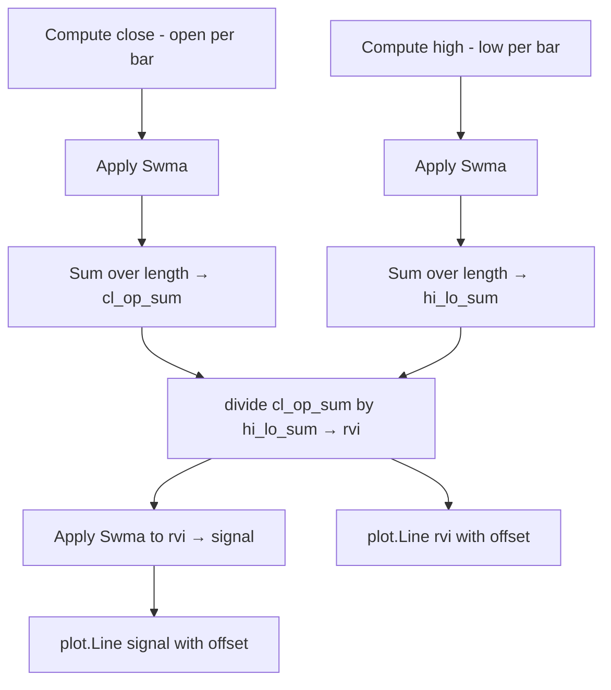

# Relative Vigor Index (RVGI) - Built-in Indicator Guide

> Relative Vigor Index (RVGI) measures trend strength via smoothed close-open vs high-low ranges.

| | |
| --- | --- |
| **Language** | Indie Script v5 |
| **Platform** | [TakeProfit](https://takeprofit.com) |
| **Category** | Oscillators |
| **Type** | Built-in indicator |
| **Author** | TakeProfit |
| **License** | MIT |
| **Documentation** | [Built-in indicators](https://takeprofit.com/docs/indie/Code-examples/built-in-indicators#relative-vigor-index) |
| **Source file** | [Relative Vigor Index.indie5](Relative%20Vigor%20Index.indie5) |

## Overview

The Relative Vigor Index (RVGI) evaluates the conviction behind price moves by comparing the close-to-open change relative to the high-to-low range over a given period. It is based on the idea that in a healthy trend, prices close in the direction of the move more often than not. This indicator is typically used to confirm trend direction and spot potential reversals when the RVGI line crosses its signal line.

The chart displays two lines: the RVGI (green) and a signal line (red), both subject to an optional horizontal offset. The relationship between these lines and their position relative to zero provides visual cues about trend strength and momentum.

## How it works

1. Define a symmetrically weighted moving average (Swma) that assigns weights 1/6, 1/3, 1/3, and 1/6 to the four most recent bars (current to third previous).
2. Compute the raw vigor for each bar as (close - open) and feed it through the Swma.
3. Sum the smoothed close‑open values over the user‑defined 'length' period to get cl_op_sum.
4. Compute the smoothed range (high - low) similarly and sum it to get hi_lo_sum.
5. Divide cl_op_sum by hi_lo_sum to obtain the RVGI value; the helper 'divide' guards against division by zero.
6. Set the signal line to the current RVGI value (constant).
7. Apply the 'offset' parameter (in bars) to both lines as a visual shift.
8. Return the two lines to be plotted on the chart.

## Mathematical model

$$
\mathrm{Swma}(x)_t = \frac{x_{t-3}}{6} + \frac{x_{t-2}}{3} + \frac{x_{t-1}}{3} + \frac{x_t}{6}
$$

$$
\mathrm{RVGI}_t = \frac{ \sum_{i=0}^{\mathrm{length}-1} \mathrm{Swma}(\mathrm{close}-\mathrm{open})_{t-i} }{ \sum_{i=0}^{\mathrm{length}-1} \mathrm{Swma}(\mathrm{high}-\mathrm{low})_{t-i} }
$$

$$
\mathrm{Signal}_t = \mathrm{RVGI}_t
$$

## Logic flow



## Parameters

| Parameter | Type | Default | Range | Description |
| --- | --- | --- | --- | --- |
| `length` | int | 10 | ≥ 1 |  |
| `offset` | int | 0 | -500 - 500 |  |

## Code walkthrough

### Symmetrically Weighted Moving Average

Lines 7-9 of [Relative Vigor Index.indie5](Relative%20Vigor%20Index.indie5):

```python
@algorithm  # Symmetrically Weighted Moving Average
def Swma(self, src: SeriesF) -> SeriesF:
    return MutSeriesF.new(src[3] / 6 + src[2] / 3 + src[1] / 3 + src[0] / 6)
```

The @algorithm decorator defines a reusable series transformation. The Swma uses four bars with weights 1/6, 2/6, 2/6, 1/6. The MutSeriesF.new call creates the output series, and indexing [0]..[3] accesses current to third previous bar values.

### Indicator Decorators and Parameters

Lines 12-16 of [Relative Vigor Index.indie5](Relative%20Vigor%20Index.indie5):

```python
@indicator('RVGI', format=format.PRICE, precision=4)  # Relative Vigor Index
@param.int('length', default=10, min=1)
@param.int('offset', default=0, min=-500, max=500)
@plot.line(color=color.GREEN, title='RVGI')
@plot.line(color=color.RED, title='Signal')
```

The @indicator declares the display name and precision. @param.int defines two user‑adjustable settings: 'length' (lookback period) and 'offset' (horizontal shift in bars). @plot.line specifies the color and title for each output line.

### Main Computation

Lines 18-21 of [Relative Vigor Index.indie5](Relative%20Vigor%20Index.indie5):

```python
    cl_op_sum = Sum.new(Swma.new(MutSeriesF.new(self.close[0] - self.open[0])), length)[0]
    hi_lo_sum = Sum.new(Swma.new(MutSeriesF.new(self.high[0] - self.low[0])), length)[0]
    rvi = divide(cl_op_sum, hi_lo_sum)
    sig = Swma.new(MutSeriesF.new(rvi))[0]
```

For each bar, the raw close‑open and high‑low values are smoothed with Swma, then summed over 'length' bars. The ratio gives the RVGI. The signal line is set to the current RVGI value (constant). The plot.Line results are returned as a tuple with the offset applied.

## Reading the chart

- The green RVGI line represents the smoothed momentum ratio.
- The red Signal line is identical to the green RVGI line.
- Since both lines are identical, no crossover signals are generated.
- Values above zero generally indicate positive close‑open pressure, while values below zero indicate negative pressure.
- The 'offset' parameter shifts both lines horizontally, which can help align signals with price action.

## Implementation notes

- The 'divide' helper prevents division by zero; if hi_lo_sum is zero (e.g., flat bars), the result is NaN and nothing is drawn for that bar.
- Swma uses the four most recent bars; early bars lack sufficient history and produce undefined values (NaN).
- The offset shifts the plotted lines without recalculating the underlying series, which may cause visual misalignment at the chart edges.
- Both 'length' and 'offset' are integers; 'length' must be at least 1, 'offset' can be between -500 and 500.

## FAQ

**How does the 'length' parameter affect the indicator?**

It sets the number of bars used for the summation of the smoothed ranges. A larger length smooths the RVGI more, making it less sensitive to short‑term fluctuations.

**What does the 'offset' parameter do?**

It shifts both the RVGI and signal lines forward (positive) or backward (negative) by a given number of bars, without recalculating the values. This can be used to align the lines with price peaks or troughs.

**Can I use this indicator for intraday charts?**

Yes, it works on any timeframe because it is based on raw bar data (open, high, low, close). The interpretation remains the same, though the optimal length may vary by market and timeframe.

## Full source code

Indie Script v5, the built-in indicator as shipped with TakeProfit. Add it from the indicators menu or copy the code into the platform's script editor.

```python
# indie:lang_version = 5
from indie import algorithm, SeriesF, MutSeriesF, indicator, format, param, plot, color
from indie.algorithms import Sum
from indie.math import divide


@algorithm  # Symmetrically Weighted Moving Average
def Swma(self, src: SeriesF) -> SeriesF:
    return MutSeriesF.new(src[3] / 6 + src[2] / 3 + src[1] / 3 + src[0] / 6)


@indicator('RVGI', format=format.PRICE, precision=4)  # Relative Vigor Index
@param.int('length', default=10, min=1)
@param.int('offset', default=0, min=-500, max=500)
@plot.line(color=color.GREEN, title='RVGI')
@plot.line(color=color.RED, title='Signal')
def Main(self, length, offset):
    cl_op_sum = Sum.new(Swma.new(MutSeriesF.new(self.close[0] - self.open[0])), length)[0]
    hi_lo_sum = Sum.new(Swma.new(MutSeriesF.new(self.high[0] - self.low[0])), length)[0]
    rvi = divide(cl_op_sum, hi_lo_sum)
    sig = Swma.new(MutSeriesF.new(rvi))[0]
    return plot.Line(rvi, offset=offset), plot.Line(sig, offset=offset)
```
