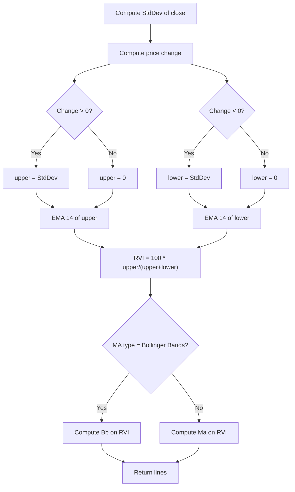

# Relative Volatility Index (RVI) - Built-in Indicator Guide

> Computes the Relative Volatility Index (RVI) oscillator and a moving average of it, with optional Bollinger Bands.

| | |
| --- | --- |
| **Language** | Indie Script v5 |
| **Platform** | [TakeProfit](https://takeprofit.com) |
| **Category** | Oscillators |
| **Type** | Built-in indicator |
| **Author** | TakeProfit |
| **License** | MIT |
| **Documentation** | [Built-in indicators](https://takeprofit.com/docs/indie/Code-examples/built-in-indicators#relative-volatility-index) |
| **Source file** | [Relative Volatility Index.indie5](Relative%20Volatility%20Index.indie5) |

## Overview

The Relative Volatility Index (RVI) measures the direction of volatility by comparing upward and downward standard deviations of price changes. It is designed to identify overbought and oversold conditions in volatile markets, similar to RSI but using volatility instead of price change magnitude.

The indicator plots a purple RVI line oscillating between 0 and 100, with a yellow moving average (or Bollinger Bands) of the RVI. Gray bands at 20 and 80 and a gray level at 50 provide reference zones. When the MA type is set to Bollinger Bands, green upper/lower bands and a fill are drawn around the RVI.

## How it works

1. Compute the standard deviation of the close price over the specified length.
2. Calculate the price change from the previous bar.
3. If the change is positive, assign the standard deviation to the 'upper' series; otherwise assign 0.
4. If the change is negative or zero, assign the standard deviation to the 'lower' series; otherwise assign 0.
5. Smooth both upper and lower series with a 14-period EMA.
6. Compute RVI as 100 * upper / (upper + lower) using a safe division function.
7. Apply a moving average (or Bollinger Bands) to the RVI series using the chosen MA type and length.
8. Plot the RVI, its moving average, and optionally the Bollinger Bands with fill.

## Mathematical model

$$
\text{RVI} = 100 \times \frac{\text{EMA}_{14}(\text{upVol})}{\text{EMA}_{14}(\text{upVol}) + \text{EMA}_{14}(\text{downVol})}
$$

where upVol = StdDev(close, length) if price change > 0 else 0, and downVol = StdDev(close, length) if price change <= 0 else 0.

## Logic flow



## Parameters

| Parameter | Type | Default | Range | Description |
| --- | --- | --- | --- | --- |
| `length` | int | 10 | ≥ 1 |  |
| `offset` | int | 0 | -500 - 500 |  |
| `ma_type` | str | SMA |  | MA Type |
| `ma_length` | int | 14 | ≥ 1 | MA Length |
| `bb_mult` | float | 2.0 | 0.001 - 50 | BB StdDev |

## Code walkthrough

### Core RVI computation

Lines 22-25 of [Relative Volatility Index.indie5](Relative%20Volatility%20Index.indie5):

```python
    dev = StdDev.new(self.close, length)[0]
    upper = Ema.new(MutSeriesF.new(0 if Change.new(self.close)[0] <= 0 else dev), 14)[0]
    lower = Ema.new(MutSeriesF.new(0 if Change.new(self.close)[0] > 0 else dev), 14)[0]
    rvi = MutSeriesF.new(100 * divide(upper, upper + lower))
```

Lines 22-25 calculate the RVI. First, the standard deviation of the close price is computed. Then, based on the sign of the price change, either the standard deviation or zero is fed into two 14-period EMAs. The RVI is the ratio of the upward EMA to the total volatility, scaled to 0–100. The `MutSeriesF` wrapper preserves state across bars for the EMA inputs.

### Moving average or Bollinger Bands selection

Lines 27-34 of [Relative Volatility Index.indie5](Relative%20Volatility%20Index.indie5):

```python
    low_value, rvi_ma, high_value = nan, nan, nan
    if ma_type == 'Bollinger Bands':
        (bb_lower, bb_middle, bb_upper) = Bb.new(rvi, ma_length, bb_mult)
        low_value = bb_lower[0]
        rvi_ma = bb_middle[0]
        high_value = bb_upper[0]
    else:
        rvi_ma = Ma.new(rvi, ma_length, ma_type)[0]
```

Depending on the `ma_type` parameter, the code either applies Bollinger Bands to the RVI series (using `Bb.new`) or a standard moving average (using `Ma.new`). For Bollinger Bands, three values (lower, middle, upper) are extracted; otherwise only the middle line is computed. The `low_value` and `high_value` variables are set to `nan` when not using Bollinger Bands to avoid plotting them.

### Returning plot elements

Lines 36-42 of [Relative Volatility Index.indie5](Relative%20Volatility%20Index.indie5):

```python
    return (
        plot.Line(rvi_ma, offset=offset),
        plot.Line(rvi[0], offset=offset),
        low_value,
        high_value,
        plot.Fill(),
    )
```

The function returns a tuple of plot objects. The first two are `plot.Line` for the RVI-based MA (yellow) and the raw RVI (purple), both shifted by the `offset` parameter. The third and fourth values are the lower and upper Bollinger Bands (or `nan`), and the fifth is a `plot.Fill` that fills between the bands when they are valid.

## Reading the chart

- The **purple line** is the RVI oscillator. Values above 80 suggest high upward volatility (overbought), below 20 suggest high downward volatility (oversold).
- The **yellow line** is a moving average of the RVI (or the middle Bollinger Band). It smooths the RVI and can be used as a signal line.
- When MA Type is 'Bollinger Bands', **green upper and lower bands** are drawn around the RVI, with a semi-transparent green fill between them. These bands expand/contract based on RVI volatility.
- Gray horizontal bands at 20 and 80 and a gray line at 50 serve as reference levels.
- The `offset` parameter shifts all lines horizontally (positive shifts right, negative left).

## Implementation notes

- The `divide` function from `indie.math` safely handles division by zero, returning `nan` when the denominator is zero.
- The `MutSeriesF` wrapper is used to create mutable series for the EMA inputs, allowing the conditional assignment of 0 or StdDev per bar.
- When `ma_type` is not 'Bollinger Bands', the `low_value` and `high_value` are set to `nan`, so no bands or fill are plotted.
- The `offset` parameter shifts the plotted lines without affecting the underlying calculation.

## FAQ

**What is the Relative Volatility Index (RVI)?**

The RVI is an oscillator that measures the direction of volatility by comparing upward and downward standard deviations of price changes. It ranges from 0 to 100 and is interpreted similarly to RSI, but based on volatility rather than price change magnitude.

**How do I interpret the RVI values?**

Values above 80 indicate high upward volatility (potentially overbought), while values below 20 indicate high downward volatility (potentially oversold). The 50 level acts as a centerline. Crossings of the RVI and its moving average can be used as trade signals.

**Can I change the smoothing period or add Bollinger Bands?**

Yes. The `length` parameter controls the standard deviation period (default 10). The `ma_length` and `ma_type` parameters control the smoothing of the RVI. Set `ma_type` to 'Bollinger Bands' to display volatility bands around the RVI, with width adjusted by `bb_mult`.

## Full source code

Indie Script v5, the built-in indicator as shipped with TakeProfit. Add it from the indicators menu or copy the code into the platform's script editor.

```python
# indie:lang_version = 5
from math import nan
from indie import indicator, format, param, band, color, level, plot, MutSeriesF
from indie.algorithms import StdDev, Ema, Change, Bb, Ma
from indie.math import divide


@indicator('RVI', format=format.PRICE)  # Relative Volatility Index
@param.int('length', default=10, min=1)
@param.int('offset', default=0, min=-500, max=500)
@param.str('ma_type', default='SMA', title='MA Type', options=['SMA', 'Bollinger Bands', 'EMA', 'SMMA (RMA)', 'WMA', 'VWMA'])
@param.int('ma_length', default=14, title='MA Length', min=1)
@param.float('bb_mult', default=2.0, title='BB StdDev', min=0.001, max=50)
@band(20, 80, line_color=color.GRAY, fill_color=color.PURPLE(0.1))
@level(50, line_color=color.GRAY(0.5))
@plot.line(color=color.YELLOW, title='RVI-based MA')
@plot.line(color=color.PURPLE, title='RVI')
@plot.line('bb_lower', color=color.GREEN, title='Lower Bollinger Band')
@plot.line('bb_upper', color=color.GREEN, title='Upper Bollinger Band')
@plot.fill('bb_lower', 'bb_upper', color=color.GREEN(0.1), title='Bollinger Bands Background Fill')
def Main(self, length, offset, ma_type, ma_length, bb_mult):
    dev = StdDev.new(self.close, length)[0]
    upper = Ema.new(MutSeriesF.new(0 if Change.new(self.close)[0] <= 0 else dev), 14)[0]
    lower = Ema.new(MutSeriesF.new(0 if Change.new(self.close)[0] > 0 else dev), 14)[0]
    rvi = MutSeriesF.new(100 * divide(upper, upper + lower))

    low_value, rvi_ma, high_value = nan, nan, nan
    if ma_type == 'Bollinger Bands':
        (bb_lower, bb_middle, bb_upper) = Bb.new(rvi, ma_length, bb_mult)
        low_value = bb_lower[0]
        rvi_ma = bb_middle[0]
        high_value = bb_upper[0]
    else:
        rvi_ma = Ma.new(rvi, ma_length, ma_type)[0]

    return (
        plot.Line(rvi_ma, offset=offset),
        plot.Line(rvi[0], offset=offset),
        low_value,
        high_value,
        plot.Fill(),
    )
```
