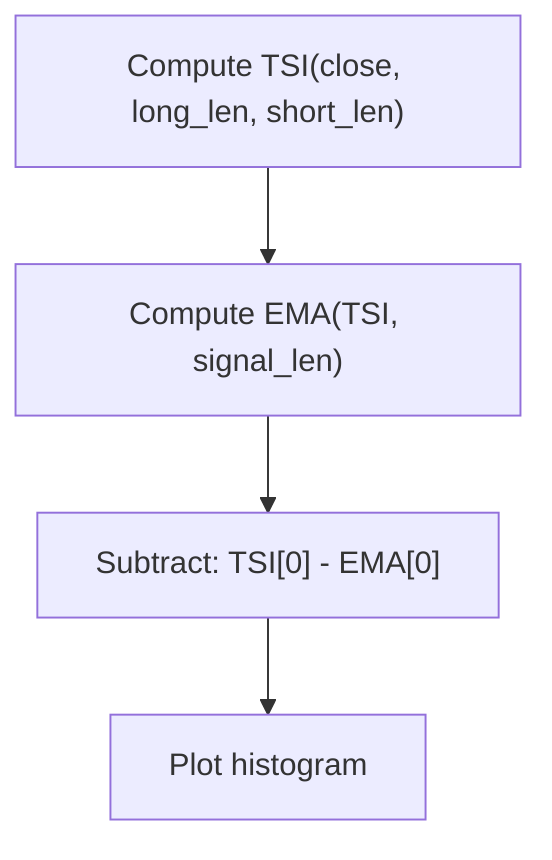

# SMI Ergodic Oscillator (SMIO) - Built-in Indicator Guide

> Computes the SMI Ergodic Oscillator as the difference between the True Strength Index and its EMA signal line.

| | |
| --- | --- |
| **Language** | Indie Script v5 |
| **Platform** | [TakeProfit](https://takeprofit.com) |
| **Category** | Oscillators |
| **Type** | Built-in indicator |
| **Author** | TakeProfit |
| **License** | MIT |
| **Documentation** | [Built-in indicators](https://takeprofit.com/docs/indie/Code-examples/built-in-indicators#smi-ergodic-oscillator) |
| **Source file** | [SMI Ergodic Oscillator.indie5](SMI%20Ergodic%20Oscillator.indie5) |

## Overview

The SMI Ergodic Oscillator (SMIO) is a momentum-based oscillator derived from the True Strength Index (TSI). It measures the difference between the TSI and a smoothed (EMA) version of itself, highlighting short-term divergences and potential reversals. The indicator is typically used to identify overbought/oversold conditions and to generate signals when the histogram crosses above or below zero.

On the chart, the SMIO is plotted as a red histogram. Positive values indicate that the TSI is above its signal line (bullish momentum), while negative values indicate the opposite (bearish momentum). The histogram's height reflects the strength of the divergence.

## How it works

1. 1. Compute the True Strength Index (TSI) using the specified long_len and short_len parameters on the close price.
2. 2. Calculate an Exponential Moving Average (EMA) of the TSI series with period signal_len to obtain the signal line.
3. 3. Subtract the current signal line value from the current TSI value to produce the oscillator value.
4. 4. Plot the resulting value as a histogram bar for the current bar, colored red.

## Mathematical model

$$
\text{SMIO} = \text{TSI}(\text{close}, \text{long\_len}, \text{short\_len}) - \text{EMA}(\text{TSI}, \text{signal\_len})
$$

## Logic flow



## Parameters

| Parameter | Type | Default | Range | Description |
| --- | --- | --- | --- | --- |
| `long_len` | int | 20 | ≥ 1 | Long Length |
| `short_len` | int | 5 | ≥ 1 | Short Length |
| `signal_len` | int | 5 | ≥ 1 | Signal Length |

## Code walkthrough

### Indicator decorators and parameters

Lines 6-9 of [SMI Ergodic Oscillator.indie5](SMI%20Ergodic%20Oscillator.indie5):

```python
@indicator('SMIO', format=format.PRICE, precision=4)  # SMI Ergodic Oscillator
@param.int('long_len', default=20, min=1, title='Long Length')
@param.int('short_len', default=5, min=1, title='Short Length')
@param.int('signal_len', default=5, min=1, title='Signal Length')
```

The @indicator decorator sets the short name 'SMIO', the display format to PRICE, and precision to 4 decimal places. Three integer parameters are defined: long_len (default 20), short_len (default 5), and signal_len (default 5), each with a minimum of 1. The @plot.histogram decorator specifies that the output will be drawn as a red histogram.

### Core computation

Lines 12-13 of [SMI Ergodic Oscillator.indie5](SMI%20Ergodic%20Oscillator.indie5):

```python
    tsi = Tsi.new(self.close, long_len, short_len)
    return tsi[0] - Ema.new(tsi, signal_len)[0]
```

The TSI is computed using the built-in Tsi.new algorithm on the close price with the given lengths. The result is a series; [0] accesses the current bar's value. An EMA of that TSI series with period signal_len is then computed, and its current value is subtracted from the TSI to produce the oscillator value. This single value is returned and plotted as the histogram bar.

## Reading the chart

- The histogram is drawn in red.
- Values above zero indicate the TSI is above its signal line (bullish momentum).
- Values below zero indicate the TSI is below its signal line (bearish momentum).
- Crossings of the zero line can be used as potential trade signals.
- The height of the histogram shows the magnitude of divergence between TSI and its smoothed version.

## Implementation notes

- The indicator uses built-in Tsi and Ema algorithms; no manual state management is needed.
- The output is a single series; only the current bar's value is returned, so no repainting occurs.
- All parameters are integers with a minimum of 1; no upper bound is enforced.
- The histogram is drawn with a fixed red color; color cannot be changed via parameters.

## FAQ

**What do the three length parameters control?**

long_len and short_len are used in the TSI calculation to smooth price changes over different timeframes. signal_len is the period for the EMA applied to the TSI to create the signal line.

**How can I change the histogram color?**

The color is hardcoded as RED in the @plot.histogram decorator. To change it, you would need to modify the source code or add a color parameter.

**Does this indicator repaint?**

No, because it only uses the current bar's close price and the built-in series algorithms (Tsi.new, Ema.new) which compute values sequentially without look-ahead bias.

## Full source code

Indie Script v5, the built-in indicator as shipped with TakeProfit. Add it from the indicators menu or copy the code into the platform's script editor.

```python
# indie:lang_version = 5
from indie import indicator, format, param, plot, color
from indie.algorithms import Tsi, Ema


@indicator('SMIO', format=format.PRICE, precision=4)  # SMI Ergodic Oscillator
@param.int('long_len', default=20, min=1, title='Long Length')
@param.int('short_len', default=5, min=1, title='Short Length')
@param.int('signal_len', default=5, min=1, title='Signal Length')
@plot.histogram(color=color.RED)
def Main(self, long_len, short_len, signal_len):
    tsi = Tsi.new(self.close, long_len, short_len)
    return tsi[0] - Ema.new(tsi, signal_len)[0]
```
