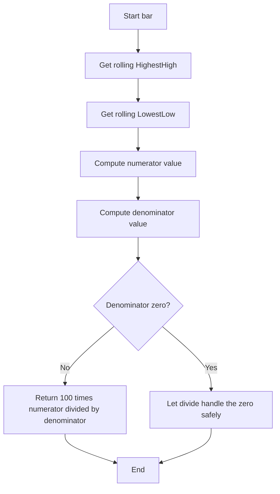

# Williams Percent Range (Williams %R) - Built-in Indicator Guide

> Williams %R oscillator showing where the selected source is within the highest high/lowest low range over `length` bars.

| | |
| --- | --- |
| **Language** | Indie Script v5 |
| **Platform** | [TakeProfit](https://takeprofit.com) |
| **Category** | Oscillators |
| **Type** | Built-in indicator |
| **Author** | TakeProfit |
| **License** | MIT |
| **Documentation** | [Built-in indicators](https://takeprofit.com/docs/indie/Code-examples/built-in-indicators#williams-percent-range) |
| **Source file** | [Williams Percent Range.indie5](Williams%20Percent%20Range.indie5) |

## Overview

Williams %R is a momentum-style oscillator that compares the current price source to the highest high and lowest low observed over a rolling window. The computed value is normally negative, ranging from 0 (when the source equals the period's highest high) to -100 (when the source equals the period's lowest low). It is intended for observing how close the current price is to the extremes of its recent trading range.

The chart shows a purple `%R` line, a gray-bordered background band between -20 and -80 with a translucent purple fill, and a dotted gray level at -50. These static reference marks help visually separate the upper, middle, and lower parts of the oscillator range.

## How it works

1. For each bar, `Highest.new(self.high, length)[0]` returns the rolling highest high over the last `length` bars.
2. `Lowest.new(self.low, length)[0]` returns the rolling lowest low over the same lookback window.
3. `src[0]` is the current value of the selected source, which defaults to `close`.
4. The numerator is `src[0] - max`, and the denominator is `max - min`.
5. The `divide` helper is used instead of `/` so that a zero denominator does not cause a runtime division error.
6. The result is multiplied by 100 and returned as the `%R` plot line.
7. The band at -20/-80 and the dotted level at -50 are drawn as static chart decorations by `@band` and `@level`.

## Mathematical model

$$
\text{Williams \%R}_t = 100 \cdot \frac{\text{src}[0] - \text{HighestHigh}_t}{\text{HighestHigh}_t - \text{LowestLow}_t}
$$

$$
\text{HighestHigh}_t = \max_{i=0}^{length-1} \text{high}[t-i]
$$

$$
\text{LowestLow}_t = \min_{i=0}^{length-1} \text{low}[t-i]
$$

## Logic flow



## Parameters

| Parameter | Type | Default | Range | Description |
| --- | --- | --- | --- | --- |
| `length` | int | 14 | ≥ 1 |  |
| `src` | source | source.CLOSE |  | Source |

## Code walkthrough

### Decorators and parameters

Lines 7-9 of [Williams Percent Range.indie5](Williams%20Percent%20Range.indie5):

```python
@indicator('Williams %R', format=format.PRICE)  # Williams Percent Range
@param.int('length', default=14, min=1)
@param.source('src', default=source.CLOSE, title='Source')
```

The `@indicator` decorator sets the chart name and display format. The `@param.int` and `@param.source` decorators expose user settings: `length` with a default of 14 and a minimum of 1, and `src` defaulting to the close price. These decorators also generate the settings UI.

### Chart visual elements

Lines 10-12 of [Williams Percent Range.indie5](Williams%20Percent%20Range.indie5):

```python
@band(-20, -80, line_color=color.GRAY, fill_color=color.PURPLE(0.1), title='Background')
@level(-50, line_color=color.GRAY, line_style=line_style.DOTTED, title='Middle Level')
@plot.line(color=color.PURPLE, title='%R')
```

`@band` draws a gray-bordered, translucent purple fill between -20 and -80. `@level` places a dotted gray line at -50. `@plot.line` declares the main output as a purple line named `%R`. These visual elements are independent of the calculation.

### Rolling extrema

Lines 13-15 of [Williams Percent Range.indie5](Williams%20Percent%20Range.indie5):

```python
def Main(self, length, src):
    max = Highest.new(self.high, length)[0]
    min = Lowest.new(self.low, length)[0]
```

`Highest.new` and `Lowest.new` allocate rolling-window algorithms. Reading `[0]` gives the current bar's value. `self.high` and `self.low` are built-in price series, and the algorithms keep state internally between bars so no explicit loop is needed.

### Returning the oscillator value

Lines 16-16 of [Williams Percent Range.indie5](Williams%20Percent%20Range.indie5):

```python
    return 100 * divide(src[0] - max, max - min)
```

The return expression computes the percentage by dividing the difference between the source and the highest high by the full range. The `divide` helper protects against a zero denominator, which can happen when the highest high equals the lowest low in a flat period. Multiplying by 100 puts the result on the conventional -100..0 scale.

## Reading the chart

- The purple line `%R` moves in a normally negative range, typically between -100 and 0.
- Values near 0 mean the current `src` is close to the period's highest high; values near -100 mean it is close to the period's lowest low.
- The gray band boundaries at -20 and -80 frame the middle region of the oscillator, while the dotted line at -50 marks the midpoint.
- The `%R` line above -20 sits above the reference band; below -80 it sits below the reference band.

## Implementation notes

- The rolling extrema are implemented through `Highest.new` and `Lowest.new`, not by manual loops over historical bars.
- `divide` absorbs the zero-denominator case, so flat periods do not produce division errors.
- With `length=1`, `max` equals the current bar's high and `min` equals the current bar's low, making the output based only on the current bar's high-low range rather than a rolling window.

## FAQ

**What does the `length` parameter control?**

`length` is the lookback window for both the highest high and lowest low. The default is 14. A larger length uses a broader range, while a smaller length reacts to a shorter range.

**Can I use a source other than the close price?**

Yes. The `src` parameter defaults to `close`, but it can be changed in the indicator settings to open, high, low, or another provided source. The rolling extrema are always based on high and low.

**Why is the result often negative?**

The formula measures how far the current source is below the period's highest high as a percentage of the full high-low range. It yields 0 at the maximum and -100 at the minimum, so the output is usually negative or zero.

## Full source code

Indie Script v5, the built-in indicator as shipped with TakeProfit. Add it from the indicators menu or copy the code into the platform's script editor.

```python
# indie:lang_version = 5
from indie import indicator, format, param, source, band, color, level, line_style, plot
from indie.algorithms import Highest, Lowest
from indie.math import divide


@indicator('Williams %R', format=format.PRICE)  # Williams Percent Range
@param.int('length', default=14, min=1)
@param.source('src', default=source.CLOSE, title='Source')
@band(-20, -80, line_color=color.GRAY, fill_color=color.PURPLE(0.1), title='Background')
@level(-50, line_color=color.GRAY, line_style=line_style.DOTTED, title='Middle Level')
@plot.line(color=color.PURPLE, title='%R')
def Main(self, length, src):
    max = Highest.new(self.high, length)[0]
    min = Lowest.new(self.low, length)[0]
    return 100 * divide(src[0] - max, max - min)
```
