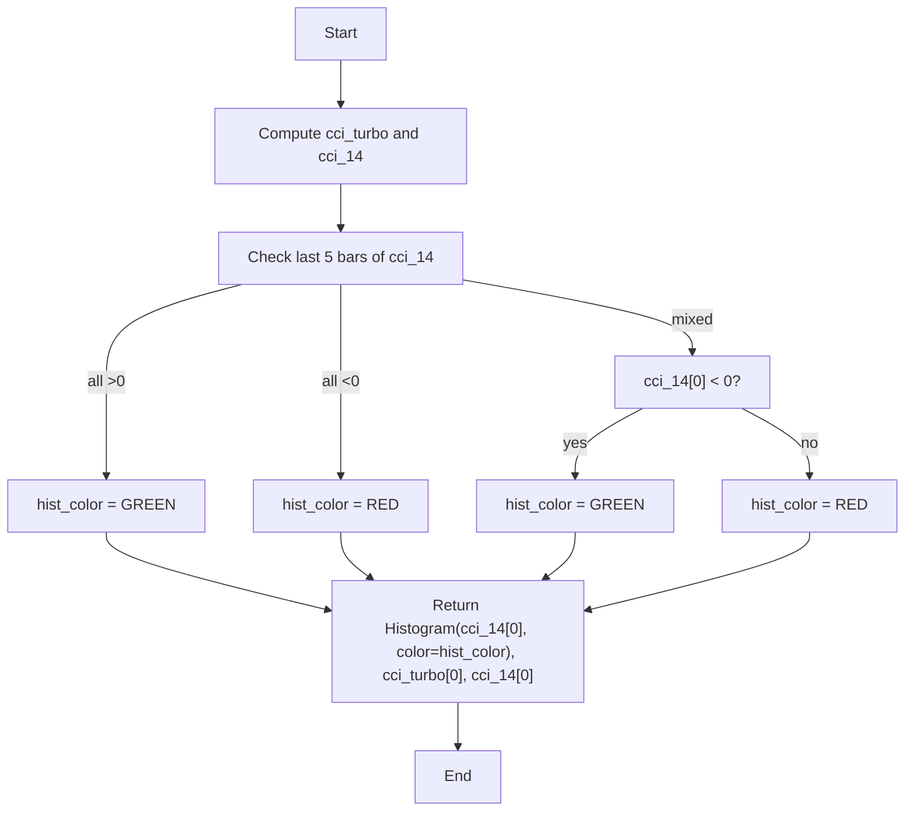

# Woodies CCI - Built-in Indicator Guide

> Plots CCI Turbo and CCI 14 lines; histogram colored based on five consecutive bars' positivity/negativity or current bar direction.

| | |
| --- | --- |
| **Language** | Indie Script v5 |
| **Platform** | [TakeProfit](https://takeprofit.com) |
| **Category** | Oscillators |
| **Type** | Built-in indicator |
| **Author** | TakeProfit |
| **License** | MIT |
| **Documentation** | [Built-in indicators](https://takeprofit.com/docs/indie/Code-examples/built-in-indicators#woodies-cci) |
| **Source file** | [Woodies CCI.indie5](Woodies%20CCI.indie5) |

## Overview

Woodies CCI is a dual-length Commodity Channel Index indicator designed to capture short-term momentum shifts using the close price. It displays a fast Turbo CCI line and a standard 14-period CCI line, along with a histogram of the 14-period CCI.

Horizontal levels at -100, 0, and 100 provide reference for overbought/oversold conditions. The histogram color changes according to a set of rules that examine whether the previous five CCI14 bars were all positive or all negative, falling back to the sign of the current bar. This coloring scheme aims to highlight sustained directional bias or immediate direction changes.

## How it works

1. Compute CCI Turbo using the close price over the cci_turbo_len period.
2. Compute CCI 14 using the close price over the cci_14_len period.
3. Check if the previous five bars of CCI 14 (indices [5]..[1]) are all negative (last_5_down) or all positive (last_5_up), ignoring the current bar.
4. Determine histogram color: if last_5_up → green; else if last_5_down → red; else if current CCI 14 (index [0]) is negative → green; else → red.
5. Plot a histogram bar for the CCI 14 value using the determined color.
6. Plot the Turbo CCI line and the CCI 14 line as separate series.

## Mathematical model

$$
\text{CCI} = \frac{ \text{close} - \text{SMA}(\text{close}, n) }{ 0.015 \times \text{MD} }
$$

 where MD is the mean absolute deviation of close from its SMA over n periods. The platform's Cci.new implements this formula.

## Logic flow



## Parameters

| Parameter | Type | Default | Range | Description |
| --- | --- | --- | --- | --- |
| `cci_turbo_len` | int | 6 | 3 - 14 | CCI Turbo Length |
| `cci_14_len` | int | 14 | 7 - 20 | CCI 14 Length |

## Code walkthrough

### Compute CCI series

Lines 16-17 of [Woodies CCI.indie5](Woodies%20CCI.indie5):

```python
    cci_turbo = Cci.new(self.close, cci_turbo_len)
    cci_14 = Cci.new(self.close, cci_14_len)
```

Two CCI series are created using the close price and user-defined lengths. The .new() method returns a series that can be indexed with [0] for the current bar and higher indices for previous bars. Using close instead of typical price is a notable difference from standard CCI.

### Define consecutive-bar conditions

Lines 18-19 of [Woodies CCI.indie5](Woodies%20CCI.indie5):

```python
    last_5_down = cci_14[5] < 0 and cci_14[4] < 0 and cci_14[3] < 0 and cci_14[2] < 0 and cci_14[1] < 0
    last_5_up = cci_14[5] > 0 and cci_14[4] > 0 and cci_14[3] > 0 and cci_14[2] > 0 and cci_14[1] > 0
```

Two boolean flags check whether the previous five bars (indices 5 through 1) of CCI 14 are all on the same side of zero. This avoids using the current bar's value and detects persistent directional bias.

### Histogram color logic

Lines 21-29 of [Woodies CCI.indie5](Woodies%20CCI.indie5):

```python
    hist_color = color.BLACK  # default value
    if last_5_up:
        hist_color = color.GREEN
    elif last_5_down:
        hist_color = color.RED
    elif cci_14[0] < 0:
        hist_color = color.GREEN
    else:
        hist_color = color.RED
```

The histogram color is determined by a priority chain: if the last five bars are all positive → green; else if all negative → red; else if the current bar is negative → green; else → red. The final return includes the histogram, the Turbo CCI line value, and the CCI 14 line value.

## Reading the chart

- Three horizontal reference lines: -100 (dotted gray), 0 (solid gray), 100 (dotted gray).
- The Turbo CCI line (green) reacts quickly to price changes.
- The CCI 14 line (red) is slower and smoother.
- The histogram bar represents the CCI 14 value, colored as:
   - **Green** if the previous five CCI 14 bars were all positive, OR (if mixed) the current CCI 14 value is negative.
   - **Red** if the previous five CCI 14 bars were all negative, OR (if mixed) the current CCI 14 value is positive.

## Implementation notes

- The CCI is computed using close price, not typical price (H+L+C)/3, so values may differ from standard CCI.
- The histogram color logic involves both sustained multi-bar conditions and the current bar sign, which can produce seemingly contradictory colors.
- Parameters cci_turbo_len and cci_14_len are adjustable (min/max constraints are enforced by the @param decorators).
- The indicator does not repaint because only historical data (bars [5] to [1] and [0]) are used on each bar.

## FAQ

**How can I change the Turbo CCI length?**

Adjust the 'CCI Turbo Length' parameter in the indicator settings; allowed range is 3 to 14.

**What do the histogram colors mean?**

Green indicates either the previous five CCI 14 bars were all above zero or (if mixed) the current bar is below zero. Red indicates the opposite conditions.

**Can I add overbought/oversold lines like -200/200?**

The indicator currently draws -100 and 100 lines. You can add additional levels by using the @level decorator with the desired value and style in the script.

## Full source code

Indie Script v5, the built-in indicator as shipped with TakeProfit. Add it from the indicators menu or copy the code into the platform's script editor.

```python
# indie:lang_version = 5
from indie import indicator, param, level, color, line_style, plot, Color
from indie.algorithms import Cci


@indicator('Woodies CCI')
@param.int('cci_turbo_len', default=6, min=3, max=14, title='CCI Turbo Length')
@param.int('cci_14_len', default=14, min=7, max=20, title='CCI 14 Length')
@level(-100, line_color=color.GRAY, line_style=line_style.DOTTED, title='Minus Line')
@level(0, line_color=color.GRAY, line_style=line_style.SOLID, title='Zero Line')
@level(100, line_color=color.GRAY, line_style=line_style.DOTTED, title='Hundred Line')
@plot.histogram(title='CCI Turbo Histogram')
@plot.line(color=color.GREEN, title='CCI Turbo')
@plot.line(color=color.RED, title='CCI 14')
def Main(self, cci_turbo_len, cci_14_len):
    cci_turbo = Cci.new(self.close, cci_turbo_len)
    cci_14 = Cci.new(self.close, cci_14_len)
    last_5_down = cci_14[5] < 0 and cci_14[4] < 0 and cci_14[3] < 0 and cci_14[2] < 0 and cci_14[1] < 0
    last_5_up = cci_14[5] > 0 and cci_14[4] > 0 and cci_14[3] > 0 and cci_14[2] > 0 and cci_14[1] > 0

    hist_color = color.BLACK  # default value
    if last_5_up:
        hist_color = color.GREEN
    elif last_5_down:
        hist_color = color.RED
    elif cci_14[0] < 0:
        hist_color = color.GREEN
    else:
        hist_color = color.RED
    return plot.Histogram(cci_14[0], color=hist_color), cci_turbo[0], cci_14[0]
```
