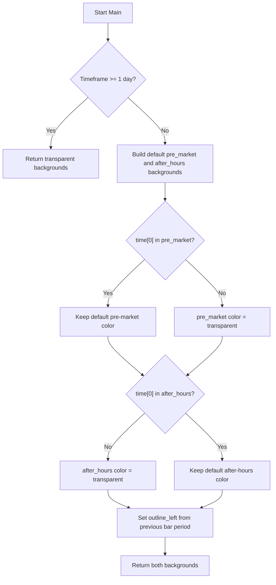

# Trading Sessions - Built-in Indicator Guide

> Shades chart bars that fall in the pre-market and after-hours trading sessions; transparent on daily or higher timeframes.

| | |
| --- | --- |
| **Language** | Indie Script v5 |
| **Platform** | [TakeProfit](https://takeprofit.com) |
| **Category** | Other |
| **Type** | Built-in indicator |
| **Author** | TakeProfit |
| **License** | MIT |
| **Documentation** | [Built-in indicators](https://takeprofit.com/docs/indie/Code-examples/built-in-indicators#trading-sessions) |
| **Source file** | [Trading Sessions.indie5](Trading%20Sessions.indie5) |

## Overview

This indicator visualizes trading session structure by painting chart bars that belong to the pre-market session and the after-hours (post-market) session. It is meant for intraday charts where session boundaries matter; on daily and higher timeframes it intentionally draws nothing.

The pre-market session is shown with a translucent yellow background and the after-hours session with a translucent blue background. The after-hours block can have a left outline that marks the start of a new trading period. Regular trading hours remain unshaded.

## How it works

1. If `self.time_frame` is daily or higher, return transparent backgrounds so no session shading is drawn.
2. For intraday timeframes, create a `plot.Background()` for the pre-market session.
3. If `self.time[0]` is not inside `self.trading_session.pre_market`, set its color to `color.TRANSPARENT`, otherwise keep the decorator default.
4. Create a second `plot.Background()` for the after-hours session and apply the same membership check with `self.trading_session.after_hours`.
5. For the after-hours background, set `outline_left` to true only when the previous timestamp exists and `is_same_period` sees a different period.
6. Return both background objects; the order matches the two `@plot.background` decorators.

## Logic flow



## Code walkthrough

### Indicator declaration and daily guard

Lines 6-11 of [Trading Sessions.indie5](Trading%20Sessions.indie5):

```python
@indicator('Trading Sessions', overlay_main_pane=True)
@plot.background(color=color.YELLOW(0.07), title='Pre-market session')
@plot.background(color=color.BLUE(0.07), outline_color=color.BLUE, title='Post-market session')
def Main(self):
    if self.time_frame >= TimeFrame(1, time_frame_unit.DAY):
        return plot.Background(color=color.TRANSPARENT), plot.Background(color=color.TRANSPARENT)
```

The `@indicator` decorator registers the script as an overlay in the main pane. Two `@plot.background` decorators create two background plots with default colors and settings titles. The first check skips all work on daily or higher timeframes by returning transparent backgrounds.

### Per-session color decisions

Lines 13-19 of [Trading Sessions.indie5](Trading%20Sessions.indie5):

```python
    pre_market_background = plot.Background()
    if self.time[0] not in self.trading_session.pre_market:
        pre_market_background.color = color.TRANSPARENT

    after_hours_background = plot.Background()
    if self.time[0] not in self.trading_session.after_hours:
        after_hours_background.color = color.TRANSPARENT
```

New `plot.Background()` objects are created for each bar. Each one starts with the defaults from the decorator. If the current bar time is not in `pre_market` or `after_hours`, the corresponding color is set to `color.TRANSPARENT`, so only bars inside those sessions get a visible fill.

### Left outline and return

Lines 21-26 of [Trading Sessions.indie5](Trading%20Sessions.indie5):

```python
    after_hours_background.outline_left = (
        not isnan(self.time[1]) and
        not self.trading_session.is_same_period(self.time[0], self.time[1])
    )

    return pre_market_background, after_hours_background
```

`outline_left` is assigned only for the after-hours background. It becomes true when the previous timestamp exists and `is_same_period` reports the two timestamps are in different periods, drawing a vertical line at the left edge of the background. The returned tuple matches the order of the `@plot.background` decorators.

## Reading the chart

- Yellow translucent background: bars whose timestamp is in `self.trading_session.pre_market`.
- Blue translucent background: bars whose timestamp is in `self.trading_session.after_hours`.
- A blue outline on the left side of the after-hours block marks a bar that starts a new period relative to the previous bar.
- Transparent background means either the timeframe is daily or higher, or the bar is outside the corresponding session; regular market hours are not colored.

## Implementation notes

- On daily or higher timeframes the indicator is a no-op because both backgrounds are transparent.
- `self.time[1]` is used only to compute `outline_left`; it is guarded with `isnan` to handle missing previous timestamps.
- The `@plot.background` decorators supply default colors and titles; `Main` overrides `color` only for bars outside the session.
- No explicit regular-session background exists; regular hours are the absence of both pre-market and after-hours shading.

## FAQ

**On which timeframes does this indicator draw anything?**

On intraday timeframes only. The code checks `self.time_frame >= TimeFrame(1, time_frame_unit.DAY)` and returns transparent backgrounds on daily or higher.

**How do I change the session colors?**

Edit the `color` arguments in the `@plot.background` decorators, for example `color.YELLOW(0.07)` to another color and alpha. The `title` parameter there controls the name shown in the settings UI.

**What is the vertical outline on the left of the after-hours background?**

It is `outline_left`, set when `self.time[1]` exists and `self.trading_session.is_same_period(self.time[0], self.time[1])` is false, meaning the current bar starts a new trading period relative to the previous bar.

## Full source code

Indie Script v5, the built-in indicator as shipped with TakeProfit. Add it from the indicators menu or copy the code into the platform's script editor.

```python
# indie:lang_version = 5
from math import isnan
from indie import indicator, plot, color, TimeFrame, time_frame_unit


@indicator('Trading Sessions', overlay_main_pane=True)
@plot.background(color=color.YELLOW(0.07), title='Pre-market session')
@plot.background(color=color.BLUE(0.07), outline_color=color.BLUE, title='Post-market session')
def Main(self):
    if self.time_frame >= TimeFrame(1, time_frame_unit.DAY):
        return plot.Background(color=color.TRANSPARENT), plot.Background(color=color.TRANSPARENT)

    pre_market_background = plot.Background()
    if self.time[0] not in self.trading_session.pre_market:
        pre_market_background.color = color.TRANSPARENT

    after_hours_background = plot.Background()
    if self.time[0] not in self.trading_session.after_hours:
        after_hours_background.color = color.TRANSPARENT

    after_hours_background.outline_left = (
        not isnan(self.time[1]) and
        not self.trading_session.is_same_period(self.time[0], self.time[1])
    )

    return pre_market_background, after_hours_background
```
