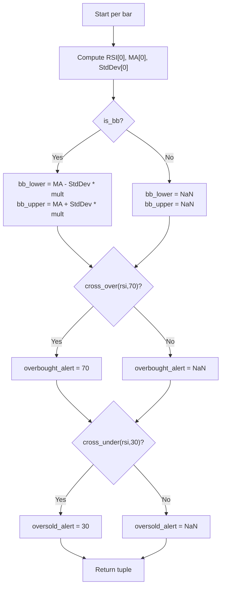

# relative strength index + Over Alert - Technical Guide

> Computes the Relative Strength Index (RSI) with a moving average, optional Bollinger Bands, and crossover alerts at 70 and 30.

| | |
| --- | --- |
| **Language** | Indie Script v5 |
| **Platform** | [TakeProfit](https://takeprofit.com) |
| **Category** | Oscillators |
| **Type** | Indicator |
| **Author** | @reinner on TakeProfit |
| **License** | MIT |
| **Live script** | [Open on TakeProfit](https://takeprofit.com/indicator/relative-strength-index-over-alert-75) |
| **Source file** | [relative strength index + Over Alert.indie5](relative%20strength%20index%20+%20Over%20Alert.indie5) |

## Overview

The Relative Strength Index (RSI) is a momentum oscillator that measures the speed and magnitude of recent price changes on a scale from 0 to 100. This indicator computes the RSI from the selected source price and overlays a moving average of the RSI, with an option to display Bollinger Bands (standard deviation bands) around that average. It also highlights bars where the RSI crosses above 70 (overbought) or below 30 (oversold) with alert markers.

On the chart, the RSI is plotted as a purple line, its moving average as a yellow line. When Bollinger Bands are enabled, green lines show the upper and lower bands with a translucent green fill between them. A gray band between 30 and 70 with a purple fill indicates the typical overbought/oversold thresholds, and a gray line marks the 50 level. Alert markers appear at 70 and 30 only on bars where the RSI crosses those thresholds, though the alert lines themselves are drawn with transparent color.

## How it works

1. Compute the RSI series from the source price over the specified `rsi_length` using the built-in RSI algorithm.
2. Determine the moving average type: if 'Bollinger Bands' is selected, force the algorithm to SMA; otherwise use the chosen type.
3. Calculate the moving average of the RSI series over `ma_length` using the determined algorithm.
4. Compute the standard deviation of the RSI series over the same `ma_length`.
5. If Bollinger Bands is selected, calculate the lower and upper bands as the moving average ± (standard deviation × `bb_mult`); otherwise set both bands to NaN.
6. Check for RSI crossing above 70 using `cross_over`; if true, output 70 for the overbought alert, else NaN.
7. Check for RSI crossing below 30 using `cross_under`; if true, output 30 for the oversold alert, else NaN.
8. Return the moving average, RSI, bands, fill object, and alert values for plotting.

## Mathematical model

$$
\text{Lower} = \text{MA} - k \cdot \sigma
$$

$$
\text{Upper} = \text{MA} + k \cdot \sigma
$$

Where MA is the moving average of RSI, σ is the standard deviation, and k is `bb_mult`.

## Logic flow



## Parameters

| Parameter | Type | Default | Range | Description |
| --- | --- | --- | --- | --- |
| `rsi_length` | int | 14 | ≥ 1 | RSI Length |
| `src` | source | source.CLOSE |  | Source |
| `ma_length` | int | 14 | ≥ 1 | MA Length |
| `bb_mult` | float | 2.0 | 0.001 - 50 | BB StdDev |

## Code walkthrough

### Decorators and configuration

Lines 6-21 of [relative strength index + Over Alert.indie5](relative%20strength%20index%20+%20Over%20Alert.indie5):

```python
@indicator('RSI', format=format.PRICE) # Relative Strength Index
@param.int('rsi_length', default=14, title='RSI Length', min=1)
@param.source('src', default=source.CLOSE, title='Source')
@param.str('ma_type', default='SMA', title='MA Type',
 options=['SMA', 'Bollinger Bands', 'EMA', 'SMMA (RMA)', 'WMA', 'VWMA'])
@param.int('ma_length', default=14, title='MA Length', min=1)
@param.float('bb_mult', default=2.0, title='BB StdDev', min=0.001, max=50)
@band(30, 70, line_color=color.GRAY, fill_color=color.PURPLE(0.1))
@level(50, line_color=color.GRAY(0.5))
@plot.line(color=color.YELLOW, title='RSI-based MA')
@plot.line(color=color.PURPLE, title='RSI')
@plot.line('bb_lower', color=color.GREEN, title='RSI Lower Band')
@plot.line('bb_upper', color=color.GREEN, title='RSI Upper Band')
@plot.fill('bb_lower', 'bb_upper', color=color.GREEN(0.1), title='Bollinger Bands Background Fill')
@plot.line('overbought_alert', color=color.TRANSPARENT, title='RSI Overbought Alert')
@plot.line('oversold_alert', color=color.TRANSPARENT, title='RSI Oversold Alert')
```

These decorators configure the indicator's name, format, parameters, and plot appearance. They define user-adjustable settings like RSI length, source, MA type, MA length, and Bollinger Bands multiplier. The band, level, and plot decorators set up the visual elements: a gray band between 30 and 70 with purple fill, a level line at 50, and colored lines for the MA, RSI, bands, and alerts.

### Moving average type override

Lines 24-26 of [relative strength index + Over Alert.indie5](relative%20strength%20index%20+%20Over%20Alert.indie5):

```python
 is_bb = ma_type == 'Bollinger Bands'
 ma_algorithm = 'SMA' if is_bb else ma_type
 rsi_ma = Ma.new(rsi, ma_length, ma_algorithm)
```

This fragment checks if the user selected 'Bollinger Bands' as the MA type. If so, it forces the moving average algorithm to 'SMA' because Bollinger Bands require a simple moving average for the standard deviation calculation to be meaningful. Otherwise, it uses the user-selected algorithm.

### Bollinger Bands calculation

Lines 28-29 of [relative strength index + Over Alert.indie5](relative%20strength%20index%20+%20Over%20Alert.indie5):

```python
 bb_lower = rsi_ma[0] - std_dev[0] * bb_mult if is_bb else nan
 bb_upper = rsi_ma[0] + std_dev[0] * bb_mult if is_bb else nan
```

These lines compute the lower and upper Bollinger Bands only when the Bollinger Bands option is active. The bands are centered on the moving average of RSI, offset by the standard deviation multiplied by the user-defined multiplier. If not active, both values are set to NaN, which prevents them from being plotted.

### Alert conditions

Lines 32-33 of [relative strength index + Over Alert.indie5](relative%20strength%20index%20+%20Over%20Alert.indie5):

```python
 overbought_alert = 70.0 if cross_over(rsi, 70.0) else nan
 oversold_alert = 30.0 if cross_under(rsi, 30.0) else nan
```

The `cross_over` and `cross_under` functions from `indie.math` detect the exact bar where the RSI crosses above 70 or below 30. On that bar, the alert value is set to the threshold level (70 or 30); otherwise it is NaN. These values are plotted as separate lines with transparent color, making them invisible but available for further processing or custom alerts.

### Return statement

Lines 35-35 of [relative strength index + Over Alert.indie5](relative%20strength%20index%20+%20Over%20Alert.indie5):

```python
 return rsi_ma[0], rsi[0], bb_lower, bb_upper, plot.Fill(), overbought_alert, oversold_alert
```

The function returns a tuple of seven values that correspond to the plot lines defined by the decorators. The order matches the `@plot.line` decorators: RSI-based MA, RSI, lower band, upper band, a Fill object for the band fill, overbought alert, and oversold alert. The Fill object is used by the platform to fill between the lower and upper band lines.

## Reading the chart

- Purple line: The raw RSI value, oscillating between 0 and 100.
- Yellow line: The moving average of the RSI, smoothing short-term fluctuations.
- Green lines (lower and upper): When Bollinger Bands are enabled, these lines show the bands at MA ± (stddev × multiplier). They are only visible when the Bollinger Bands option is selected.
- Green fill: Translucent fill between the lower and upper green lines, highlighting the band region.
- Gray band (30–70) with purple fill: Background zone indicating the typical overbought (≥70) and oversold (≤30) thresholds.
- Gray line at 50: Neutral level reference.
- Alert markers: On bars where the RSI crosses above 70, a point is plotted at 70 (overbought alert). On bars where it crosses below 30, a point is plotted at 30 (oversold alert). These markers are drawn with transparent color, so they are not visible by default but can be used for custom alerting logic.

## Implementation notes

- The Bollinger Bands option forces the moving average to SMA, regardless of the selected MA type.
- When Bollinger Bands is not selected, `bb_lower` and `bb_upper` are set to NaN, so the corresponding plot lines and fill are not drawn.
- The alert lines use `color.TRANSPARENT`, making them invisible; they only carry data values on crossover bars.
- The `cross_over` and `cross_under` functions return `True` only on the bar where the crossover occurs, so alerts are single-bar events.

## FAQ

**How do I change the RSI length?**

Adjust the 'RSI Length' parameter (default 14). A shorter length makes the RSI more responsive, a longer length smoother.

**What does the Bollinger Bands option do?**

When enabled, it draws upper and lower bands around the RSI moving average at a distance of 'BB StdDev' times the standard deviation. This helps visualize volatility in the RSI.

**How are the alerts triggered?**

The overbought alert triggers on the bar where the RSI crosses above 70; the oversold alert triggers on the bar where it crosses below 30. Only one bar per crossover is marked.

## Full source code

Indie Script v5, as published on TakeProfit. Copy it into the platform's script editor or [open the live script](https://takeprofit.com/indicator/relative-strength-index-over-alert-75).

```python
# indie:lang_version = 5
from math import nan
from indie import indicator, format, param, source, band, color, level, plot
from indie.algorithms import Rsi, Ma, StdDev
from indie.math import cross_over, cross_under
@indicator('RSI', format=format.PRICE) # Relative Strength Index
@param.int('rsi_length', default=14, title='RSI Length', min=1)
@param.source('src', default=source.CLOSE, title='Source')
@param.str('ma_type', default='SMA', title='MA Type',
 options=['SMA', 'Bollinger Bands', 'EMA', 'SMMA (RMA)', 'WMA', 'VWMA'])
@param.int('ma_length', default=14, title='MA Length', min=1)
@param.float('bb_mult', default=2.0, title='BB StdDev', min=0.001, max=50)
@band(30, 70, line_color=color.GRAY, fill_color=color.PURPLE(0.1))
@level(50, line_color=color.GRAY(0.5))
@plot.line(color=color.YELLOW, title='RSI-based MA')
@plot.line(color=color.PURPLE, title='RSI')
@plot.line('bb_lower', color=color.GREEN, title='RSI Lower Band')
@plot.line('bb_upper', color=color.GREEN, title='RSI Upper Band')
@plot.fill('bb_lower', 'bb_upper', color=color.GREEN(0.1), title='Bollinger Bands Background Fill')
@plot.line('overbought_alert', color=color.TRANSPARENT, title='RSI Overbought Alert')
@plot.line('oversold_alert', color=color.TRANSPARENT, title='RSI Oversold Alert')
def Main(self, rsi_length, src, ma_type, ma_length, bb_mult):
 rsi = Rsi.new(src, rsi_length)
 is_bb = ma_type == 'Bollinger Bands'
 ma_algorithm = 'SMA' if is_bb else ma_type
 rsi_ma = Ma.new(rsi, ma_length, ma_algorithm)
 std_dev = StdDev.new(rsi, ma_length)
 bb_lower = rsi_ma[0] - std_dev[0] * bb_mult if is_bb else nan
 bb_upper = rsi_ma[0] + std_dev[0] * bb_mult if is_bb else nan
 
 # Alert conditions for RSI crossovers
 overbought_alert = 70.0 if cross_over(rsi, 70.0) else nan
 oversold_alert = 30.0 if cross_under(rsi, 30.0) else nan
 
 return rsi_ma[0], rsi[0], bb_lower, bb_upper, plot.Fill(), overbought_alert, oversold_alert
```
