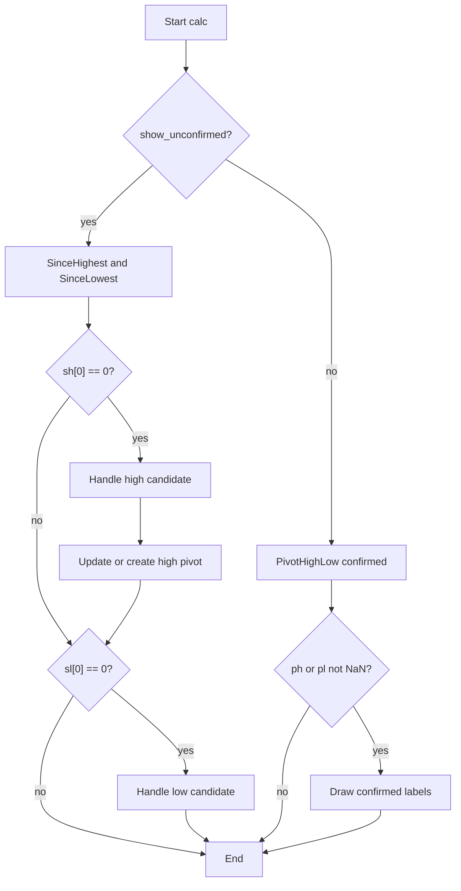

# Pivot Points High/Low (Pivots High/Low) - Built-in Indicator Guide

> Draws pivot high and low labels using configurable left/right lengths, with optional real-time unconfirmed candidates.

| | |
| --- | --- |
| **Language** | Indie Script v5 |
| **Platform** | [TakeProfit](https://takeprofit.com) |
| **Category** | Support & resistance |
| **Type** | Built-in indicator |
| **Author** | TakeProfit |
| **License** | MIT |
| **Documentation** | [Built-in indicators](https://takeprofit.com/docs/indie/Code-examples/built-in-indicators#pivot-points-high%2Flow) |
| **Source file** | [Pivot Points High-Low.indie5](Pivot%20Points%20High-Low.indie5) |

## Overview

Pivot Points High/Low is an overlay indicator that identifies swing highs and swing lows on the price chart. It uses separate left and right lookback lengths for highs and lows, so the user can control how many bars must be higher or lower on each side before a bar is considered a pivot.

By default it also shows potential pivot points in real time, before the right-side confirmation is complete. On the chart, confirmed or candidate pivot highs are marked with green labels above the bar, and pivot lows with red labels below the bar; each label shows the price rounded to the instrument's price precision.

## How it works

1. On each bar, if show_unconfirmed is enabled, compute SinceHighest and SinceLowest with left length + 1 to detect candidate pivots.
2. When the current high is a new local high, compare it with the stored previous high pivot; if the previous one is farther than length_high_right bars, forget it, otherwise replace it if the new high is higher. If no previous high pivot exists, create a new one.
3. Create or update the high pivot label and repeat the same logic for lows using SinceLowest and length_low_right.
4. If show_unconfirmed is disabled, call PivotHighLow.new for highs and lows with the configured left/right lengths.
5. When PivotHighLow returns a non-NaN value, draw a label at the pivot bar's time and price, offset by right_bars.
6. Labels are LabelAbs objects with green/red text and callout positions; the text is the rounded pivot price.

## Mathematical model

$$
\text{pivot high at } t \iff \text{high}[t] = \max_{i \in [t-L_h, t+R_h]} \text{high}[i]
$$

$$
\text{pivot low at } t \iff \text{low}[t] = \min_{i \in [t-L_l, t+R_l]} \text{low}[i]
$$

## Logic flow



## Parameters

| Parameter | Type | Default | Range | Description |
| --- | --- | --- | --- | --- |
| `length_high_left` | int | 10 | ≥ 1 | High left length |
| `length_low_left` | int | 10 | ≥ 1 | Low left length |
| `length_high_right` | int | 10 | ≥ 1 | High right length |
| `length_low_right` | int | 10 | ≥ 1 | Low right length |
| `show_unconfirmed` | bool | true |  | Show potential pivot points |

## Code walkthrough

### Unconfirmed high pivot detection

Lines 24-39 of [Pivot Points High-Low.indie5](Pivot%20Points%20High-Low.indie5):

```python
        if show_unconfirmed:
            sh = SinceHighest.new(self.high, length_high_left + 1)
            sl = SinceLowest.new(self.low, length_low_left + 1)

            if sh[0] == 0:
                # we have a new high pivot candidate
                new_h_pivot_candidate_y = self.high[0]
                hp_opt: Optional[LabelAbs] = self._prev_high_pivot.get()
                if hp_opt is not None:  # we have a previous high pivot, must decide which one is better
                    if self.bar_index - self._prev_high_pivot_bar_index.get() > length_high_right:
                        self._prev_high_pivot.set(None)  # prev_high_pivot is too far away in history, forget about it
                    elif hp_opt.value().position.price < new_h_pivot_candidate_y:
                        self._update_high_pivot()  # new pivot candidate is better, update previous pivot
                    # else new pivot candidate is worse, keep the previous pivot
                if self._prev_high_pivot.get() is None:
                    self._update_high_pivot()  # create new low pivot
```

When show_unconfirmed is true, SinceHighest checks whether the current bar is a new local high over the left window. If it is, the code compares it with the previous high pivot candidate: if the previous one is too far away it is forgotten, otherwise it is replaced when the new candidate is higher. If no previous candidate remains, a new high pivot label is created.

### Unconfirmed low pivot detection

Lines 40-50 of [Pivot Points High-Low.indie5](Pivot%20Points%20High-Low.indie5):

```python
            if sl[0] == 0:
                new_l_pivot_candidate_y = self.low[0]
                lp_opt: Optional[LabelAbs] = self._prev_low_pivot.get()
                if lp_opt is not None:  # we have a previous low pivot, must decide which one is better
                    if self.bar_index - self._prev_low_pivot_bar_index.get() > length_low_right:
                        self._prev_low_pivot.set(None)  # prev_low_pivot is too far away in history, forget about it
                    elif lp_opt.value().position.price > new_l_pivot_candidate_y:
                        self._update_low_pivot()  # new pivot candidate is better, update previous pivot
                    # else new pivot candidate is worse, keep the previous pivot
                if self._prev_low_pivot.get() is None:
                    self._update_low_pivot()  # create new low pivot
```

The low side mirrors the high logic using SinceLowest. A current bar is a low candidate when sl[0] equals 0. The previous low pivot is replaced when the new low is lower, forgotten when it is older than length_low_right bars, and created if no previous low pivot exists.

### Confirmed pivot mode

Lines 51-63 of [Pivot Points High-Low.indie5](Pivot%20Points%20High-Low.indie5):

```python
        else:
            ph, _ = PivotHighLow.new(self.high, left_bars=length_high_left, right_bars=length_high_right)
            _, pl = PivotHighLow.new(self.low, left_bars=length_low_left, right_bars=length_low_right)

            if not isnan(ph[0]):
                new_pivot_y = self.high[length_high_right]
                new_pivot_x = self.time[length_high_right]
                self.chart.draw(self._create_new_label(new_pivot_x, new_pivot_y, is_high=True))  # create and draw

            if not isnan(pl[0]):
                new_pivot_y = self.low[length_low_right]
                new_pivot_x = self.time[length_low_right]
                self.chart.draw(self._create_new_label(new_pivot_x, new_pivot_y, is_high=False))  # create and draw
```

When show_unconfirmed is false, PivotHighLow.new returns confirmed pivot series. A non-NaN value for ph[0] or pl[0] means a pivot exists; the label is placed at the pivot bar's actual time and price, which is length_high_right or length_low_right bars in the past from the current bar.

### Updating and creating high pivot labels

Lines 65-78 of [Pivot Points High-Low.indie5](Pivot%20Points%20High-Low.indie5):

```python
    def _update_high_pivot(self) -> None:
        new_pivot_y = self.high[0]
        new_pivot_x = self.time[0]
        new_pivot_bar_index = self.bar_index

        if self._prev_high_pivot.get() is None:  # create and draw
            self._prev_high_pivot.set(self._create_new_label(new_pivot_x, new_pivot_y, is_high=True))
        else:  # update field values and redraw
            hp = self._prev_high_pivot.get().value()
            hp.position = AbsolutePosition(new_pivot_x, new_pivot_y)
            hp.text = str(round(new_pivot_y, self.info.price_precision))

        self._prev_high_pivot_bar_index.set(new_pivot_bar_index)
        self.chart.draw(self._prev_high_pivot.get().value())
```

This helper either creates a new LabelAbs for a high pivot or updates the existing label's position and text. It also stores the current bar index so the caller can later decide if the candidate is too old. The label is then drawn to the chart.

### Label construction

Lines 95-105 of [Pivot Points High-Low.indie5](Pivot%20Points%20High-Low.indie5):

```python
    def _create_new_label(self, time: float, price: float, is_high: bool) -> LabelAbs:
        text_color = color.GREEN if is_high else color.RED
        callout_pos = callout_position.TOP_RIGHT if is_high else callout_position.BOTTOM_LEFT
        return LabelAbs(
            str(round(price, self.info.price_precision)),
            AbsolutePosition(time, price),
            callout_position=callout_pos,
            bg_color=color.TRANSPARENT,
            text_color=text_color,
            font_size=11,
        )
```

Labels are green for highs and red for lows, with a callout position pointing from the top-right for highs and bottom-left for lows. The displayed text is the pivot price rounded to the instrument's price precision.

## Reading the chart

- Green labels above price are pivot highs; red labels below price are pivot lows.
- In unconfirmed mode, labels can move as new candidates appear; a previous candidate is replaced if a higher high or lower low appears within the right window.
- In confirmed mode, labels appear only after the right side is confirmed, so they are placed on the pivot bar (which is length_high_right or length_low_right bars in the past) rather than the current bar.
- The number on each label is the pivot price rounded to the instrument's price precision.

## Implementation notes

- Uses MutSeriesF via new_var to keep label references and bar indices between bars; .get() and .set() access the mutable state.
- In unconfirmed mode, a candidate that is too old is forgotten by setting the stored label reference to None; the already drawn label remains on the chart.
- Confirmed mode uses isnan to skip bars that are not pivots; the label is drawn at the high or low of the pivot bar, not the current bar.
- High and low pivot lengths are independent, so asymmetric swing detection is possible.

## FAQ

**How do I make pivot highs and lows use different lookbacks?**

Set length_high_left and length_high_right for highs, and length_low_left and length_low_right for lows independently in the indicator settings.

**What is the difference between enabled and disabled 'Show potential pivot points'?**

Enabled draws candidates as soon as the left side is confirmed using SinceHighest and SinceLowest; disabled waits for PivotHighLow to confirm both sides, so labels appear later but are stable.

**Can I change the label colors?**

The colors are hard-coded in _create_new_label: green for highs and red for lows. You would need to edit the source to change them.

## Full source code

Indie Script v5, the built-in indicator as shipped with TakeProfit. Add it from the indicators menu or copy the code into the platform's script editor.

```python
# indie:lang_version = 5
from math import isnan
from indie import indicator, param, Optional, MainContext, color
from indie.algorithms import PivotHighLow, SinceHighest, SinceLowest
from indie.drawings import LabelAbs, AbsolutePosition, callout_position


@indicator('Pivots High/Low', overlay_main_pane=True)
@param.int('length_high_left', default=10, min=1, title='High left length')
@param.int('length_low_left', default=10, min=1, title='Low left length')
@param.int('length_high_right', default=10, min=1, title='High right length')
@param.int('length_low_right', default=10, min=1, title='Low right length')
# Display potential pivot points in real-time before right-side confirmation
@param.bool('show_unconfirmed', default=True, title='Show potential pivot points')
class Main(MainContext):
    def __init__(self):
        none_label: Optional[LabelAbs] = None
        self._prev_high_pivot = self.new_var(none_label)
        self._prev_high_pivot_bar_index = self.new_var(0)
        self._prev_low_pivot = self.new_var(none_label)
        self._prev_low_pivot_bar_index = self.new_var(0)

    def calc(self, length_high_left, length_low_left, length_high_right, length_low_right, show_unconfirmed):
        if show_unconfirmed:
            sh = SinceHighest.new(self.high, length_high_left + 1)
            sl = SinceLowest.new(self.low, length_low_left + 1)

            if sh[0] == 0:
                # we have a new high pivot candidate
                new_h_pivot_candidate_y = self.high[0]
                hp_opt: Optional[LabelAbs] = self._prev_high_pivot.get()
                if hp_opt is not None:  # we have a previous high pivot, must decide which one is better
                    if self.bar_index - self._prev_high_pivot_bar_index.get() > length_high_right:
                        self._prev_high_pivot.set(None)  # prev_high_pivot is too far away in history, forget about it
                    elif hp_opt.value().position.price < new_h_pivot_candidate_y:
                        self._update_high_pivot()  # new pivot candidate is better, update previous pivot
                    # else new pivot candidate is worse, keep the previous pivot
                if self._prev_high_pivot.get() is None:
                    self._update_high_pivot()  # create new low pivot
            if sl[0] == 0:
                new_l_pivot_candidate_y = self.low[0]
                lp_opt: Optional[LabelAbs] = self._prev_low_pivot.get()
                if lp_opt is not None:  # we have a previous low pivot, must decide which one is better
                    if self.bar_index - self._prev_low_pivot_bar_index.get() > length_low_right:
                        self._prev_low_pivot.set(None)  # prev_low_pivot is too far away in history, forget about it
                    elif lp_opt.value().position.price > new_l_pivot_candidate_y:
                        self._update_low_pivot()  # new pivot candidate is better, update previous pivot
                    # else new pivot candidate is worse, keep the previous pivot
                if self._prev_low_pivot.get() is None:
                    self._update_low_pivot()  # create new low pivot
        else:
            ph, _ = PivotHighLow.new(self.high, left_bars=length_high_left, right_bars=length_high_right)
            _, pl = PivotHighLow.new(self.low, left_bars=length_low_left, right_bars=length_low_right)

            if not isnan(ph[0]):
                new_pivot_y = self.high[length_high_right]
                new_pivot_x = self.time[length_high_right]
                self.chart.draw(self._create_new_label(new_pivot_x, new_pivot_y, is_high=True))  # create and draw

            if not isnan(pl[0]):
                new_pivot_y = self.low[length_low_right]
                new_pivot_x = self.time[length_low_right]
                self.chart.draw(self._create_new_label(new_pivot_x, new_pivot_y, is_high=False))  # create and draw

    def _update_high_pivot(self) -> None:
        new_pivot_y = self.high[0]
        new_pivot_x = self.time[0]
        new_pivot_bar_index = self.bar_index

        if self._prev_high_pivot.get() is None:  # create and draw
            self._prev_high_pivot.set(self._create_new_label(new_pivot_x, new_pivot_y, is_high=True))
        else:  # update field values and redraw
            hp = self._prev_high_pivot.get().value()
            hp.position = AbsolutePosition(new_pivot_x, new_pivot_y)
            hp.text = str(round(new_pivot_y, self.info.price_precision))

        self._prev_high_pivot_bar_index.set(new_pivot_bar_index)
        self.chart.draw(self._prev_high_pivot.get().value())

    def _update_low_pivot(self) -> None:
        new_pivot_y = self.low[0]
        new_pivot_x = self.time[0]
        new_pivot_bar_index = self.bar_index

        if self._prev_low_pivot.get() is None:  # create and draw
            self._prev_low_pivot.set(self._create_new_label(new_pivot_x, new_pivot_y, is_high=False))
        else:  # update field values and redraw
            lp = self._prev_low_pivot.get().value()
            lp.position = AbsolutePosition(new_pivot_x, new_pivot_y)
            lp.text = str(round(new_pivot_y, self.info.price_precision))

        self._prev_low_pivot_bar_index.set(new_pivot_bar_index)
        self.chart.draw(self._prev_low_pivot.get().value())

    def _create_new_label(self, time: float, price: float, is_high: bool) -> LabelAbs:
        text_color = color.GREEN if is_high else color.RED
        callout_pos = callout_position.TOP_RIGHT if is_high else callout_position.BOTTOM_LEFT
        return LabelAbs(
            str(round(price, self.info.price_precision)),
            AbsolutePosition(time, price),
            callout_position=callout_pos,
            bg_color=color.TRANSPARENT,
            text_color=text_color,
            font_size=11,
        )
```
