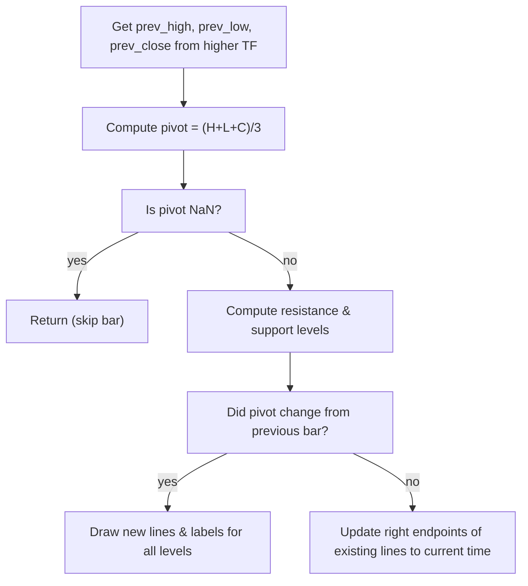

# Pivot Points Standard - Built-in Indicator Guide

> Computes standard pivot point (P), support (S1-S3) and resistance (R1-R3) levels based on prior period's high, low, close.

| | |
| --- | --- |
| **Language** | Indie Script v5 |
| **Platform** | [TakeProfit](https://takeprofit.com) |
| **Category** | Support & resistance |
| **Type** | Built-in indicator |
| **Author** | TakeProfit |
| **License** | MIT |
| **Documentation** | [Built-in indicators](https://takeprofit.com/docs/indie/Code-examples/built-in-indicators#pivot-points-standard) |
| **Source file** | [Pivot Points Standard.indie5](Pivot%20Points%20Standard.indie5) |

## Overview

Pivot Points Standard calculates the classic floor pivot point and up to three support and resistance levels using the previous higher‑timeframe bar's high, low, and close. It is meant for identifying potential reversal zones, setting stop‑loss or take‑profit targets, and gauging intraday or swing market sentiment.

The indicator draws gray horizontal lines for the pivot level (P), resistance levels (R1–R3), and support levels (S1–S3) directly on the main price pane. Labels may optionally display the level name and/or price. Lines extend to the right and are updated on each bar.

## How it works

1. On each bar, calculate the pivot point as (prev_high + prev_low + prev_close) / 3 using data from the chosen higher timeframe.
2. Compute resistance levels: R1 = 2*P - prev_low, R2 = P + (prev_high - prev_low), R3 = prev_high + 2*(P - prev_low).
3. Compute support levels: S1 = 2*P - prev_high, S2 = P - (prev_high - prev_low), S3 = prev_low - 2*(prev_high - P).
4. If the pivot value changed compared to the previous bar, draw new line segments for P, R1–R3, S1–S3 starting at the current bar and extending three bar widths to the right.
5. Also draw labels (if enabled) showing the level name and optionally the price in gray.
6. If the pivot value is unchanged, update the right endpoint of the existing lines to the current bar's time without creating new objects.
7. When the pivot value is NaN (e.g., insufficient data), skip drawing for that bar.

## Mathematical model

$$
P = \frac{H_{prev} + L_{prev} + C_{prev}}{3}
$$

$$
\begin{aligned}
R_1 &= 2P - L_{prev} \\
R_2 &= P + (H_{prev} - L_{prev}) \\
R_3 &= H_{prev} + 2(P - L_{prev}) \\
S_1 &= 2P - H_{prev} \\
S_2 &= P - (H_{prev} - L_{prev}) \\
S_3 &= L_{prev} - 2(H_{prev} - P)
\end{aligned}
$$

## Logic flow



## Parameters

| Parameter | Type | Default | Range | Description |
| --- | --- | --- | --- | --- |
| `show_labels` | bool | true |  | Show Labels |
| `show_prices` | bool | true |  | Show Prices |
| `lookahead` | bool | true |  | Lookahead on history bars |
| `levels_number` | int | 3 | 1 - 3 | Levels Number |

## Code walkthrough

### Higher Timeframe Selection

Lines 22-34 of [Pivot Points Standard.indie5](Pivot%20Points%20Standard.indie5):

```python
        chosen_higher_tf = TimeFrame.from_str('12M')  # default value
        if higher_tf == 'Auto':
            if self.time_frame <= TimeFrame.from_str('15m'):
                chosen_higher_tf = TimeFrame.from_str('1D')
            elif self.time_frame < TimeFrame.from_str('1D'):
                chosen_higher_tf = TimeFrame.from_str('1W')
            elif self.time_frame == TimeFrame.from_str('1D'):
                chosen_higher_tf = TimeFrame.from_str('1M')
            else:
                chosen_higher_tf = TimeFrame.from_str('12M')
        else:
            chosen_higher_tf = TimeFrame.from_str(higher_tf)
        self._prev_high, self._prev_low, self._prev_close = self.calc_on(HigherTfMain, time_frame=chosen_higher_tf, lookahead=lookahead)
```

The constructor chooses the higher timeframe based on the 'higher_tf' parameter. If 'Auto', it adapts: up to 15min uses 1D, up to 1D uses 1W, exactly 1D uses 1M, else 12M. This ensures pivot levels are always based on a meaningful previous period relative to the chart's timeframe.

### Pivot Calculation and NaN Guard

Lines 44-46 of [Pivot Points Standard.indie5](Pivot%20Points%20Standard.indie5):

```python
        pivot_level = MutSeriesF.new((self._prev_high[0] + self._prev_low[0] + self._prev_close[0]) / 3)
        if isnan(pivot_level[0]):
            return
```

The pivot is computed as the average of the previous high, low, and close from the higher timeframe. If the result is NaN (e.g., first bar or missing data), the function returns early without drawing anything, preventing erroneous lines.

### Updating Existing Lines When Pivot Changes

Lines 61-72 of [Pivot Points Standard.indie5](Pivot%20Points%20Standard.indie5):

```python
        if pivot_level[0] != pivot_level[1]:
            if pivot_line is not None:  # updating the previous lines if exist
                pivot_line.value().point_b.time = self.time[0]
                self.chart.draw(pivot_line.value())

                for res_line in res_lines:
                    res_line.get().value().point_b.time = self.time[0]
                    self.chart.draw(res_line.get().value())

                for sup_line in sup_lines:
                    sup_line.get().value().point_b.time = self.time[0]
                    self.chart.draw(sup_line.get().value())
```

When the pivot level differs from the previous bar, the code first extends the existing lines to the current time by updating their endpoint, then draws them again. This ensures that lines from the previous period are terminated cleanly before new ones are created.

### Creating New Lines and Labels

Lines 96-138 of [Pivot Points Standard.indie5](Pivot%20Points%20Standard.indie5):

```python
            for i in range(len(res_lines)):  # creating new support and resistance lines and labels
                res_line = res_lines[i]
                sup_line = sup_lines[i]
                time_to = self.time[0] + (self.time[0] - self.time[1]) * 3
                new_resistance_line = LineSegment(
                    AbsolutePosition(self.time[0], resistance_levels[i]),
                    AbsolutePosition(time_to, resistance_levels[i]),
                    color=color.GRAY, line_width=1,
                )
                res_line.set(new_resistance_line)
                self.chart.draw(res_line.get().value())
                time_to = self.time[0] + (self.time[0] - self.time[1]) * 3
                new_support_line = LineSegment(
                    AbsolutePosition(self.time[0], support_levels[i]),
                    AbsolutePosition(time_to, support_levels[i]),
                    color=color.GRAY, line_width=1,
                )
                sup_line.set(new_support_line)
                self.chart.draw(sup_line.get().value())
                if show_labels or show_prices:
                    text = 'R' + str(i + 1) if show_labels else ''
                    text += ('(' + str(round(resistance_levels[i], self.info.price_precision)) + ')') if show_prices else ''
                    new_resistance_label = LabelAbs(
                        text,
                        AbsolutePosition(self.time[0], resistance_levels[i]),
                        bg_color=color.TRANSPARENT,
                        text_color=color.rgba(187, 187, 187),
                        font_size=11,
                        callout_position=callout_position.TOP_LEFT,  # TODO: callout_position.LEFT
                    )
                    self.chart.draw(new_resistance_label)

                    text = 'S' + str(i + 1) if show_labels else ''
                    text += ('(' + str(round(support_levels[i], self.info.price_precision)) + ')') if show_prices else ''
                    new_support_label = LabelAbs(
                        text,
                        AbsolutePosition(self.time[0], support_levels[i]),
                        bg_color=color.TRANSPARENT,
                        text_color=color.rgba(187, 187, 187),
                        font_size=11,
                        callout_position=callout_position.TOP_LEFT,  # TODO: callout_position.LEFT
                    )
                    self.chart.draw(new_support_label)
```

For each level index (0 to levels_number-1), new horizontal LineSegments are created and stored in state variables. If show_labels or show_prices is enabled, a LabelAbs is also drawn with the level name (e.g., 'R1') and optionally the price in parentheses, positioned at the left side of the line.

## Reading the chart

- The pivot line (P) is drawn in gray at the calculated pivot level.
- Resistance lines (R1, R2, R3) and support lines (S1, S2, S3) are also gray, with higher-numbered levels farther from the pivot.
- Labels (if enabled) show "P", "R1", "S1", etc. and optionally the price in parentheses.
- Lines extend from the current bar to three bar widths ahead, indicating the expected levels until the next recalculation.
- All levels are drawn on the main price pane as horizontal lines; no additional panes are used.

## Implementation notes

- The indicator uses `calc_on` with a separate higher-timeframe function to fetch previous period data; this means it does not rely on built-in `security()` but a custom multi‑timeframe approach.
- Lines are stored as `Var[Optional[LineSegment]]` state variables, allowing them to be updated in place each bar without redrawing from scratch.
- On historical bars with `lookahead=True`, the indicator uses future data to ensure the correct previous period is used (repainting behavior). On real‑time bars, no lookahead is applied.
- If the pivot value is the same across adjacent bars, the existing lines are simply extended to the current bar's time without creating new objects, reducing visual clutter.

## FAQ

**How is the higher timeframe chosen when set to Auto?**

The indicator compares the chart's timeframe to predefined thresholds: chart ≤ 15m → use 1D; chart < 1D → use 1W; chart == 1D → use 1M; otherwise use 12M.

**What does the Lookahead parameter do?**

When enabled on historical (backtest) bars, the indicator uses future data to determine the correct previous higher‑timeframe bar. This can change levels on past bars but better reflects real‑time behavior. On the current (real‑time) bar, lookahead is not applied.

**Can I show only specific levels?**

Yes, set the Levels Number parameter to 1, 2, or 3. A value of 1 draws only the pivot, R1, and S1 lines; higher values add R2/S2 and R3/S3 accordingly.

## Full source code

Indie Script v5, the built-in indicator as shipped with TakeProfit. Add it from the indicators menu or copy the code into the platform's script editor.

```python
# indie:lang_version = 5
from indie import indicator, param, sec_context, Optional, MainContext, MutSeriesF, Var, color, TimeFrame
from indie.drawings import LineSegment, LabelAbs, AbsolutePosition, callout_position
from math import isnan


@sec_context
def HigherTfMain(self):
    return self.high[1], self.low[1], self.close[1]

@indicator('Pivot Points Standard', overlay_main_pane=True)
@param.str('higher_tf', default='Auto',
           options=['Auto', '1m', '3m', '5m', '15m', '30m', '45m',
                    '1h', '2h', '3h', '4h',
                    '1D', '1W', '1M', '12M'])
@param.bool('show_labels', default=True, title='Show Labels')
@param.bool('show_prices', default=True, title='Show Prices')
@param.bool('lookahead', default=True, title='Lookahead on history bars')
@param.int('levels_number', default=3, min=1, max=3, title='Levels Number')
class Main(MainContext):
    def __init__(self, higher_tf, lookahead, levels_number):
        chosen_higher_tf = TimeFrame.from_str('12M')  # default value
        if higher_tf == 'Auto':
            if self.time_frame <= TimeFrame.from_str('15m'):
                chosen_higher_tf = TimeFrame.from_str('1D')
            elif self.time_frame < TimeFrame.from_str('1D'):
                chosen_higher_tf = TimeFrame.from_str('1W')
            elif self.time_frame == TimeFrame.from_str('1D'):
                chosen_higher_tf = TimeFrame.from_str('1M')
            else:
                chosen_higher_tf = TimeFrame.from_str('12M')
        else:
            chosen_higher_tf = TimeFrame.from_str(higher_tf)
        self._prev_high, self._prev_low, self._prev_close = self.calc_on(HigherTfMain, time_frame=chosen_higher_tf, lookahead=lookahead)
        none_line: Optional[LineSegment] = None
        self._pivot_line = self.new_var(none_line)
        self._resistance_lines: list[Var[Optional[LineSegment]]] = []
        self._support_lines: list[Var[Optional[LineSegment]]] = []
        for _ in range(levels_number):
            self._resistance_lines.append(self.new_var(none_line))
            self._support_lines.append(self.new_var(none_line))

    def calc(self, show_labels, show_prices):
        pivot_level = MutSeriesF.new((self._prev_high[0] + self._prev_low[0] + self._prev_close[0]) / 3)
        if isnan(pivot_level[0]):
            return
        resistance_levels = [
            pivot_level[0] * 2 - self._prev_low[0],
            pivot_level[0] + (self._prev_high[0] - self._prev_low[0]),
            self._prev_high[0] + 2 * (pivot_level[0] - self._prev_low[0]),
        ]
        support_levels = [
            pivot_level[0] * 2 - self._prev_high[0],
            pivot_level[0] - (self._prev_high[0] - self._prev_low[0]),
            self._prev_low[0] - 2 * (self._prev_high[0] - pivot_level[0]),
        ]

        pivot_line = self._pivot_line.get()
        res_lines = self._resistance_lines
        sup_lines = self._support_lines
        if pivot_level[0] != pivot_level[1]:
            if pivot_line is not None:  # updating the previous lines if exist
                pivot_line.value().point_b.time = self.time[0]
                self.chart.draw(pivot_line.value())

                for res_line in res_lines:
                    res_line.get().value().point_b.time = self.time[0]
                    self.chart.draw(res_line.get().value())

                for sup_line in sup_lines:
                    sup_line.get().value().point_b.time = self.time[0]
                    self.chart.draw(sup_line.get().value())

            # creating new pivot line and label
            time_to = self.time[0] + (self.time[0] - self.time[1]) * 3
            new_pivot_line = LineSegment(
                AbsolutePosition(self.time[0], pivot_level[0]),
                AbsolutePosition(time_to, pivot_level[0]),
                line_width=1, color=color.GRAY,
            )
            self._pivot_line.set(new_pivot_line)
            self.chart.draw(self._pivot_line.get().value())
            if show_labels or show_prices:
                text = 'P ' if show_labels else ''
                text += ('(' + str(round(pivot_level[0], self.info.price_precision)) + ')') if show_prices else ''
                new_pivot_label = LabelAbs(
                    text,
                    AbsolutePosition(self.time[0], pivot_level[0]),
                    bg_color=color.TRANSPARENT,
                    text_color=color.rgba(187, 187, 187),
                    font_size=11,
                    callout_position=callout_position.TOP_LEFT,  # TODO: callout_position.LEFT
                )
                self.chart.draw(new_pivot_label)

            for i in range(len(res_lines)):  # creating new support and resistance lines and labels
                res_line = res_lines[i]
                sup_line = sup_lines[i]
                time_to = self.time[0] + (self.time[0] - self.time[1]) * 3
                new_resistance_line = LineSegment(
                    AbsolutePosition(self.time[0], resistance_levels[i]),
                    AbsolutePosition(time_to, resistance_levels[i]),
                    color=color.GRAY, line_width=1,
                )
                res_line.set(new_resistance_line)
                self.chart.draw(res_line.get().value())
                time_to = self.time[0] + (self.time[0] - self.time[1]) * 3
                new_support_line = LineSegment(
                    AbsolutePosition(self.time[0], support_levels[i]),
                    AbsolutePosition(time_to, support_levels[i]),
                    color=color.GRAY, line_width=1,
                )
                sup_line.set(new_support_line)
                self.chart.draw(sup_line.get().value())
                if show_labels or show_prices:
                    text = 'R' + str(i + 1) if show_labels else ''
                    text += ('(' + str(round(resistance_levels[i], self.info.price_precision)) + ')') if show_prices else ''
                    new_resistance_label = LabelAbs(
                        text,
                        AbsolutePosition(self.time[0], resistance_levels[i]),
                        bg_color=color.TRANSPARENT,
                        text_color=color.rgba(187, 187, 187),
                        font_size=11,
                        callout_position=callout_position.TOP_LEFT,  # TODO: callout_position.LEFT
                    )
                    self.chart.draw(new_resistance_label)

                    text = 'S' + str(i + 1) if show_labels else ''
                    text += ('(' + str(round(support_levels[i], self.info.price_precision)) + ')') if show_prices else ''
                    new_support_label = LabelAbs(
                        text,
                        AbsolutePosition(self.time[0], support_levels[i]),
                        bg_color=color.TRANSPARENT,
                        text_color=color.rgba(187, 187, 187),
                        font_size=11,
                        callout_position=callout_position.TOP_LEFT,  # TODO: callout_position.LEFT
                    )
                    self.chart.draw(new_support_label)
        else:  # the same levels, just updating the right points of previous lines
            if (pivot_line is not None) and (pivot_line.value().point_b.time != self.time[0]):
                pivot_line.value().point_b.time = self.time[0]
                self.chart.draw(pivot_line.value())
                for res_line in res_lines:
                    res_line.get().value().point_b.time = self.time[0]
                    self.chart.draw(res_line.get().value())
                for sup_line in sup_lines:
                    sup_line.get().value().point_b.time = self.time[0]
                    self.chart.draw(sup_line.get().value())
        return
```
