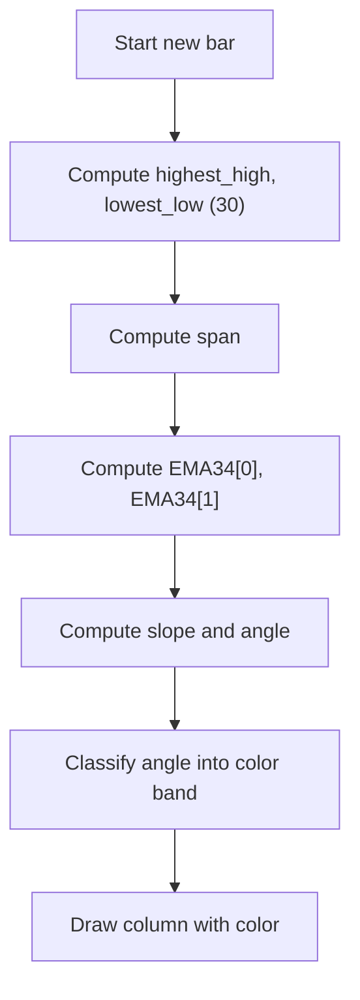

# Chop Zone - Built-in Indicator Guide

> Computes the slope angle of a 34-period EMA relative to the price range and colors a column to indicate trend strength and direction.

| | |
| --- | --- |
| **Language** | Indie Script v5 |
| **Platform** | [TakeProfit](https://takeprofit.com) |
| **Category** | Trend |
| **Type** | Built-in indicator |
| **Author** | TakeProfit |
| **License** | MIT |
| **Documentation** | [Built-in indicators](https://takeprofit.com/docs/indie/Code-examples/built-in-indicators#chop-zone) |
| **Source file** | [Chop Zone.indie5](Chop%20Zone.indie5) |

## Overview

The Chop Zone indicator measures the steepness and direction of the trend by calculating the angle of a 34-period exponential moving average (EMA) relative to the recent price range. It is designed to help traders identify trending versus choppy or sideways market conditions, with color-coded columns indicating the strength of the trend.

On the chart, the indicator draws a vertical column at each bar with a fixed height of 1 price unit. The column's color is determined by the computed angle: turquoise/green shades for upward trends, red/orange shades for downward trends, and yellow for near-flat conditions. The angle is derived from the normalized difference between consecutive EMA values, scaled by the 30-bar high-low range.

## How it works

1. Compute the highest high and lowest low over the last 30 bars.
2. Calculate a scaling factor `span = 25 / (highest_high - lowest_low) * lowest_low` to normalize the EMA slope.
3. Calculate a 34-period EMA of the closing price and obtain the current and previous values.
4. Compute the normalized slope: `(prev_EMA - curr_EMA) / hlc3 * span`, where hlc3 is the average of high, low, and close.
5. Convert the absolute slope to an angle in degrees: `angle = round(180/π * arctan(|slope|))`.
6. Assign a negative angle for downward slopes (prev EMA > curr EMA) and positive for upward slopes.
7. Classify the angle into one of nine color bands using fixed thresholds (e.g., ≥5° → turquoise, ≤-5° → dark red, between -0.71° and 0.71° → yellow).
8. Draw a single column of height 1 at the current bar using the assigned color.

## Mathematical model

$$
\text{span} = \frac{25}{\text{highest\_high} - \text{lowest\_low}} \times \text{lowest\_low}
$$

$$
\text{slope} = \frac{\text{EMA}_{prev} - \text{EMA}_{curr}}{\text{hlc3}} \times \text{span}
$$

$$
\text{angle} = -\text{sgn}(\text{slope}) \times \frac{180}{\pi} \arctan(|\text{slope}|)
$$

## Logic flow



## Code walkthrough

### Range and scaling factor

Lines 21-24 of [Chop Zone.indie5](Chop%20Zone.indie5):

```python
    periods = 30
    highest_high = Highest.new(self.high, periods)[0]
    lowest_low = Lowest.new(self.low, periods)[0]
    span = divide(25, highest_high - lowest_low) * lowest_low
```

These lines calculate the 30-bar high and low range and derive a scaling factor `span` that normalizes the EMA slope relative to the price level and range. The `divide` function safely handles division by zero.

### EMA and angle calculation

Lines 26-32 of [Chop Zone.indie5](Chop%20Zone.indie5):

```python
    ema34 = Ema.new(self.close, 34)
    y2_ema34 = divide(ema34[1] - ema34[0], self.hlc3[0]) * span

    ema_angle_1 = nan
    if not isnan(y2_ema34):
        ema_angle_1 = round(180 * atan(abs(y2_ema34)) / pi)
    ema_angle = -ema_angle_1 if y2_ema34 > 0 else ema_angle_1
```

The 34-period EMA of the close price is computed. The difference between previous and current EMA is divided by the average price (hlc3) and multiplied by `span` to get a normalized slope. The angle in degrees is derived using arctan, and its sign is set negative for downward slopes (prev > curr).

### Color classification

Lines 34-52 of [Chop Zone.indie5](Chop%20Zone.indie5):

```python
    chop_zone_color = color.BLACK  # default value
    if ema_angle >= 5:
        chop_zone_color = color_turquoise
    elif ema_angle >= 3.57:
        chop_zone_color = color_dark_green
    elif ema_angle >= 2.14:
        chop_zone_color = color_pale_green
    elif ema_angle >= 0.71:
        chop_zone_color = color_lime
    elif ema_angle <= -5:
        chop_zone_color = color_dark_red
    elif ema_angle <= -3.57:
        chop_zone_color = color_red
    elif ema_angle <= -2.14:
        chop_zone_color = color_orange
    elif ema_angle <= -0.71:
        chop_zone_color = color_light_orange
    else:  # ema_angle > -0.71 and ema_angle < 0.71
        chop_zone_color = color_yellow
```

A series of conditional checks assigns a color based on the computed angle. The thresholds are fixed: angles >=5° indicate a strong uptrend (turquoise), angles <=-5° indicate a strong downtrend (dark red), and angles between -0.71° and 0.71° are considered flat (yellow). The color is used to draw the column.

## Reading the chart

- The indicator draws a vertical column at each bar with a fixed height of 1 price unit.
- The column color indicates the trend strength and direction:
  - Turquoise: strong uptrend (angle ≥ 5°)
  - Dark green: moderate uptrend (3.57° ≤ angle < 5°)
  - Pale green: slight uptrend (2.14° ≤ angle < 3.57°)
  - Lime: very slight uptrend (0.71° ≤ angle < 2.14°)
  - Yellow: flat/sideways (-0.71° < angle < 0.71°)
  - Light orange: very slight downtrend (-2.14° < angle ≤ -0.71°)
  - Orange: slight downtrend (-3.57° < angle ≤ -2.14°)
  - Red: moderate downtrend (-5° < angle ≤ -3.57°)
  - Dark red: strong downtrend (angle ≤ -5°)
- The column is drawn at the current bar's position; consecutive columns create a color-coded strip along the time axis.

## Implementation notes

- The indicator uses a fixed 30-bar window for the high-low range and a 34-period EMA; these parameters are not user-adjustable in this version.
- The `hlc3` series (average of high, low, close) is used as a denominator to normalize the slope relative to the price level.
- The angle calculation uses `round()` and integer thresholds, so small changes in slope may not produce a color change.
- If the high-low range is zero (e.g., flat price), `divide` returns `nan`, causing `span` to be `nan` and consequently the angle to be `nan`, which falls into the `else` branch and yields a yellow column.

## FAQ

**How can I adjust the sensitivity of the Chop Zone indicator?**

The indicator uses fixed parameters (30-bar range, 34-period EMA, and angle thresholds). To modify sensitivity, you would need to edit the source code, changing `periods`, the EMA length, or the threshold values.

**What does the column height represent?**

The column height is fixed at 1 price unit. It does not represent any data value; it is merely a visual marker. The color alone conveys the trend information.

**Can I change the color scheme?**

Yes, you can modify the color definitions in the source code (lines 11-19) and the assignment logic (lines 34-52) to use your preferred colors.

## Full source code

Indie Script v5, the built-in indicator as shipped with TakeProfit. Add it from the indicators menu or copy the code into the platform's script editor.

```python
# indie:lang_version = 5
from math import nan, isnan, atan, pi
from indie import indicator, format, plot, color, Color
from indie.algorithms import Highest, Lowest, Ema
from indie.math import divide


@indicator('Chop Zone', format=format.PRICE, precision=0)
@plot.columns()
def Main(self):
    color_turquoise = color.rgba(38, 198, 218)
    color_dark_green = color.rgba(67, 160, 71)
    color_pale_green = color.rgba(165, 214, 167)
    color_lime = color.rgba(0, 150, 136)
    color_dark_red = color.rgba(213, 0, 0)
    color_red = color.rgba(233, 30, 99)
    color_orange = color.rgba(255, 109, 0)
    color_light_orange = color.rgba(255, 183, 77)
    color_yellow = color.rgba(253, 216, 53)

    periods = 30
    highest_high = Highest.new(self.high, periods)[0]
    lowest_low = Lowest.new(self.low, periods)[0]
    span = divide(25, highest_high - lowest_low) * lowest_low

    ema34 = Ema.new(self.close, 34)
    y2_ema34 = divide(ema34[1] - ema34[0], self.hlc3[0]) * span

    ema_angle_1 = nan
    if not isnan(y2_ema34):
        ema_angle_1 = round(180 * atan(abs(y2_ema34)) / pi)
    ema_angle = -ema_angle_1 if y2_ema34 > 0 else ema_angle_1

    chop_zone_color = color.BLACK  # default value
    if ema_angle >= 5:
        chop_zone_color = color_turquoise
    elif ema_angle >= 3.57:
        chop_zone_color = color_dark_green
    elif ema_angle >= 2.14:
        chop_zone_color = color_pale_green
    elif ema_angle >= 0.71:
        chop_zone_color = color_lime
    elif ema_angle <= -5:
        chop_zone_color = color_dark_red
    elif ema_angle <= -3.57:
        chop_zone_color = color_red
    elif ema_angle <= -2.14:
        chop_zone_color = color_orange
    elif ema_angle <= -0.71:
        chop_zone_color = color_light_orange
    else:  # ema_angle > -0.71 and ema_angle < 0.71
        chop_zone_color = color_yellow
    return plot.Columns(1, color=chop_zone_color)
```
