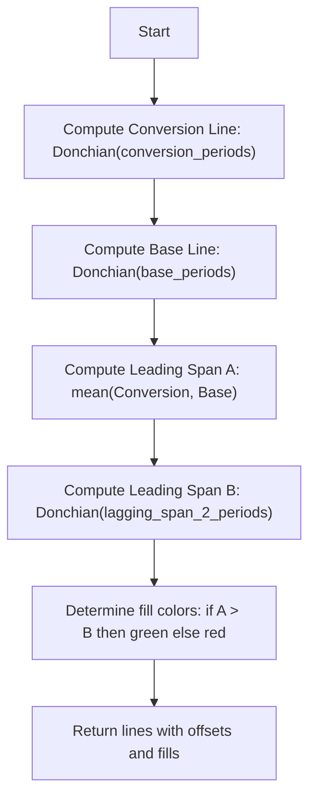

# Ichimoku Cloud (Ichimoku) - Built-in Indicator Guide

> Ichimoku Cloud indicator with conversion, base, lagging span, and leading spans A and B, forming a cloud for trend and support/resistance.

| | |
| --- | --- |
| **Language** | Indie Script v5 |
| **Platform** | [TakeProfit](https://takeprofit.com) |
| **Category** | Trend |
| **Type** | Built-in indicator |
| **Author** | TakeProfit |
| **License** | MIT |
| **Documentation** | [Built-in indicators](https://takeprofit.com/docs/indie/Code-examples/built-in-indicators#ichimoku-cloud) |
| **Source file** | [Ichimoku Cloud.indie5](Ichimoku%20Cloud.indie5) |

## Overview

The Ichimoku Cloud is a comprehensive trend-following indicator that displays multiple timeframes in a single view. It consists of five lines: the Conversion Line (Tenkan-sen), Base Line (Kijun-sen), Lagging Span (Chikou Span), Leading Span A (Senkou Span A), and Leading Span B (Senkou Span B). The area between Leading Spans A and B forms the cloud (Kumo), which acts as dynamic support/resistance and indicates trend direction.

This indicator is designed for trending markets where it helps identify trend direction, momentum, and potential support/resistance levels. The cloud's color (green when A > B, red when B > A) signals bullish or bearish sentiment. Price relative to the cloud determines the overall trend: above is bullish, below is bearish, and inside suggests consolidation.

## How it works

1. Compute the Conversion Line as the Donchian midpoint over conversion_periods (default 9).
2. Compute the Base Line as the Donchian midpoint over base_periods (default 26).
3. Compute Leading Span A as the average of the Conversion Line and Base Line.
4. Compute Leading Span B as the Donchian midpoint over lagging_span_2_periods (default 52).
5. Return the Conversion Line and Base Line for the current bar.
6. Return the Lagging Span (current close) plotted with an offset of -displacement + 1 (default -25).
7. Return Leading Span A and Leading Span B plotted with an offset of displacement - 1 (default 25), forming the cloud.
8. Fill the area between Leading Spans A and B: green when A > B, red when B > A, using plot.Fill with the same offset.

## Mathematical model

$$
\text{Conversion Line} = \text{Donchian}(\text{conversion\_periods})
$$

$$
\text{Base Line} = \text{Donchian}(\text{base\_periods})
$$

$$
\text{Leading Span A} = \frac{\text{Conversion Line} + \text{Base Line}}{2}
$$

$$
\text{Leading Span B} = \text{Donchian}(\text{lagging\_span\_2\_periods})
$$

$$
\text{Lagging Span} = \text{close}[0] \text{ (offset by } -\text{displacement}+1)
$$

## Logic flow



## Parameters

| Parameter | Type | Default | Range | Description |
| --- | --- | --- | --- | --- |
| `conversion_periods` | int | 9 | ≥ 1 | Conversion Line Length |
| `base_periods` | int | 26 | ≥ 1 | Base Line Length |
| `lagging_span_2_periods` | int | 52 | ≥ 1 | Leading Span B Length |
| `displacement` | int | 26 | ≥ 1 | Lagging Span |

## Code walkthrough

### Mean Helper Function

Lines 6-8 of [Ichimoku Cloud.indie5](Ichimoku%20Cloud.indie5):

```python
def mean(price1: SeriesF, price2: SeriesF) -> float:
    # TODO: implement @algorithm avg with variable number of arguments in indie.algorithms
    return (price1[0] + price2[0]) / 2
```

A simple helper that averages two series values at the current bar. It is used to compute Leading Span A from the Conversion and Base lines. The function accesses the current value via [0] and returns a float.

### Indicator Decorators and Parameters

Lines 12-23 of [Ichimoku Cloud.indie5](Ichimoku%20Cloud.indie5):

```python
@indicator('Ichimoku', overlay_main_pane=True)  # Ichimoku Cloud
@param.int('conversion_periods', default=9, min=1, title='Conversion Line Length')
@param.int('base_periods', default=26, min=1, title='Base Line Length')
@param.int('lagging_span_2_periods', default=52, min=1, title='Leading Span B Length')
@param.int('displacement', default=26, min=1, title='Lagging Span')
@plot.line(color=color.BLUE, title='Conversion Line')
@plot.line(color=color.RED, title='Base Line')
@plot.line(color=color.GREEN, title='Lagging Span')
@plot.line('ls_a', color=color.GREEN(0.6), title='Leading Span A')
@plot.line('ls_b', color=color.RED(0.6), title='Leading Span B')
@plot.fill('ls_a', 'ls_b', title='Background Up', color=color.GREEN(0.1))
@plot.fill('ls_a', 'ls_b', title='Background Down', color=color.RED(0.1))
```

The @indicator decorator sets the indicator name and overlays it on the main chart pane. Four integer parameters control the periods and displacement. The @plot decorators define five lines and two fills with specific colors and titles. Note that Leading Span A and B use custom plot IDs ('ls_a', 'ls_b') and fills reference those IDs.

### Main Computation and Return

Lines 24-40 of [Ichimoku Cloud.indie5](Ichimoku%20Cloud.indie5):

```python
def Main(self, conversion_periods, base_periods, lagging_span_2_periods, displacement):
    conversion_line = Donchian.new(conversion_periods)
    base_line = Donchian.new(base_periods)
    lead_line1 = mean(conversion_line, base_line)
    lead_line2 = Donchian.new(lagging_span_2_periods)[0]

    fill_up_color = None if lead_line1 > lead_line2 else color.TRANSPARENT
    fill_down_color = color.TRANSPARENT if lead_line1 > lead_line2 else None
    return (
        conversion_line[0],
        base_line[0],
        plot.Line(self.close[0], offset=-displacement + 1),
        plot.Line(lead_line1, offset=displacement - 1),
        plot.Line(lead_line2, offset=displacement - 1),
        plot.Fill(offset=displacement - 1, color=fill_up_color),
        plot.Fill(offset=displacement - 1, color=fill_down_color),
    )
```

Inside Main, Donchian.new creates series for the Conversion and Base lines. Leading Span A is computed via the mean helper. Leading Span B is the current value of a Donchian series. The return tuple includes: Conversion Line, Base Line, Lagging Span (close with negative offset), Leading Span A and B (with positive offset), and two Fill objects with conditional colors based on whether A > B.

### Offset Logic for Lagging and Leading Spans

Lines 35-39 of [Ichimoku Cloud.indie5](Ichimoku%20Cloud.indie5):

```python
        plot.Line(self.close[0], offset=-displacement + 1),
        plot.Line(lead_line1, offset=displacement - 1),
        plot.Line(lead_line2, offset=displacement - 1),
        plot.Fill(offset=displacement - 1, color=fill_up_color),
        plot.Fill(offset=displacement - 1, color=fill_down_color),
```

The Lagging Span uses offset = -displacement + 1, which shifts the current close backward by displacement-1 bars. Leading Spans A and B use offset = displacement - 1, shifting them forward. This creates the classic Ichimoku time displacement: the cloud is plotted into the future, and the lagging line is plotted into the past.

## Reading the chart

- **Conversion Line (blue)**: Fast trend indicator; price above suggests short-term bullish momentum.
- **Base Line (red)**: Slower trend indicator; acts as support/resistance.
- **Lagging Span (green)**: Current price plotted 25 bars back; used to confirm trend when it is above/below historical price.
- **Leading Span A (green, 0.6 opacity)**: Future cloud boundary; average of Conversion and Base lines.
- **Leading Span B (red, 0.6 opacity)**: Future cloud boundary; Donchian midpoint of 52 periods.
- **Cloud Fill**: Green when Leading Span A > B (bullish), red when B > A (bearish).
- **Price relative to cloud**: Above cloud = bullish trend, below = bearish, inside = consolidation.
- **Crossovers**: Conversion crossing above Base (TK cross) is bullish; below is bearish.

## Implementation notes

- All lines use Donchian midpoints (average of highest high and lowest low over the period).
- Leading spans are plotted into the future (offset displacement-1), so they repaint as new bars form.
- The Lagging Span uses a negative offset, shifting the close backward; it does not repaint because it uses the current close.
- If either Leading Span is NaN (insufficient bars), the fill may not appear; the code does not explicitly handle NaN.

## FAQ

**How do I adjust the periods for a different timeframe?**

Change the parameters conversion_periods, base_periods, lagging_span_2_periods, and displacement in the indicator settings. Common values for daily charts are 9, 26, 52, 26; for intraday, you may scale them proportionally.

**What does the cloud color indicate?**

The cloud is green when Leading Span A is above Leading Span B, suggesting bullish momentum. It is red when B is above A, suggesting bearish momentum. The cloud thickness also indicates volatility.

**How should I interpret a Conversion Line crossover of the Base Line?**

A crossover of the Conversion Line above the Base Line (TK cross) is a bullish signal, especially if it occurs above the cloud. A crossover below is bearish. This is a classic Ichimoku trading signal.

## Full source code

Indie Script v5, the built-in indicator as shipped with TakeProfit. Add it from the indicators menu or copy the code into the platform's script editor.

```python
# indie:lang_version = 5
from indie import SeriesF, MutSeriesF, indicator, param, plot, color
from indie.algorithms import Donchian


def mean(price1: SeriesF, price2: SeriesF) -> float:
    # TODO: implement @algorithm avg with variable number of arguments in indie.algorithms
    return (price1[0] + price2[0]) / 2


# TODO: Add palette of colors
@indicator('Ichimoku', overlay_main_pane=True)  # Ichimoku Cloud
@param.int('conversion_periods', default=9, min=1, title='Conversion Line Length')
@param.int('base_periods', default=26, min=1, title='Base Line Length')
@param.int('lagging_span_2_periods', default=52, min=1, title='Leading Span B Length')
@param.int('displacement', default=26, min=1, title='Lagging Span')
@plot.line(color=color.BLUE, title='Conversion Line')
@plot.line(color=color.RED, title='Base Line')
@plot.line(color=color.GREEN, title='Lagging Span')
@plot.line('ls_a', color=color.GREEN(0.6), title='Leading Span A')
@plot.line('ls_b', color=color.RED(0.6), title='Leading Span B')
@plot.fill('ls_a', 'ls_b', title='Background Up', color=color.GREEN(0.1))
@plot.fill('ls_a', 'ls_b', title='Background Down', color=color.RED(0.1))
def Main(self, conversion_periods, base_periods, lagging_span_2_periods, displacement):
    conversion_line = Donchian.new(conversion_periods)
    base_line = Donchian.new(base_periods)
    lead_line1 = mean(conversion_line, base_line)
    lead_line2 = Donchian.new(lagging_span_2_periods)[0]

    fill_up_color = None if lead_line1 > lead_line2 else color.TRANSPARENT
    fill_down_color = color.TRANSPARENT if lead_line1 > lead_line2 else None
    return (
        conversion_line[0],
        base_line[0],
        plot.Line(self.close[0], offset=-displacement + 1),
        plot.Line(lead_line1, offset=displacement - 1),
        plot.Line(lead_line2, offset=displacement - 1),
        plot.Fill(offset=displacement - 1, color=fill_up_color),
        plot.Fill(offset=displacement - 1, color=fill_down_color),
    )
```
