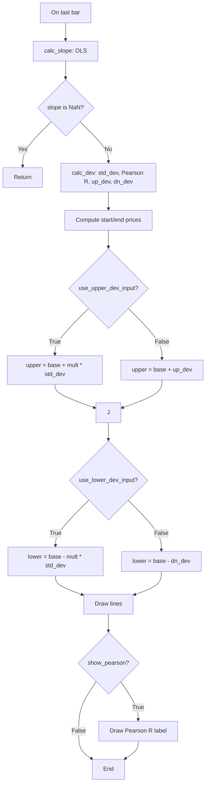

# Linear Regression Channel - Built-in Indicator Guide

> Computes a linear regression channel with upper/lower deviation bands and Pearson's R coefficient.

| | |
| --- | --- |
| **Language** | Indie Script v5 |
| **Platform** | [TakeProfit](https://takeprofit.com) |
| **Category** | Trend |
| **Type** | Built-in indicator |
| **Author** | TakeProfit |
| **License** | MIT |
| **Documentation** | [Built-in indicators](https://takeprofit.com/docs/indie/Code-examples/built-in-indicators#linear-regression-channel) |
| **Source file** | [Linear Regression Channel.indie5](Linear%20Regression%20Channel.indie5) |

## Overview

This indicator fits an ordinary least squares regression line over a user-defined lookback period on the selected price source (default close). It then constructs a channel by adding and subtracting either a multiple of the standard deviation of residuals or the maximum observed deviation from the high/low. The result is a dynamic support/resistance channel that adapts to recent price action.

The channel is drawn as three line segments: a red base line (the regression line) and two blue deviation lines. An optional label displays the Pearson correlation coefficient (R), indicating the strength of the linear relationship. The lines can be extended left or right, and the calculation is performed only on the last bar, so it updates on each tick of the current bar and may repaint intra-bar.

## How it works

1. Collect the last `length` values of the source series (default close) and compute the sums needed for ordinary least squares (sum_x, sum_y, sum_x_sqr, sum_xy).
2. Calculate the slope, intercept, and average of the source series using the OLS formulas.
3. Compute the standard deviation of residuals around the regression line, the Pearson correlation coefficient (R), and the maximum positive deviation from high and maximum negative deviation from low.
4. Determine the start and end prices of the base regression line: start = intercept + slope * (length - 1), end = intercept.
5. Construct the upper band by adding either (upper_mult_input * std_dev) or the max up deviation to the base line, depending on the `use_upper_dev_input` flag.
6. Construct the lower band by subtracting either (lower_mult_input * std_dev) or the max down deviation from the base line, depending on the `use_lower_dev_input` flag.
7. Draw the three line segments (base, upper, lower) on the chart using the timestamps of the first and last bars in the lookback period.
8. If enabled, display a label with the Pearson R value at the start of the lower band.

## Mathematical model

$$
\text{slope} = \frac{n \sum xy - \sum x \sum y}{n \sum x^2 - (\sum x)^2}
$$

$$
\text{intercept} = \bar{y} - \text{slope} \cdot \bar{x} + \text{slope}
$$

$$
\text{std\_dev} = \sqrt{\frac{1}{n-1} \sum_{i=0}^{n-1} (y_i - \hat{y}_i)^2}
$$

$$
\text{Pearson's } r = \frac{\sum (x_i - \bar{x})(y_i - \bar{y})}{\sqrt{\sum (x_i - \bar{x})^2 \sum (y_i - \bar{y})^2}}
$$

## Logic flow



## Parameters

| Parameter | Type | Default | Range | Description |
| --- | --- | --- | --- | --- |
| `length_input` | int | 100 | 1 - 5000 | Length |
| `source_input` | source | source.CLOSE |  | Source |
| `use_upper_dev_input` | bool | true |  | Upper Deviation |
| `upper_mult_input` | float | 2.0 |  | Upper Multiplier |
| `use_lower_dev_input` | bool | true |  | Lower Deviation |
| `lower_mult_input` | float | 2.0 |  | Lower Multiplier |
| `show_pearson_input` | bool | true |  | Show Pearson's R |
| `extend_left_input` | bool | false |  | Extend Lines Left |
| `extend_right_input` | bool | true |  | Extend Lines Right |

## Code walkthrough

### OLS slope and intercept calculation

Lines 8-26 of [Linear Regression Channel.indie5](Linear%20Regression%20Channel.indie5):

```python
def calc_slope(src: SeriesF, length: int) -> tuple[float, float, float]:
    sum_x = 0.0
    sum_y = 0.0
    sum_x_sqr = 0.0
    sum_xy = 0.0

    for i in range(length):
        val = src[i]
        per = i + 1.0
        sum_x += per
        sum_y += val
        sum_x_sqr += per * per
        sum_xy += val * per

    slope = divide(length * sum_xy - sum_x * sum_y, length * sum_x_sqr - sum_x * sum_x)
    average = sum_y / length
    intercept = average - slope * sum_x / length + slope

    return slope, average, intercept
```

This function computes the ordinary least squares slope, average, and intercept over the lookback length. It accumulates sums of x (bar index), y (price), x², and xy, then applies the standard OLS formula. The intercept is adjusted by adding the slope so that the regression line starts at the correct price level.

### Deviation and Pearson R computation

Lines 29-63 of [Linear Regression Channel.indie5](Linear%20Regression%20Channel.indie5):

```python
def calc_dev(slope: float, average: float, intercept: float,
             src: SeriesF, high: SeriesF, low: SeriesF, length: int) -> tuple[float, float, float, float]:
    up_dev = 0.0
    dn_dev = 0.0
    std_dev_acc = 0.0
    dsxx = 0.0
    dsyy = 0.0
    dsxy = 0.0
    periods = length - 1
    day_y = intercept + slope * periods / 2
    val = intercept

    for j in range(length):
        price = high[j] - val
        if price > up_dev:
            up_dev = price

        price = val - low[j]
        if price > dn_dev:
            dn_dev = price

        price = src[j]
        dxt = price - average
        dyt = val - day_y
        price -= val
        std_dev_acc += price * price
        dsxx += dxt * dxt
        dsyy += dyt * dyt
        dsxy += dxt * dyt
        val += slope

    std_dev = sqrt(std_dev_acc / (periods if periods != 0 else 1))
    pearson_r = divide(dsxy, sqrt(dsxx * dsyy), 0.0)

    return std_dev, pearson_r, up_dev, dn_dev
```

This function calculates three quantities: the standard deviation of residuals, the Pearson correlation coefficient, and the maximum positive/negative deviations from the regression line using high and low prices. It iterates over the lookback period, updating the regression line value (`val`) by adding the slope each step. The Pearson R is computed using the formula for correlation between the price and the regression line values.

### Indicator decorators and parameters

Lines 66-75 of [Linear Regression Channel.indie5](Linear%20Regression%20Channel.indie5):

```python
@indicator('Linear Regression Channel', overlay_main_pane=True)
@param.int('length_input', default=100, min=1, max=5000, title='Length')
@param.source('source_input', default=source.CLOSE, title='Source')
@param.bool('use_upper_dev_input', default=True, title='Upper Deviation')
@param.float('upper_mult_input', default=2.0, title='Upper Multiplier')
@param.bool('use_lower_dev_input', default=True, title='Lower Deviation')
@param.float('lower_mult_input', default=2.0, title='Lower Multiplier')
@param.bool('show_pearson_input', default=True, title="Show Pearson's R")
@param.bool('extend_left_input', default=False, title='Extend Lines Left')
@param.bool('extend_right_input', default=True, title='Extend Lines Right')
```

The `@indicator` decorator sets the indicator name and places it in the main chart pane. The `@param.*` decorators define user-configurable inputs: lookback length, source price, toggles for upper/lower deviation mode, multipliers, Pearson R display, and line extension options. These automatically generate the settings UI in the platform.

### Drawing the channel on the last bar

Lines 113-157 of [Linear Regression Channel.indie5](Linear%20Regression%20Channel.indie5):

```python
    def calc(self,
             length_input, source_input,
             use_upper_dev_input, upper_mult_input,
             use_lower_dev_input, lower_mult_input,
             show_pearson_input):
        if not self.is_last_bar:
            return

        # Calculate regression parameters
        slope, average, intercept = calc_slope(source_input, length_input)

        if isnan(slope):
            return

        start_price = intercept + slope * (length_input - 1)
        end_price = intercept

        # Calculate deviations
        std_dev, pearson_r, up_dev, dn_dev = calc_dev(slope, average, intercept, source_input,
                                                      self.high, self.low, length_input)

        upper_start_price = start_price + (upper_mult_input * std_dev if use_upper_dev_input else up_dev)
        upper_end_price = end_price + (upper_mult_input * std_dev if use_upper_dev_input else up_dev)
        lower_start_price = start_price + (-lower_mult_input * std_dev if use_lower_dev_input else -dn_dev)
        lower_end_price = end_price + (-lower_mult_input * std_dev if use_lower_dev_input else -dn_dev)

        # Draw lines
        if not isnan(start_price) and not isnan(upper_start_price) and not isnan(lower_start_price):
            start_x = self.time[length_input - 1]
            end_x = self.time[0]

            # Update base line coordinates
            self._base_line.point_a = AbsolutePosition(start_x, start_price)
            self._base_line.point_b = AbsolutePosition(end_x, end_price)
            self.chart.draw(self._base_line)

            # Update upper line coordinates
            self._upper_line.point_a = AbsolutePosition(start_x, upper_start_price)
            self._upper_line.point_b = AbsolutePosition(end_x, upper_end_price)
            self.chart.draw(self._upper_line)

            # Update lower line coordinates
            self._lower_line.point_a = AbsolutePosition(start_x, lower_start_price)
            self._lower_line.point_b = AbsolutePosition(end_x, lower_end_price)
            self.chart.draw(self._lower_line)
```

The `calc` method runs only on the last bar (`is_last_bar`). It calls the helper functions, then constructs the start and end prices for the base line. Depending on the deviation mode, it adds either a multiple of std_dev or the max deviation to form the upper and lower bands. Finally, it updates the `LineSegment` objects with absolute positions (timestamp + price) and draws them.

## Reading the chart

- **Red line**: The linear regression line (base) – represents the best-fit trend over the lookback period.
- **Blue lines**: Upper and lower deviation bands – indicate the channel width. When using standard deviation mode, the bands represent a multiple of the residual standard deviation; when using max deviation mode, they represent the farthest high/low from the regression line.
- **Pearson R label** (if enabled): Displays the correlation coefficient between price and time. Values near +1 or -1 indicate a strong linear trend; values near 0 indicate a weak linear relationship.
- The channel is drawn from the first bar of the lookback period to the current bar. Extension settings control whether the lines continue left/right beyond those points.

## Implementation notes

- The indicator only executes on the last bar (`is_last_bar`), so it may repaint intra-bar until the bar closes.
- If the slope is NaN (e.g., insufficient data or constant prices), no lines are drawn.
- The max deviation mode uses the actual high/low extremes, which can produce wider channels than the standard deviation mode.
- The Pearson R label is placed at the start of the lower band; its background is transparent.

## FAQ

**What does the 'Length' parameter control?**

It sets the number of bars used to calculate the regression line and deviations. A longer length produces a smoother, more lagging channel; a shorter length makes it more responsive.

**When should I use 'Upper/Lower Deviation' vs 'Upper/Lower Multiplier'?**

When 'Upper Deviation' is enabled, the upper band is drawn using the multiplier times the standard deviation. When disabled, it uses the maximum positive deviation from the high. Similarly for the lower band. Use standard deviation for a statistical channel, or max deviation to capture the absolute extremes.

**Does the indicator repaint on historical bars?**

No. The calculation runs only on the last bar, so it does not change for previous bars, but it may repaint on the current bar until it closes.

## Full source code

Indie Script v5, the built-in indicator as shipped with TakeProfit. Add it from the indicators menu or copy the code into the platform's script editor.

```python
# indie:lang_version = 5
from math import sqrt, isnan, nan
from indie import indicator, param, source, color, MainContext, SeriesF
from indie.drawings import LineSegment, LabelAbs, AbsolutePosition, extend_type, callout_position
from indie.math import divide


def calc_slope(src: SeriesF, length: int) -> tuple[float, float, float]:
    sum_x = 0.0
    sum_y = 0.0
    sum_x_sqr = 0.0
    sum_xy = 0.0

    for i in range(length):
        val = src[i]
        per = i + 1.0
        sum_x += per
        sum_y += val
        sum_x_sqr += per * per
        sum_xy += val * per

    slope = divide(length * sum_xy - sum_x * sum_y, length * sum_x_sqr - sum_x * sum_x)
    average = sum_y / length
    intercept = average - slope * sum_x / length + slope

    return slope, average, intercept


def calc_dev(slope: float, average: float, intercept: float,
             src: SeriesF, high: SeriesF, low: SeriesF, length: int) -> tuple[float, float, float, float]:
    up_dev = 0.0
    dn_dev = 0.0
    std_dev_acc = 0.0
    dsxx = 0.0
    dsyy = 0.0
    dsxy = 0.0
    periods = length - 1
    day_y = intercept + slope * periods / 2
    val = intercept

    for j in range(length):
        price = high[j] - val
        if price > up_dev:
            up_dev = price

        price = val - low[j]
        if price > dn_dev:
            dn_dev = price

        price = src[j]
        dxt = price - average
        dyt = val - day_y
        price -= val
        std_dev_acc += price * price
        dsxx += dxt * dxt
        dsyy += dyt * dyt
        dsxy += dxt * dyt
        val += slope

    std_dev = sqrt(std_dev_acc / (periods if periods != 0 else 1))
    pearson_r = divide(dsxy, sqrt(dsxx * dsyy), 0.0)

    return std_dev, pearson_r, up_dev, dn_dev


@indicator('Linear Regression Channel', overlay_main_pane=True)
@param.int('length_input', default=100, min=1, max=5000, title='Length')
@param.source('source_input', default=source.CLOSE, title='Source')
@param.bool('use_upper_dev_input', default=True, title='Upper Deviation')
@param.float('upper_mult_input', default=2.0, title='Upper Multiplier')
@param.bool('use_lower_dev_input', default=True, title='Lower Deviation')
@param.float('lower_mult_input', default=2.0, title='Lower Multiplier')
@param.bool('show_pearson_input', default=True, title="Show Pearson's R")
@param.bool('extend_left_input', default=False, title='Extend Lines Left')
@param.bool('extend_right_input', default=True, title='Extend Lines Right')
class Main(MainContext):
    def __init__(self, extend_left_input, extend_right_input):
        # Determine extend type
        extend_style = extend_type.NONE
        if extend_left_input and extend_right_input:
            extend_style = extend_type.BOTH
        elif extend_left_input:
            extend_style = extend_type.LEFT
        elif extend_right_input:
            extend_style = extend_type.RIGHT

        self._base_line = LineSegment(
            AbsolutePosition(0, 0),
            AbsolutePosition(0, 0),
            extend_type=extend_style,
            color=color.RED,
        )
        self._upper_line = LineSegment(
            AbsolutePosition(0, 0),
            AbsolutePosition(0, 0),
            extend_type=extend_style,
            color=color.BLUE,
        )
        self._lower_line = LineSegment(
            AbsolutePosition(0, 0),
            AbsolutePosition(0, 0),
            extend_type=extend_style,
            color=color.BLUE,
        )
        self._pearson_label = LabelAbs(
            '',
            AbsolutePosition(0, 0),
            text_color=color.BLUE,
            callout_position=callout_position.BOTTOM_LEFT,
            bg_color=color.TRANSPARENT,
        )

    def calc(self,
             length_input, source_input,
             use_upper_dev_input, upper_mult_input,
             use_lower_dev_input, lower_mult_input,
             show_pearson_input):
        if not self.is_last_bar:
            return

        # Calculate regression parameters
        slope, average, intercept = calc_slope(source_input, length_input)

        if isnan(slope):
            return

        start_price = intercept + slope * (length_input - 1)
        end_price = intercept

        # Calculate deviations
        std_dev, pearson_r, up_dev, dn_dev = calc_dev(slope, average, intercept, source_input,
                                                      self.high, self.low, length_input)

        upper_start_price = start_price + (upper_mult_input * std_dev if use_upper_dev_input else up_dev)
        upper_end_price = end_price + (upper_mult_input * std_dev if use_upper_dev_input else up_dev)
        lower_start_price = start_price + (-lower_mult_input * std_dev if use_lower_dev_input else -dn_dev)
        lower_end_price = end_price + (-lower_mult_input * std_dev if use_lower_dev_input else -dn_dev)

        # Draw lines
        if not isnan(start_price) and not isnan(upper_start_price) and not isnan(lower_start_price):
            start_x = self.time[length_input - 1]
            end_x = self.time[0]

            # Update base line coordinates
            self._base_line.point_a = AbsolutePosition(start_x, start_price)
            self._base_line.point_b = AbsolutePosition(end_x, end_price)
            self.chart.draw(self._base_line)

            # Update upper line coordinates
            self._upper_line.point_a = AbsolutePosition(start_x, upper_start_price)
            self._upper_line.point_b = AbsolutePosition(end_x, upper_end_price)
            self.chart.draw(self._upper_line)

            # Update lower line coordinates
            self._lower_line.point_a = AbsolutePosition(start_x, lower_start_price)
            self._lower_line.point_b = AbsolutePosition(end_x, lower_end_price)
            self.chart.draw(self._lower_line)

            # Update Pearson's R label text and position
            if show_pearson_input and not isnan(pearson_r):
                self._pearson_label.text = str(round(pearson_r, 8))
                self._pearson_label.position = AbsolutePosition(start_x, lower_start_price)
                self.chart.draw(self._pearson_label)
```
