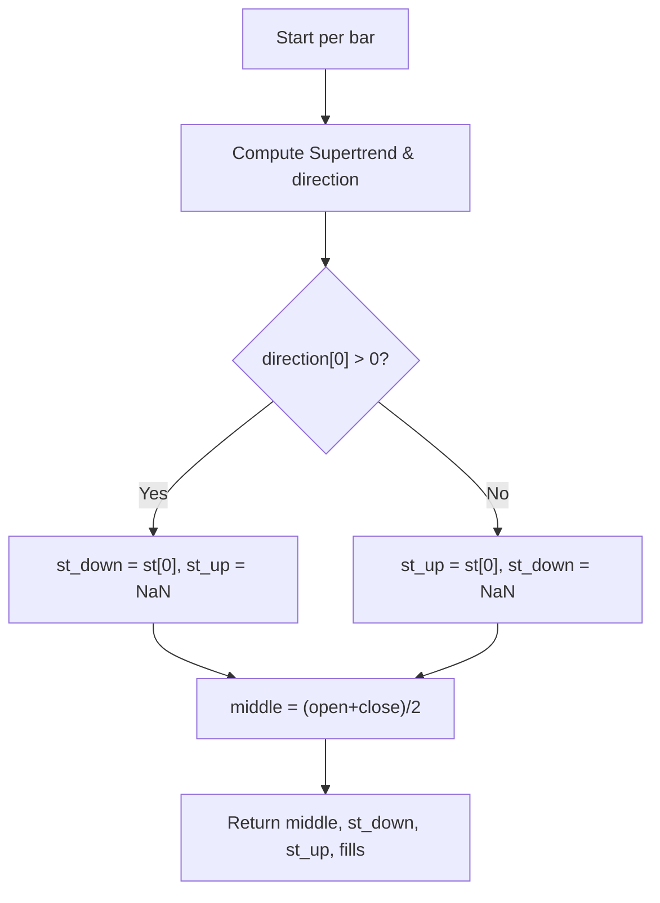

# Supertrend - Built-in Indicator Guide

> Computes Supertrend lines based on ATR and moving average, with directional fills.

| | |
| --- | --- |
| **Language** | Indie Script v5 |
| **Platform** | [TakeProfit](https://takeprofit.com) |
| **Category** | Trend |
| **Type** | Built-in indicator |
| **Author** | TakeProfit |
| **License** | MIT |
| **Documentation** | [Built-in indicators](https://takeprofit.com/docs/indie/Code-examples/built-in-indicators#supertrend) |
| **Source file** | [Supertrend.indie5](Supertrend.indie5) |

## Overview

The Supertrend indicator is a trend-following tool that uses Average True Range (ATR) and a moving average to generate dynamic support/resistance levels. It is designed for trending markets where price moves persistently in one direction, helping to identify trend reversals and set trailing stops.

The indicator plots three lines on the chart: a gray middle line (average of open and close), a red line above price during downtrends, and a green line below price during uptrends. Fills between the middle line and the trend line provide visual clarity. The trend direction is determined by the Supertrend algorithm, which flips when price crosses the bands.

## How it works

1. Initialize the Supertrend algorithm with user-defined ATR period, multiplier factor, and MA type.
2. On each bar, compute the Supertrend value and direction sign using the built-in algorithm.
3. If direction is negative (uptrend), plot the Supertrend value as the green 'up' line; otherwise set it to NaN.
4. If direction is positive (downtrend), plot the Supertrend value as the red 'down' line; otherwise set it to NaN.
5. Calculate the middle line as the average of current bar's open and close prices.
6. Return the middle, down, and up lines along with fill objects connecting them.

## Logic flow



## Parameters

| Parameter | Type | Default | Range | Description |
| --- | --- | --- | --- | --- |
| `atr_period` | int | 10 | ≥ 1 |  |
| `factor` | float | 3.0 |  |  |
| `ma_algorithm` | str | RMA |  |  |

## Code walkthrough

### Parameter and Plot Decorators

Lines 7-15 of [Supertrend.indie5](Supertrend.indie5):

```python
@indicator('Supertrend', overlay_main_pane=True)
@param.int('atr_period', default=10, min=1)
@param.float('factor', default=3.0)
@param.str('ma_algorithm', default='RMA', options=['RMA', 'SMA', 'EMA', 'WMA'])
@plot.line('middle', color=color.GRAY(0.5), title='Body Middle')  # TODO: support display.none
@plot.line('down', color=color.RED, title='Down Trend')
@plot.line('up', color=color.GREEN, title='Up Trend')
@plot.fill('down', 'middle', color=color.RED(0.1), title='Down-Middle Fill')
@plot.fill('middle', 'up', color=color.GREEN(0.1), title='Middle-Up Fill')
```

The @indicator decorator sets the indicator name and places it in the main chart pane. @param.int, @param.float, and @param.str define user-configurable settings: ATR period (default 10), multiplier factor (default 3.0), and moving average algorithm (RMA, SMA, EMA, WMA). @plot.line and @plot.fill decorators define the three plotted lines and the two fills between them, with colors and transparency.

### Main Function and Supertrend Initialization

Lines 16-17 of [Supertrend.indie5](Supertrend.indie5):

```python
def Main(self, factor, atr_period, ma_algorithm):
    st, direction = Supertrend.new(factor, atr_period, ma_algorithm)
```

The Main function receives the parameter values. It calls Supertrend.new() with the factor, period, and MA algorithm, which returns two series: the Supertrend value (st) and the direction sign (direction). These series are accessed with [0] for the current bar's value.

### Conditional Line Assignment and Middle Calculation

Lines 18-20 of [Supertrend.indie5](Supertrend.indie5):

```python
    st_down = st[0] if direction[0] > 0 else nan
    st_up = st[0] if direction[0] < 0 else nan
    middle = (self.open[0] + self.close[0]) / 2
```

Based on the direction sign, either the downtrend line (st_down) or uptrend line (st_up) is set to the Supertrend value; the opposite line is set to NaN to hide it. The middle line is computed as the simple average of the current bar's open and close prices.

### Return Statement with Fills

Lines 21-21 of [Supertrend.indie5](Supertrend.indie5):

```python
    return middle, st_down, st_up, plot.Fill(), plot.Fill()
```

The function returns a tuple of five values: the middle line, down line, up line, and two Fill objects. The Fill objects are placeholders that instruct the platform to fill the areas between 'down' and 'middle' (red fill) and between 'middle' and 'up' (green fill), as defined by the @plot.fill decorators.

## Reading the chart

- **Gray middle line**: Average of open and close for each bar; serves as a neutral reference.
- **Red line (down)**: Plotted above price when the Supertrend indicates a downtrend (direction > 0). The line acts as dynamic resistance.
- **Green line (up)**: Plotted below price when the Supertrend indicates an uptrend (direction < 0). The line acts as dynamic support.
- **Fills**: Semi-transparent red fill between the middle and down lines during downtrends; green fill between middle and up lines during uptrends. The fills visually highlight the current trend bias.
- When the trend flips, the colored line switches sides relative to price, and the fill color changes accordingly.

## Implementation notes

- The Supertrend algorithm is provided by the platform's built-in `indie.algorithms.Supertrend`; its internal logic is not exposed in this script.
- Lines are hidden (set to NaN) on bars where the direction does not match the line's trend, preventing overlapping plots.
- The middle line does not repaint on historical bars because the open and close of a closed bar are fixed. The Supertrend algorithm may repaint depending on internal ATR and MA calculations.
- The `ma_algorithm` parameter accepts only the four listed options; any other string will cause an error.

## FAQ

**How can I make the Supertrend more or less sensitive?**

Adjust the `factor` parameter (default 3.0). A lower factor makes the bands tighter, generating more signals; a higher factor makes them wider, reducing sensitivity. You can also change the `atr_period` to alter the volatility baseline.

**What moving average algorithms are available?**

The `ma_algorithm` parameter supports RMA (Rolling Moving Average, default), SMA (Simple), EMA (Exponential), and WMA (Weighted). RMA is similar to an EMA but with a different smoothing constant.

**What do the fills between the lines represent?**

The fills visually reinforce the trend direction. A red fill between the middle and down lines indicates a downtrend; a green fill between the middle and up lines indicates an uptrend. They make it easier to see the current trend at a glance.

## Full source code

Indie Script v5, the built-in indicator as shipped with TakeProfit. Add it from the indicators menu or copy the code into the platform's script editor.

```python
# indie:lang_version = 5
from math import nan
from indie import indicator, param, plot, color
from indie.algorithms import Supertrend


@indicator('Supertrend', overlay_main_pane=True)
@param.int('atr_period', default=10, min=1)
@param.float('factor', default=3.0)
@param.str('ma_algorithm', default='RMA', options=['RMA', 'SMA', 'EMA', 'WMA'])
@plot.line('middle', color=color.GRAY(0.5), title='Body Middle')  # TODO: support display.none
@plot.line('down', color=color.RED, title='Down Trend')
@plot.line('up', color=color.GREEN, title='Up Trend')
@plot.fill('down', 'middle', color=color.RED(0.1), title='Down-Middle Fill')
@plot.fill('middle', 'up', color=color.GREEN(0.1), title='Middle-Up Fill')
def Main(self, factor, atr_period, ma_algorithm):
    st, direction = Supertrend.new(factor, atr_period, ma_algorithm)
    st_down = st[0] if direction[0] > 0 else nan
    st_up = st[0] if direction[0] < 0 else nan
    middle = (self.open[0] + self.close[0]) / 2
    return middle, st_down, st_up, plot.Fill(), plot.Fill()
```
