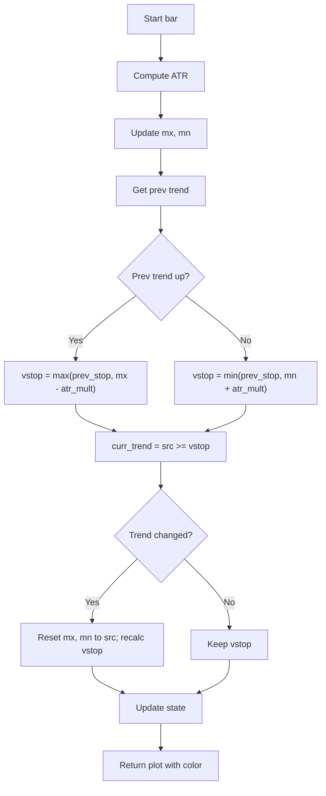

# Volatility Stop (VStop) - Built-in Indicator Guide

> A trailing stop that adjusts based on ATR volatility and flips when price crosses the stop level.

| | |
| --- | --- |
| **Language** | Indie Script v5 |
| **Platform** | [TakeProfit](https://takeprofit.com) |
| **Category** | Trend |
| **Type** | Built-in indicator |
| **Author** | TakeProfit |
| **License** | MIT |
| **Documentation** | [Built-in indicators](https://takeprofit.com/docs/indie/Code-examples/built-in-indicators#volatility-stop) |
| **Source file** | [Volatility Stop.indie5](Volatility%20Stop.indie5) |

## Overview

The Volatility Stop (VStop) is a trend-following indicator that plots a dynamic stop level derived from the Average True Range (ATR). It is designed to trail price in trending markets, switching between a lower stop (for uptrends) and an upper stop (for downtrends) when price crosses the stop line.

On the chart, a teal line is drawn when the trend is up and a red line when the trend is down. Cross markers appear at the stop level on each bar. The indicator uses a user-defined ATR length and multiplier to control the stop's sensitivity.

## How it works

1. Compute the ATR value for the given length; if NaN, fall back to the True Range of the current bar.
2. Initialize state variables: uptrend flag (default true), stop, max (mx), and min (mn) to the current source value.
3. Update mx and mn to track the highest and lowest source values since the last trend change.
4. Retrieve the previous bar's trend direction from the MutSeries.
5. If the previous trend was up, set the stop to the maximum of the previous stop and (mx - ATR multiplier). If down, set to the minimum of the previous stop and (mn + ATR multiplier).
6. Determine the current trend: source >= stop means uptrend, else downtrend.
7. If the trend has changed (and not the first bar), reset mx and mn to the current source value and recompute the stop accordingly.
8. Store the new stop and trend, then return a marker and a line colored teal for uptrend, red for downtrend.

## Mathematical model

$$
\text{ATR} = \text{ATR}_{\text{new}}(\text{length})[0]
$$

$$
\text{ATR}_{\text{mult}} = \begin{cases}\text{ATR} \times \text{factor} & \text{if ATR is not NaN}\\ \text{TR}_{\text{current}} & \text{otherwise}\end{cases}
$$

$$
\text{stop}_{\text{up}} = \max(\text{stop}_{\text{prev}}, \text{mx} - \text{ATR}_{\text{mult}})
$$

$$
\text{stop}_{\text{down}} = \min(\text{stop}_{\text{prev}}, \text{mn} + \text{ATR}_{\text{mult}})
$$

## Logic flow



## Parameters

| Parameter | Type | Default | Range | Description |
| --- | --- | --- | --- | --- |
| `src` | source | source.CLOSE |  | Source |
| `length` | int | 20 | ≥ 2 | ATR Length |
| `factor` | float | 2.0 | ≥ 0.25 | Multiplier |

## Code walkthrough

### ATR Calculation with Fallback

Lines 17-18 of [Volatility Stop.indie5](Volatility%20Stop.indie5):

```python
    atr_val = Atr.new(length)[0]
    atr_mult = (atr_val * factor) if not isnan(atr_val) else Tr.new()[0]
```

The ATR is computed using the built-in `Atr.new(length)`. If the result is NaN (e.g., on early bars), the code falls back to the True Range of the current bar via `Tr.new()[0]`. This ensures a stop value is always available.

### State Initialization and Tracking

Lines 20-23 of [Volatility Stop.indie5](Volatility%20Stop.indie5):

```python
    uptrend = MutSeries[bool].new(init=True)
    stop = Var[float].new(src[0])
    mn = Var[float].new(src[0])
    mx = Var[float].new(src[0])
```

A `MutSeries[bool]` holds the uptrend flag across bars. Three `Var[float]` variables store the current stop, the running maximum (mx), and running minimum (mn) since the last trend change. They are initialized to the current source value.

### Updating Extremes and Previous Stop

Lines 25-28 of [Volatility Stop.indie5](Volatility%20Stop.indie5):

```python
    not_first = self.bar_index > 0
    mx.set(max(mx.get(), src[0]))
    mn.set(min(mn.get(), src[0]))
    prev_stop = stop.get()
```

On each bar, mx and mn are expanded to include the new source value. The previous bar's stop is saved via `stop.get()` before it is overwritten. The `not_first` flag prevents reset logic on the very first bar.

### Stop Calculation Based on Trend

Lines 30-35 of [Volatility Stop.indie5](Volatility%20Stop.indie5):

```python
    prev_trend = uptrend[0]
    vstop = nan
    if prev_trend:
        vstop = max(prev_stop, mx.get() - atr_mult)
    else:
        vstop = min(prev_stop, mn.get() + atr_mult)
```

The stop level is computed differently depending on the previous trend. In an uptrend, the stop is the maximum of the prior stop and (mx - ATR multiplier), which trails price upward. In a downtrend, it is the minimum of the prior stop and (mn + ATR multiplier), trailing downward.

### Trend Change Detection and Reset

Lines 37-43 of [Volatility Stop.indie5](Volatility%20Stop.indie5):

```python
    curr_trend = (src[0] >= vstop)
    if not_first and curr_trend != prev_trend:
        mx.set(src[0]); mn.set(src[0])
        vstop = (mx.get() - atr_mult) if curr_trend else (mn.get() + atr_mult)

    stop.set(vstop)
    uptrend[0] = curr_trend
```

The current trend is determined by comparing the source to the computed stop. If the trend flips (and it's not the first bar), mx and mn are reset to the current source value, and the stop is recalculated from scratch. This ensures the stop adapts immediately to the new trend.

### Color and Output

Lines 45-49 of [Volatility Stop.indie5](Volatility%20Stop.indie5):

```python
    col = color.TEAL if curr_trend else color.RED
    return (
        plot.Marker(vstop, color=col),
        plot.Line(vstop, color=col)
    )
```

The stop line and marker are colored teal when the trend is up, red when down. Both a marker (cross) and a line are returned, allowing the user to see the stop level as a continuous line with a cross at each bar.

## Reading the chart

- **Teal line**: The stop is in uptrend mode; price is expected to stay above this level.
- **Red line**: The stop is in downtrend mode; price is expected to stay below this level.
- **Cross markers**: Plotted at the stop value on every bar, colored to match the trend.
- **Trend flip**: When price crosses the stop line, the color changes and the stop resets to the opposite side of price.
- **First bar**: No trend change logic is applied; the stop starts at the source value.

## Implementation notes

- Uses `MutSeries[bool]` to persist the trend direction across bars; the `[0]` index reads the previous bar's value.
- On the first bar (`bar_index == 0`), the trend change reset is skipped, so the stop starts as the source value.
- If ATR is NaN (e.g., insufficient bars), the indicator falls back to the True Range of the current bar.
- The stop is non-repainting because it only uses current bar's source and previous bar's state.

## FAQ

**How can I make the stop more or less sensitive?**

Adjust the 'ATR Length' (default 20) and 'Multiplier' (default 2.0). A shorter length or smaller multiplier makes the stop tighter; a longer length or larger multiplier widens it.

**What happens on the very first bar?**

On the first bar, the stop is set to the source value, and no trend change logic is applied. The mx and mn are also initialized to that value.

**Can I use a different price source?**

Yes, the 'Source' parameter defaults to close but can be changed to open, high, low, or any other source available in the dropdown.

## Full source code

Indie Script v5, the built-in indicator as shipped with TakeProfit. Add it from the indicators menu or copy the code into the platform's script editor.

```python
# indie:lang_version = 5
from math import isnan, nan
from indie import indicator, param, source, plot, color, Var, MutSeries
from indie.algorithms import Atr, Tr


@indicator('VStop', overlay_main_pane=True)  # Volatility Stop
@param.source('src', default=source.CLOSE, title='Source')
@param.int('length', default=20, min=2, title='ATR Length')
@param.float('factor', default=2.0, min=0.25, step=0.25, title='Multiplier')
@plot.marker(title='VStop (Cross)', size=3, style=plot.marker_style.CROSS, position=plot.marker_position.CENTER)
@plot.line(title='VStop (Line)', display_options=plot.LineDisplayOptions())
def Main(self, src, length, factor):
    if isnan(src[0]):
        return plot.Marker(value=nan), plot.Line(value=nan)

    atr_val = Atr.new(length)[0]
    atr_mult = (atr_val * factor) if not isnan(atr_val) else Tr.new()[0]

    uptrend = MutSeries[bool].new(init=True)
    stop = Var[float].new(src[0])
    mn = Var[float].new(src[0])
    mx = Var[float].new(src[0])

    not_first = self.bar_index > 0
    mx.set(max(mx.get(), src[0]))
    mn.set(min(mn.get(), src[0]))
    prev_stop = stop.get()

    prev_trend = uptrend[0]
    vstop = nan
    if prev_trend:
        vstop = max(prev_stop, mx.get() - atr_mult)
    else:
        vstop = min(prev_stop, mn.get() + atr_mult)

    curr_trend = (src[0] >= vstop)
    if not_first and curr_trend != prev_trend:
        mx.set(src[0]); mn.set(src[0])
        vstop = (mx.get() - atr_mult) if curr_trend else (mn.get() + atr_mult)

    stop.set(vstop)
    uptrend[0] = curr_trend

    col = color.TEAL if curr_trend else color.RED
    return (
        plot.Marker(vstop, color=col),
        plot.Line(vstop, color=col)
    )
```
