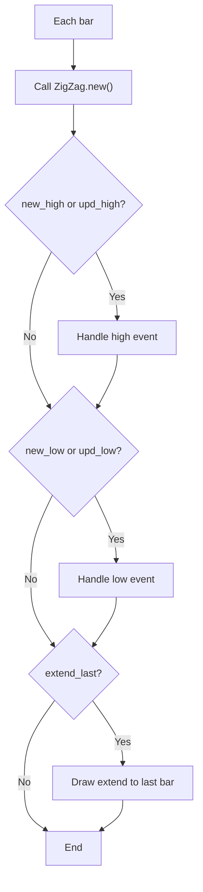

# Zig Zag - Built-in Indicator Guide

> Detects significant price reversals and draws zigzag lines between pivot points, with optional labels for price, change, and cumulative volume.

| | |
| --- | --- |
| **Language** | Indie Script v5 |
| **Platform** | [TakeProfit](https://takeprofit.com) |
| **Category** | Trend |
| **Type** | Built-in indicator |
| **Author** | TakeProfit |
| **License** | MIT |
| **Documentation** | [Built-in indicators](https://takeprofit.com/docs/indie/Code-examples/built-in-indicators#zig-zag) |
| **Source file** | [Zig Zag.indie5](Zig%20Zag.indie5) |

## Overview

The Zig Zag indicator identifies significant price reversals by filtering out minor price movements below a user-defined deviation threshold. It is useful for visualizing market structure, support/resistance levels, and trend changes by connecting alternating high and low pivot points.

On the chart, it draws line segments between pivot points in the user-specified color (default blue). Optionally, labels display the reversal price, price change (absolute or percent), and cumulative volume between pivots. The last segment can be extended to the current bar's price, providing a real-time projection of the current trend leg.

## How it works

1. For each bar, the ZigZag algorithm is called with the deviation threshold and the lookback length (depth // 2, minimum 2) to detect new or updated pivot points (highs and lows).
2. When a new pivot is detected, a Pivot object is created, drawing a line from the previous pivot to the new point and a label.
3. When an existing pivot is updated (e.g., a higher high or lower low), the pivot's endpoint and label are updated.
4. Cumulative volume between pivots is tracked using a running sum and the Sum algorithm for remaining volume.
5. If extend_last is enabled, the last segment is extended to the current bar's price, with volume including remaining volume.
6. Labels display price, price change (absolute or percent), and cumulative volume based on user settings.

## Logic flow



## Parameters

| Parameter | Type | Default | Range | Description |
| --- | --- | --- | --- | --- |
| `depth_input` | int | 10 | ≥ 2 | Pivot legs |
| `line_color` | color | color.BLUE |  | Line color |
| `extend_input` | bool | true |  | Extend to last bar |
| `show_price_input` | bool | true |  | Display reversal price |
| `show_vol_input` | bool | true |  | Display cumulative volume |
| `show_chg_input` | bool | true |  | Display reversal price change |

## Code walkthrough

### Settings class

Lines 8-31 of [Zig Zag.indie5](Zig%20Zag.indie5):

```python
class Settings:
    def __init__(self,
                 line_color: Color,
                 dev_threshold: float = 5.0,
                 depth: int = 10,
                 extend_last: bool = True,
                 display_reversal_price: bool = True,
                 display_cumulative_volume: bool = True,
                 display_reversal_price_change: bool = True,
                 difference_price_mode: str = 'Absolute',
                 draw: bool = True,
                 allow_zig_zag_on_one_bar: bool = True):
        self.dev_threshold = dev_threshold
        self.depth = depth
        self.extend_last = extend_last
        self.display_reversal_price = display_reversal_price
        self.display_cumulative_volume = display_cumulative_volume
        self.display_reversal_price_change = display_reversal_price_change
        self.difference_price_mode = difference_price_mode
        self.draw = draw
        self.allow_zig_zag_on_one_bar = allow_zig_zag_on_one_bar
        self.line_color = line_color
        self.price_precision = 2

```

Defines all user-configurable parameters for the indicator, including deviation threshold, depth, display toggles, and line color. The price_precision is set later from the chart context.

### Pivot class

Lines 33-72 of [Zig Zag.indie5](Zig%20Zag.indie5):

```python
class Pivot:
    def __init__(self,
                 start: Optional[AbsolutePosition],
                 end: AbsolutePosition,
                 vol: float,
                 is_high: bool,
                 chart: Chart,
                 settings: Settings):
        self.ln = Optional[LineSegment]()
        self.lb = Optional[LabelAbs]()
        self.is_high = is_high
        self.vol = vol
        self.start = start
        self.end = end
        self.chart = chart

        if settings.draw and start is not None:
            self.ln = LineSegment(start.value(), end, color=settings.line_color, line_width=2)
            self.lb = make_pivot_label(is_high, end, settings)
        self.update_pivot(end, vol, settings)


    def update_pivot(self, end: AbsolutePosition,
                     vol: float, settings: Settings) -> None:
        self.end = end
        self.vol = vol
        if self.lb is not None:
            self.lb.value().position = self.end
            self.lb.value().text = price_rotation_aggregate(self.start.value().price, self.end.price,
                                                            self.vol, settings)
            self.chart.draw(self.lb.value())
        if self.ln is not None:
            self.ln.value().point_b = self.end
            self.chart.draw(self.ln.value())

    def delete(self) -> None:
        if self.ln is not None:
            self.chart.erase(self.ln.value())
        if self.lb is not None:
            self.chart.erase(self.lb.value())
```

Manages a single pivot point: draws a line segment from the previous pivot to the current point and a label. The update_pivot method allows moving the endpoint and updating the label text, while delete erases the drawn elements from the chart.

### ZigZagPainter.calc

Lines 81-98 of [Zig Zag.indie5](Zig%20Zag.indie5):

```python
    def calc(self, chart: Chart, settings: Settings) -> None:
        ctx = self.ctx
        length = max(2, settings.depth // 2)
        if not isnan(ctx.volume[length]):
            self.sum_vol.set(self.sum_vol.get() + ctx.volume[length])

        new_high, upd_high, new_low, upd_low = ZigZag.new(
            length, length, settings.dev_threshold, settings.allow_zig_zag_on_one_bar)
        if new_high or upd_high:
            self._handle_zigzag_event(ctx.time[length], ctx.high[length],
                                      new_high, upd_high, True, chart, settings)
        if new_low or upd_low:
            self._handle_zigzag_event(ctx.time[length], ctx.low[length],
                                      new_low, upd_low, False, chart, settings)

        if settings.extend_last:
            zigzag_updated = new_high or upd_high or new_low or upd_low
            self._draw_extend(zigzag_updated, length, chart, settings)
```

Main per-bar logic: calls the ZigZag algorithm to detect new/updated pivots, then handles high and low events separately. If extend_last is enabled, it draws or updates an extension line to the current bar.

### _handle_zigzag_event

Lines 100-115 of [Zig Zag.indie5](Zig%20Zag.indie5):

```python
    def _handle_zigzag_event(self, time: float, price: float,
                             new_pivot: bool, upd_pivot: bool, is_high: bool,
                             chart: Chart, settings: Settings) -> None:
        point = AbsolutePosition(time, price)
        if new_pivot and self.last_pivot.get() is None:
            self.last_pivot.set(Pivot(None, point, nan, is_high, chart, settings))
            self.sum_vol.set(0)
            return
        last_pivot = self.last_pivot.get().value()
        if upd_pivot:
            last_pivot.update_pivot(point, last_pivot.vol + self.sum_vol.get(), settings)
            self.sum_vol.set(0)
        elif new_pivot:
            self.last_pivot.set(Pivot(last_pivot.end, point, self.sum_vol.get(), is_high,
                                      chart, settings))
            self.sum_vol.set(0)
```

Creates or updates a Pivot based on the event type. On a new pivot, it creates a Pivot with the previous endpoint; on an update, it moves the existing pivot's endpoint and accumulates volume.

### price_rotation_aggregate

Lines 161-169 of [Zig Zag.indie5](Zig%20Zag.indie5):

```python
def price_rotation_aggregate(start: float, end: float, vol: float, settings: Settings) -> str:
    s = ''
    if settings.display_reversal_price:
        s += str(round(end, settings.price_precision)) + ' '
    if settings.display_reversal_price_change:
        s += price_rotation_diff(start, end, settings) + ' '
    if settings.display_cumulative_volume:
        s += '\n' + to_vol_format(vol)
    return s
```

Builds the label text by concatenating the reversal price, price change (absolute or percent), and cumulative volume, according to the display settings. The price change is formatted with a sign.

### Main class with decorators

Lines 187-212 of [Zig Zag.indie5](Zig%20Zag.indie5):

```python
@indicator('Zig Zag', overlay_main_pane=True)
@param.float('deviation_input', default=5.0, min=0.00001, max=100.0, step=0.5,
             title='Price deviation for reversals (%)')
@param.int('depth_input', default=10, min=2, title='Pivot legs')
@param.color('line_color', default=color.BLUE, title='Line color')
@param.bool('extend_input', default=True, title='Extend to last bar')
@param.bool('show_price_input', default=True, title='Display reversal price')
@param.bool('show_vol_input', default=True, title='Display cumulative volume')
@param.bool('show_chg_input', default=True, title='Display reversal price change')
@param.str('price_diff_input', default='Absolute', options=['Absolute', 'Percent'],
           title='Price Reversal')
class Main(MainContext):
    def __init__(self, deviation_input, depth_input, line_color, extend_input,
                 show_price_input, show_vol_input, show_chg_input, price_diff_input):
        self._settings = Settings(
            line_color, deviation_input,
            depth_input, extend_input,
            show_price_input, show_vol_input,
            show_chg_input, price_diff_input,
        )

    def pre_calc(self):
        self._settings.price_precision = self.info.price_precision

    def calc(self):
        ZigZagPainter.new(self.chart, self._settings)
```

Entry point of the indicator. The @indicator and @param decorators define the indicator name and generate the settings UI. The Main class initializes Settings and creates a ZigZagPainter each bar to perform the calculation.

## Reading the chart

- Zigzag lines are drawn in the user-specified line_color (default blue) connecting pivot points.
- High pivots (peaks) are marked with green labels; low pivots (troughs) with red labels.
- Labels are positioned at the pivot point with callout: top-right for highs, bottom-right for lows.
- Label content depends on settings: can include reversal price, price change (absolute or percent), and cumulative volume.
- The last segment can be extended to the current bar's price if enabled, showing the ongoing leg.

## Implementation notes

- The ZigZag algorithm is provided by the platform; its internal logic is not exposed in this script.
- The indicator maintains state between bars via last_pivot and sum_vol variables, initialized with ctx.new_var.
- Volume accumulation uses Sum.new to compute remaining volume from the current bar over a window of depth // 2 bars (minimum 2).
- If allow_zig_zag_on_one_bar is true, pivots can be detected on a single bar (useful for flat markets).

## FAQ

**How do I change the sensitivity of the zigzag?**

Adjust the 'Price deviation for reversals (%)' parameter; higher values require larger price moves to trigger a reversal.

**Can I show only the lines without labels?**

Yes, disable all display options (Display reversal price, Display cumulative volume, Display reversal price change).

**What does the 'Pivot legs' parameter control?**

It sets the depth (lookback period) used by the ZigZag algorithm to detect pivots; larger values smooth out short-term fluctuations.

## Full source code

Indie Script v5, the built-in indicator as shipped with TakeProfit. Add it from the indicators menu or copy the code into the platform's script editor.

```python
# indie:lang_version = 5
from math import isnan, nan
from indie import Optional, color, Color, Context, MainContext, Var, Algorithm, indicator, param
from indie.drawings import LineSegment, LabelAbs, AbsolutePosition, Chart, callout_position
from indie.algorithms import Sum, ZigZag


class Settings:
    def __init__(self,
                 line_color: Color,
                 dev_threshold: float = 5.0,
                 depth: int = 10,
                 extend_last: bool = True,
                 display_reversal_price: bool = True,
                 display_cumulative_volume: bool = True,
                 display_reversal_price_change: bool = True,
                 difference_price_mode: str = 'Absolute',
                 draw: bool = True,
                 allow_zig_zag_on_one_bar: bool = True):
        self.dev_threshold = dev_threshold
        self.depth = depth
        self.extend_last = extend_last
        self.display_reversal_price = display_reversal_price
        self.display_cumulative_volume = display_cumulative_volume
        self.display_reversal_price_change = display_reversal_price_change
        self.difference_price_mode = difference_price_mode
        self.draw = draw
        self.allow_zig_zag_on_one_bar = allow_zig_zag_on_one_bar
        self.line_color = line_color
        self.price_precision = 2


class Pivot:
    def __init__(self,
                 start: Optional[AbsolutePosition],
                 end: AbsolutePosition,
                 vol: float,
                 is_high: bool,
                 chart: Chart,
                 settings: Settings):
        self.ln = Optional[LineSegment]()
        self.lb = Optional[LabelAbs]()
        self.is_high = is_high
        self.vol = vol
        self.start = start
        self.end = end
        self.chart = chart

        if settings.draw and start is not None:
            self.ln = LineSegment(start.value(), end, color=settings.line_color, line_width=2)
            self.lb = make_pivot_label(is_high, end, settings)
        self.update_pivot(end, vol, settings)


    def update_pivot(self, end: AbsolutePosition,
                     vol: float, settings: Settings) -> None:
        self.end = end
        self.vol = vol
        if self.lb is not None:
            self.lb.value().position = self.end
            self.lb.value().text = price_rotation_aggregate(self.start.value().price, self.end.price,
                                                            self.vol, settings)
            self.chart.draw(self.lb.value())
        if self.ln is not None:
            self.ln.value().point_b = self.end
            self.chart.draw(self.ln.value())

    def delete(self) -> None:
        if self.ln is not None:
            self.chart.erase(self.ln.value())
        if self.lb is not None:
            self.chart.erase(self.lb.value())


class ZigZagPainter(Algorithm):
    def __init__(self, ctx: Context):
        super().__init__(ctx)
        self.last_pivot = ctx.new_var(Optional[Pivot]())
        self.sum_vol = ctx.new_var(0.0)

    def calc(self, chart: Chart, settings: Settings) -> None:
        ctx = self.ctx
        length = max(2, settings.depth // 2)
        if not isnan(ctx.volume[length]):
            self.sum_vol.set(self.sum_vol.get() + ctx.volume[length])

        new_high, upd_high, new_low, upd_low = ZigZag.new(
            length, length, settings.dev_threshold, settings.allow_zig_zag_on_one_bar)
        if new_high or upd_high:
            self._handle_zigzag_event(ctx.time[length], ctx.high[length],
                                      new_high, upd_high, True, chart, settings)
        if new_low or upd_low:
            self._handle_zigzag_event(ctx.time[length], ctx.low[length],
                                      new_low, upd_low, False, chart, settings)

        if settings.extend_last:
            zigzag_updated = new_high or upd_high or new_low or upd_low
            self._draw_extend(zigzag_updated, length, chart, settings)

    def _handle_zigzag_event(self, time: float, price: float,
                             new_pivot: bool, upd_pivot: bool, is_high: bool,
                             chart: Chart, settings: Settings) -> None:
        point = AbsolutePosition(time, price)
        if new_pivot and self.last_pivot.get() is None:
            self.last_pivot.set(Pivot(None, point, nan, is_high, chart, settings))
            self.sum_vol.set(0)
            return
        last_pivot = self.last_pivot.get().value()
        if upd_pivot:
            last_pivot.update_pivot(point, last_pivot.vol + self.sum_vol.get(), settings)
            self.sum_vol.set(0)
        elif new_pivot:
            self.last_pivot.set(Pivot(last_pivot.end, point, self.sum_vol.get(), is_high,
                                      chart, settings))
            self.sum_vol.set(0)

    def _draw_extend(self, zigzag_updated: bool, length: int,
                     chart: Chart, settings: Settings) -> None:
        ctx = self.ctx
        last_pivot = self.last_pivot.get()
        extend = Var[Optional[Pivot]].new(None)

        rem_vol = Sum.new(ctx.volume, length)[0]
        if ctx.is_last_bar and last_pivot is not None:
            is_high = not last_pivot.value().is_high
            cur_series = ctx.high if is_high else ctx.low
            end = AbsolutePosition(ctx.time[0], cur_series[0])
            extend_vol = self.sum_vol.get() + rem_vol
            if extend.get() is None:  # there was no extend before, create a new one
                extend.set(Pivot(last_pivot.value().end, end, extend_vol, is_high,
                                 chart, settings))
            elif zigzag_updated:  # existing extend is obsolete, recreate it
                extend.get().value().delete()
                extend.set(Pivot(last_pivot.value().end, end, extend_vol, is_high,
                                 chart, settings))
            else:  # update right point of the extend
                extend.get().value().update_pivot(end, extend_vol, settings)


def price_rotation_diff(start: float, end: float, settings: Settings) -> str:
    diff = end - start
    sign = '+' if diff > 0 else ''
    diff_str = ''
    if settings.difference_price_mode == 'Absolute':
        diff_str = str(round(diff, settings.price_precision))
    else:
        diff_str = str(round(diff * 100 / start, 2)) + '%'
    return '(' + sign + diff_str + ')'


def to_vol_format(v: float) -> str:
    if v > 1000000:
        return str(round(v / 1000000, 3)) + 'M'
    if v > 1000:
        return str(round(v / 1000, 3)) + 'K'
    if v == 0:
        return '0'
    return str(v)


def price_rotation_aggregate(start: float, end: float, vol: float, settings: Settings) -> str:
    s = ''
    if settings.display_reversal_price:
        s += str(round(end, settings.price_precision)) + ' '
    if settings.display_reversal_price_change:
        s += price_rotation_diff(start, end, settings) + ' '
    if settings.display_cumulative_volume:
        s += '\n' + to_vol_format(vol)
    return s


def make_pivot_label(is_high: bool, point: AbsolutePosition,
                     settings: Settings) -> Optional[LabelAbs]:
    if (not settings.display_reversal_price and
            not settings.display_reversal_price_change and
            not settings.display_cumulative_volume):
        return None
    txt_color = color.RED
    callout_pos = callout_position.BOTTOM_RIGHT  # TODO: callout_position.BOTTOM
    if is_high:
        txt_color = color.GREEN
        callout_pos = callout_position.TOP_RIGHT  # TODO: callout_position.TOP
    return LabelAbs(text='', position=point, text_color=txt_color, callout_position=callout_pos,
                    font_size=11, bg_color=color.TRANSPARENT)  # TODO: text_align=text_align.CENTER


@indicator('Zig Zag', overlay_main_pane=True)
@param.float('deviation_input', default=5.0, min=0.00001, max=100.0, step=0.5,
             title='Price deviation for reversals (%)')
@param.int('depth_input', default=10, min=2, title='Pivot legs')
@param.color('line_color', default=color.BLUE, title='Line color')
@param.bool('extend_input', default=True, title='Extend to last bar')
@param.bool('show_price_input', default=True, title='Display reversal price')
@param.bool('show_vol_input', default=True, title='Display cumulative volume')
@param.bool('show_chg_input', default=True, title='Display reversal price change')
@param.str('price_diff_input', default='Absolute', options=['Absolute', 'Percent'],
           title='Price Reversal')
class Main(MainContext):
    def __init__(self, deviation_input, depth_input, line_color, extend_input,
                 show_price_input, show_vol_input, show_chg_input, price_diff_input):
        self._settings = Settings(
            line_color, deviation_input,
            depth_input, extend_input,
            show_price_input, show_vol_input,
            show_chg_input, price_diff_input,
        )

    def pre_calc(self):
        self._settings.price_precision = self.info.price_precision

    def calc(self):
        ZigZagPainter.new(self.chart, self._settings)
```
