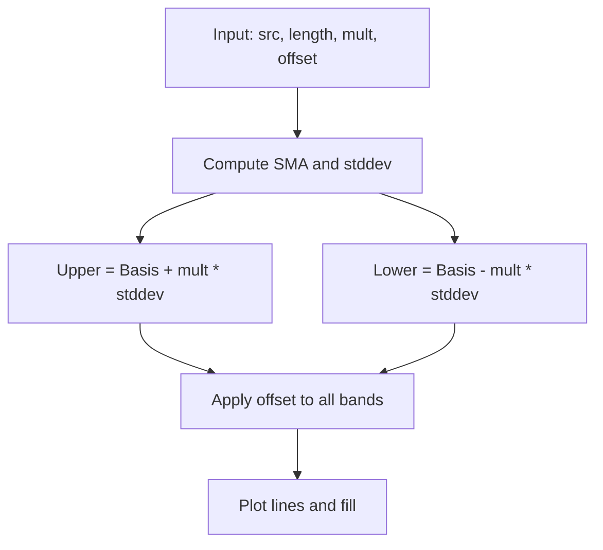

# Bollinger Bands (BB) - Built-in Indicator Guide

> Computes Bollinger Bands (middle SMA, upper/lower bands at mult*stddev) with optional offset.

| | |
| --- | --- |
| **Language** | Indie Script v5 |
| **Platform** | [TakeProfit](https://takeprofit.com) |
| **Category** | Volatility |
| **Type** | Built-in indicator |
| **Author** | TakeProfit |
| **License** | MIT |
| **Documentation** | [Built-in indicators](https://takeprofit.com/docs/indie/Code-examples/built-in-indicators#bollinger-bands) |
| **Source file** | [Bollinger Bands.indie5](Bollinger%20Bands.indie5) |

## Overview

Bollinger Bands measure volatility by plotting a simple moving average (basis) and two bands at a user-defined standard deviation multiplier. They are commonly used to identify overbought/oversold conditions and volatility expansions or contractions.

The indicator draws three lines on the price chart: the basis (red), upper band (blue), and lower band (blue), with a semi-transparent aqua fill between the upper and lower bands. An optional offset shifts all bands horizontally.

## How it works

1. Compute the simple moving average (SMA) of the source series over the specified length.
2. Compute the standard deviation of the source series over the same length.
3. Upper band = middle + mult × standard deviation.
4. Lower band = middle - mult × standard deviation.
5. Apply the user-defined offset (shift) to all three bands.
6. Plot the basis line (red), upper and lower lines (blue), and fill between them.

## Mathematical model

$$
\text{Basis} = \text{SMA}(\text{src}, \text{length})
$$

$$
\text{Upper} = \text{Basis} + \text{mult} \times \sigma(\text{src}, \text{length})
$$

$$
\text{Lower} = \text{Basis} - \text{mult} \times \sigma(\text{src}, \text{length})
$$

## Logic flow



## Parameters

| Parameter | Type | Default | Range | Description |
| --- | --- | --- | --- | --- |
| `length` | int | 20 | ≥ 1 |  |
| `src` | source | source.CLOSE |  | Source |
| `mult` | float | 2.0 | 0.001 - 50.0 | StdDev |
| `offset` | int | 0 | -500 - 500 |  |

## Code walkthrough

### Indicator and parameter decorators

Lines 6-10 of [Bollinger Bands.indie5](Bollinger%20Bands.indie5):

```python
@indicator('BB', overlay_main_pane=True)  # Bollinger Bands
@param.int('length', default=20, min=1)
@param.source('src', default=source.CLOSE, title='Source')
@param.float('mult', default=2.0, min=0.001, max=50.0, title='StdDev')
@param.int('offset', default=0, min=-500, max=500)
```

The @indicator decorator registers the script as 'BB' and sets overlay_main_pane=True so bands are drawn on the price chart. Four @param decorators define user-configurable inputs: length (period), source (price), mult (standard deviation multiplier), and offset (horizontal shift).

### Plot decorators for lines and fill

Lines 11-14 of [Bollinger Bands.indie5](Bollinger%20Bands.indie5):

```python
@plot.line('lower', color=color.BLUE, title='Lower')
@plot.line(color=color.RED, title='Basis')
@plot.line('upper', color=color.BLUE, title='Upper')
@plot.fill('lower', 'upper', color=color.AQUA(0.05), title='Background')
```

Three @plot.line decorators define the visual properties of the lower, basis, and upper lines (colors and titles). The @plot.fill decorator creates a semi-transparent aqua fill between the lower and upper bands, using the 'lower' and 'upper' plot IDs.

### Main function and Bb algorithm

Lines 15-22 of [Bollinger Bands.indie5](Bollinger%20Bands.indie5):

```python
def Main(self, length, src, mult, offset):
    (lower, middle, upper) = Bb.new(src, length, mult)
    return (
        plot.Line(lower[0], offset=offset),
        plot.Line(middle[0], offset=offset),
        plot.Line(upper[0], offset=offset),
        plot.Fill(offset=offset),
    )
```

The Main function receives the parameters and calls Bb.new(src, length, mult) which returns a tuple of three series (lower, middle, upper). Each series is accessed with [0] to get the current bar's value. The returned tuple contains plot.Line and plot.Fill objects, with the optional offset applied.

## Reading the chart

* **Basis (red line):** The simple moving average of the source price over the chosen length. Acts as a central tendency.
* **Upper band (blue line):** Basis + mult × standard deviation. Prices above this level are considered statistically high (potential overbought).
* **Lower band (blue line):** Basis - mult × standard deviation. Prices below this level are considered statistically low (potential oversold).
* **Fill (aqua, 5% opacity):** Semi-transparent area between upper and lower bands, visually highlighting the volatility channel.
* **Offset:** Shifts all bands horizontally (positive = right, negative = left) without recalculating the underlying statistics.

## Implementation notes

- The Bb.new algorithm returns series objects; [0] gives the current bar value, [1] the previous bar, etc. If length exceeds available bars, the series may contain NaN values.
- The offset parameter shifts the plotted lines and fill without affecting the underlying calculation; it is purely visual.
- The fill uses a low opacity (0.05) to avoid obscuring price action; the alpha value is hardcoded in the decorator.
- No state is maintained between bars; the indicator is stateless and recalculates each bar from the source series.

## FAQ

**How do I change the standard deviation multiplier?**

Adjust the 'StdDev' parameter (mult) in the indicator settings. The default is 2.0; common values are 1.5, 2.0, or 2.5.

**What does the offset parameter do?**

Offset shifts all three bands horizontally by the specified number of bars. A positive offset moves them to the right (future), a negative offset to the left (past). It does not recalculate the bands.

**Can I use a different source price (e.g., high or low)?**

Yes, change the 'Source' parameter from the default 'Close' to any available price source (Open, High, Low, etc.) or even another indicator output.

## Full source code

Indie Script v5, the built-in indicator as shipped with TakeProfit. Add it from the indicators menu or copy the code into the platform's script editor.

```python
# indie:lang_version = 5
from indie import indicator, param, source, plot, color
from indie.algorithms import Bb


@indicator('BB', overlay_main_pane=True)  # Bollinger Bands
@param.int('length', default=20, min=1)
@param.source('src', default=source.CLOSE, title='Source')
@param.float('mult', default=2.0, min=0.001, max=50.0, title='StdDev')
@param.int('offset', default=0, min=-500, max=500)
@plot.line('lower', color=color.BLUE, title='Lower')
@plot.line(color=color.RED, title='Basis')
@plot.line('upper', color=color.BLUE, title='Upper')
@plot.fill('lower', 'upper', color=color.AQUA(0.05), title='Background')
def Main(self, length, src, mult, offset):
    (lower, middle, upper) = Bb.new(src, length, mult)
    return (
        plot.Line(lower[0], offset=offset),
        plot.Line(middle[0], offset=offset),
        plot.Line(upper[0], offset=offset),
        plot.Fill(offset=offset),
    )
```
