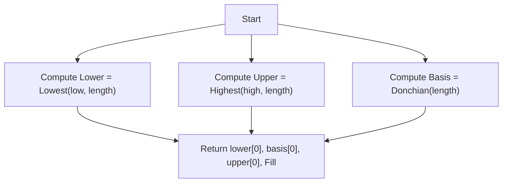

# Donchian Channels (DC) - Built-in Indicator Guide

> Computes Donchian Channels: upper (highest high), lower (lowest low), and basis (midpoint) over a given period.

| | |
| --- | --- |
| **Language** | Indie Script v5 |
| **Platform** | [TakeProfit](https://takeprofit.com) |
| **Category** | Volatility |
| **Type** | Built-in indicator |
| **Author** | TakeProfit |
| **License** | MIT |
| **Documentation** | [Built-in indicators](https://takeprofit.com/docs/indie/Code-examples/built-in-indicators#donchian-channels) |
| **Source file** | [Donchian Channels.indie5](Donchian%20Channels.indie5) |

## Overview

Donchian Channels measure market volatility and identify potential support and resistance levels by plotting the highest high and lowest low over a specified number of bars. The basis line is the midpoint between the upper and lower bands. This indicator is commonly used for breakout trading and trend following, where price breaking above the upper channel signals bullish momentum, and breaking below the lower channel signals bearish momentum.

The chart displays three lines: the lower band (blue), the basis line (red), and the upper band (blue). A semi-transparent aqua fill is drawn between the lower and upper bands to visually highlight the channel range. The channel width expands and contracts with market volatility.

## How it works

1. The indicator takes a single parameter `length` (default 20) that defines the lookback period.
2. On each bar, `Lowest.new(self.low, length)` computes the lowest low over the last `length` bars.
3. `Highest.new(self.high, length)` computes the highest high over the same period.
4. `Donchian.new(length)` computes the basis line, which is the average of the upper and lower bands.
5. The current values are obtained with `[0]` and returned as a tuple: lower, basis, upper, and a fill object.
6. The fill is drawn between the lower and upper bands using the specified color and opacity.

## Mathematical model

$$
\text{Lower} = \text{Lowest}(\text{low}, \text{length}) \\
\text{Upper} = \text{Highest}(\text{high}, \text{length}) \\
\text{Basis} = \frac{\text{Upper} + \text{Lower}}{2}
$$

## Logic flow



## Parameters

| Parameter | Type | Default | Range | Description |
| --- | --- | --- | --- | --- |
| `length` | int | 20 | ≥ 1 |  |

## Code walkthrough

### Decorators and Parameters

Lines 6-11 of [Donchian Channels.indie5](Donchian%20Channels.indie5):

```python
@indicator('DC', overlay_main_pane=True)  # Donchian Channels
@param.int('length', default=20, min=1)
@plot.line('lower', color=color.BLUE, title='Lower')
@plot.line(color=color.RED, title='Basis')
@plot.line('upper', color=color.BLUE, title='Upper')
@plot.fill('lower', 'upper', color=color.AQUA(0.05), title='Background')
```

The `@indicator` decorator sets the short name 'DC' and places the indicator in the main chart pane. `@param.int` defines the `length` parameter with a default of 20 and a minimum of 1. The `@plot.line` decorators configure three lines: lower (blue), basis (red), and upper (blue). `@plot.fill` creates a fill between lower and upper with aqua at 5% opacity.

### Computing Lower and Upper Bands

Lines 13-14 of [Donchian Channels.indie5](Donchian%20Channels.indie5):

```python
    lower = Lowest.new(self.low, length)
    upper = Highest.new(self.high, length)
```

`Lowest.new(self.low, length)` returns a series of the lowest low over the last `length` bars. Similarly, `Highest.new(self.high, length)` returns the highest high. These are built-in rolling window algorithms that efficiently compute the extremes.

### Basis and Return Values

Lines 15-16 of [Donchian Channels.indie5](Donchian%20Channels.indie5):

```python
    basis = Donchian.new(length)
    return lower[0], basis[0], upper[0], plot.Fill()
```

`Donchian.new(length)` computes the basis line, which is the midpoint of the upper and lower bands. The `Main` function returns a tuple of the current values (`[0]`) for lower, basis, upper, and a `plot.Fill()` object that triggers the fill drawing between the lower and upper bands.

## Reading the chart

- **Upper band (blue line):** The highest high over the lookback period. Price above this level suggests strong bullish momentum or a breakout.
- **Lower band (blue line):** The lowest low over the lookback period. Price below this level suggests strong bearish momentum or a breakdown.
- **Basis line (red line):** The midpoint between upper and lower bands. It can act as a dynamic support/resistance or a mean-reversion level.
- **Fill (light aqua):** Semi-transparent area between lower and upper bands, visually highlighting the channel range. The channel widens during high volatility and narrows during low volatility.

## Implementation notes

- The indicator uses built-in `Lowest`, `Highest`, and `Donchian` algorithms which are optimized for performance and handle rolling windows automatically.
- The `Donchian.new` algorithm internally computes the basis as the average of the upper and lower bands, so no manual averaging is needed.
- All three lines are plotted on the current bar using `[0]` indexing; there is no repainting because the values are based on the high/low of the last `length` bars, including the current bar.
- If the chart has fewer bars than `length`, the algorithms may return `NaN` for those initial bars, resulting in no plot until enough data is available.

## FAQ

**How do I change the lookback period for the Donchian Channels?**

Adjust the `length` parameter in the indicator settings. The default is 20, and it can be set to any integer greater than or equal to 1.

**What does the basis line represent?**

The basis line is the midpoint between the upper and lower bands. It is calculated as (upper + lower) / 2 and can be used as a dynamic support/resistance level or a mean-reversion target.

**Can I use this indicator on a different timeframe than the chart?**

Yes, you can wrap the indicator call in a `sec_context` block to compute Donchian Channels on a higher timeframe and plot them on the current chart. The indicator itself does not include multi-timeframe logic, but the platform supports it externally.

## Full source code

Indie Script v5, the built-in indicator as shipped with TakeProfit. Add it from the indicators menu or copy the code into the platform's script editor.

```python
# indie:lang_version = 5
from indie import indicator, param, plot, color
from indie.algorithms import Lowest, Highest, Donchian


@indicator('DC', overlay_main_pane=True)  # Donchian Channels
@param.int('length', default=20, min=1)
@plot.line('lower', color=color.BLUE, title='Lower')
@plot.line(color=color.RED, title='Basis')
@plot.line('upper', color=color.BLUE, title='Upper')
@plot.fill('lower', 'upper', color=color.AQUA(0.05), title='Background')
def Main(self, length):
    lower = Lowest.new(self.low, length)
    upper = Highest.new(self.high, length)
    basis = Donchian.new(length)
    return lower[0], basis[0], upper[0], plot.Fill()
```
