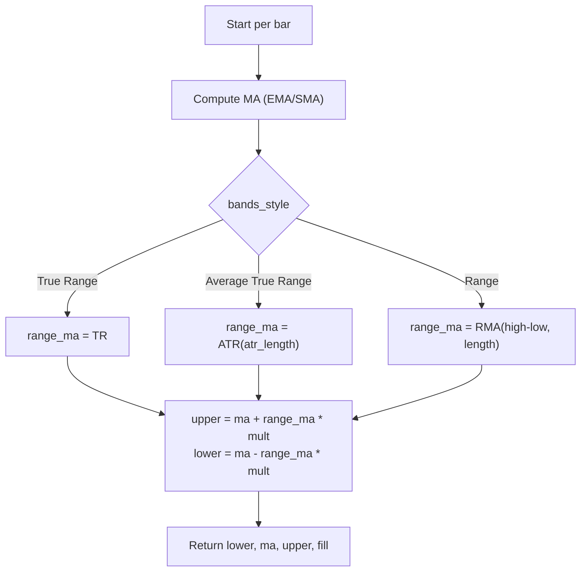

# Keltner Channels (KC) - Built-in Indicator Guide

> Plots a central moving average with upper and lower bands based on volatility (ATR, True Range, or Range) to identify overbought/oversold conditions and trend strength.

| | |
| --- | --- |
| **Language** | Indie Script v5 |
| **Platform** | [TakeProfit](https://takeprofit.com) |
| **Category** | Volatility |
| **Type** | Built-in indicator |
| **Author** | TakeProfit |
| **License** | MIT |
| **Documentation** | [Built-in indicators](https://takeprofit.com/docs/indie/Code-examples/built-in-indicators#keltner-channels) |
| **Source file** | [Keltner Channels.indie5](Keltner%20Channels.indie5) |

## Overview

Keltner Channels consist of a central moving average (EMA or SMA) and two volatility-based bands placed at a fixed multiplier above and below the average. The band width adapts to market volatility, expanding during high volatility and contracting during low volatility. This makes the indicator useful for identifying trend direction (via the slope of the basis line), potential reversal zones (when price touches the outer bands), and volatility breakouts.

The indicator draws three lines on the chart: a blue basis line (the moving average), a blue upper band, and a blue lower band. A light aqua fill between the upper and lower bands highlights the channel area. The user can choose the volatility measure (Average True Range, True Range, or Range) and the moving average type (EMA or SMA), with separate length settings for the moving average and the ATR-based volatility measure.

## How it works

1. Compute the central moving average (MA) of the source price using either EMA or SMA based on the `exp` parameter and the `length` setting.
2. Select the range measure according to `bands_style`: True Range (TR), Average True Range (ATR with its own `atr_length`), or Range (RMA of high-low with the same `length`).
3. Multiply the chosen range value by the `mult` multiplier to obtain the band offset.
4. Calculate the upper band as MA + offset and the lower band as MA - offset.
5. Return the lower band, basis line, upper band, and a fill object to color the channel area.

## Mathematical model

$$
\text{Basis} = \begin{cases}
\text{EMA}(\text{src}, \text{length}) & \text{if } \text{exp} = \text{True} \\
\text{SMA}(\text{src}, \text{length}) & \text{otherwise}
\end{cases}
$$

$$
\text{Range} = \begin{cases}
\text{TR} & \text{if } \text{bands\_style} = \text{'True Range'} \\
\text{ATR}(\text{atr\_length}) & \text{if } \text{bands\_style} = \text{'Average True Range'} \\
\text{RMA}(\text{high} - \text{low}, \text{length}) & \text{if } \text{bands\_style} = \text{'Range'}
\end{cases}
$$

$$
\text{Upper} = \text{Basis} + \text{Range} \times \text{mult}
$$

$$
\text{Lower} = \text{Basis} - \text{Range} \times \text{mult}
$$

## Logic flow



## Parameters

| Parameter | Type | Default | Range | Description |
| --- | --- | --- | --- | --- |
| `length` | int | 20 | ≥ 1 |  |
| `mult` | float | 2.0 |  | Multiplier |
| `src` | source | source.CLOSE |  | Source |
| `exp` | bool | true |  | Use Exponential MA |
| `atr_length` | int | 10 | ≥ 1 | ATR Length |

## Code walkthrough

### Central Moving Average Computation

Lines 19-19 of [Keltner Channels.indie5](Keltner%20Channels.indie5):

```python
    ma = Ma.new(src, length, 'EMA' if exp else 'SMA')[0]
```

The central moving average is computed using `Ma.new` which returns a series. The `[0]` index retrieves the current bar's value. The type (EMA or SMA) is chosen based on the `exp` boolean parameter. This single line handles both cases concisely.

### Range Measure Selection

Lines 20-26 of [Keltner Channels.indie5](Keltner%20Channels.indie5):

```python
    range_ma = 0.0
    if bands_style == 'True Range':
        range_ma = Tr.new(True)[0]
    elif bands_style == 'Average True Range':
        range_ma = Atr.new(atr_length)[0]
    else:  # bands_style == 'Range'
        range_ma = Rma.new(MutSeriesF.new(self.high[0] - self.low[0]), length)[0]
```

The variable `range_ma` is initialized to 0.0 and then conditionally assigned based on `bands_style`. For 'True Range', `Tr.new(True)` returns the True Range series. For 'Average True Range', `Atr.new(atr_length)` computes the ATR with a separate length. For 'Range', a mutable series of the current bar's high-low is created via `MutSeriesF.new` and then smoothed with `Rma.new` using the same `length` as the central MA.

### Band Calculation and Return

Lines 27-29 of [Keltner Channels.indie5](Keltner%20Channels.indie5):

```python
    upper = ma + range_ma * mult
    lower = ma - range_ma * mult
    return lower, ma, upper, plot.Fill()
```

The upper and lower bands are computed by adding or subtracting the product of `range_ma` and `mult` from the central MA. The function returns a tuple of three series (lower, basis, upper) and a `plot.Fill()` object which instructs the platform to fill the area between the lower and upper bands with the specified color.

## Reading the chart

- **Basis line** (blue): The central moving average. Its slope indicates trend direction (upward = uptrend, downward = downtrend).
- **Upper band** (blue): Basis + (range × multiplier). Price touching or exceeding this band suggests overbought conditions or strong bullish momentum.
- **Lower band** (blue): Basis - (range × multiplier). Price touching or breaking below this band suggests oversold conditions or strong bearish momentum.
- **Channel width**: The distance between bands reflects current volatility. Widening channels indicate increasing volatility; narrowing channels indicate decreasing volatility.
- **Fill** (light aqua): Visualizes the channel area, making it easier to see when price is inside or outside the bands.

## Implementation notes

- The central MA and the Range-based volatility measure both use the same `length` parameter, while the ATR-based measure uses its own `atr_length`.
- When `bands_style` is 'Range', the code creates a `MutSeriesF` from the current bar's high-low difference to feed into `Rma.new`, which computes a rolling mean of that series.
- The `Tr.new(True)` call returns the True Range series directly without any smoothing length.
- All returned series are indexed with `[0]` to get the current bar value; the platform handles the series internally for plotting.

## FAQ

**How do I change the moving average type from EMA to SMA?**

Set the `exp` parameter to `False` (unchecked) in the indicator settings. The default is `True` (EMA).

**What is the difference between the three bands styles?**

'Average True Range' uses the ATR with its own length; 'True Range' uses the raw True Range without smoothing; 'Range' uses a rolling mean of the high-low difference with the same length as the central MA.

**What does the multiplier control?**

The multiplier (`mult`) scales the volatility measure to set the distance of the bands from the basis. A higher multiplier produces wider channels, making the indicator less sensitive to price movements.

## Full source code

Indie Script v5, the built-in indicator as shipped with TakeProfit. Add it from the indicators menu or copy the code into the platform's script editor.

```python
# indie:lang_version = 5
from indie import indicator, param, source, plot, color, MutSeriesF
from indie.algorithms import Ma, Tr, Atr, Rma


@indicator('KC', overlay_main_pane=True)  # Keltner Channels
@param.int('length', default=20, min=1)
@param.float('mult', default=2.0, title='Multiplier')
@param.source('src', default=source.CLOSE, title='Source')
@param.bool('exp', default=True, title='Use Exponential MA')
@param.str('bands_style', default='Average True Range', title='Bands Style',
           options=['Average True Range', 'True Range', 'Range'])
@param.int('atr_length', default=10, min=1, title='ATR Length')
@plot.line('lower', color=color.BLUE, title='Lower')
@plot.line(color=color.BLUE, title='Basis')
@plot.line('upper', color=color.BLUE, title='Upper')
@plot.fill('lower', 'upper', color=color.AQUA(0.05), title='Background')
def Main(self, length, mult, src, exp, bands_style, atr_length):
    ma = Ma.new(src, length, 'EMA' if exp else 'SMA')[0]
    range_ma = 0.0
    if bands_style == 'True Range':
        range_ma = Tr.new(True)[0]
    elif bands_style == 'Average True Range':
        range_ma = Atr.new(atr_length)[0]
    else:  # bands_style == 'Range'
        range_ma = Rma.new(MutSeriesF.new(self.high[0] - self.low[0]), length)[0]
    upper = ma + range_ma * mult
    lower = ma - range_ma * mult
    return lower, ma, upper, plot.Fill()
```
