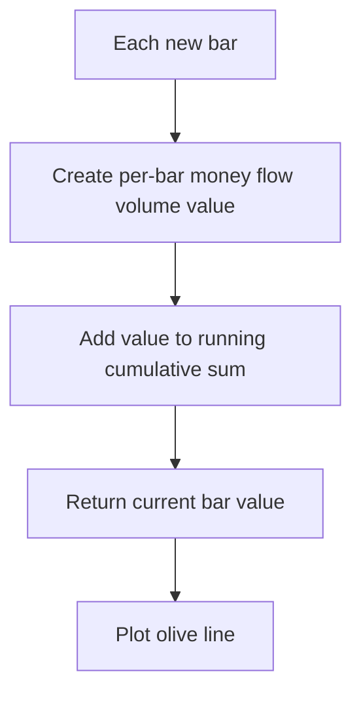

# Accumulation/Distribution (Accum/Dist) - Built-in Indicator Guide

> Accumulates per-bar money flow volume into a cumulative Accumulation/Distribution line plotted in olive.

| | |
| --- | --- |
| **Language** | Indie Script v5 |
| **Platform** | [TakeProfit](https://takeprofit.com) |
| **Category** | Volume |
| **Type** | Built-in indicator |
| **Author** | TakeProfit |
| **License** | MIT |
| **Documentation** | [Built-in indicators](https://takeprofit.com/docs/indie/Code-examples/built-in-indicators#accumulation%2Fdistribution) |
| **Source file** | [Accumulation-Distribution.indie5](Accumulation-Distribution.indie5) |

## Overview

Accum/Dist measures cumulative buying and selling pressure by adding a per-bar money flow volume value to a running total. It is meant for observing whether volume is building up or draining away over time alongside price action.

The indicator draws one olive-colored line. Because the value is cumulative, the line slope shows whether the recent money flow volume contributions are positive or negative; the absolute level depends on the full historical series.

## How it works

1. Mfv.new() creates the per-bar money flow volume series.
2. CumSum.new(Mfv.new()) passes that series into a cumulative-sum algorithm.
3. On each bar the cumulative sum includes every Mfv value from the start of the series to the current bar.
4. The [0] index reads the current bar's total from the CumSum series.
5. Main returns that scalar, and the @plot.line decorator draws it as an olive line in volume format.

## Mathematical model

$$
AD_t = \sum_{i=0}^{t} MFV_i
$$

## Logic flow



## Code walkthrough

### Indicator and plot decorators

Lines 6-7 of [Accumulation-Distribution.indie5](Accumulation-Distribution.indie5):

```python
@indicator('Accum/Dist', format=format.VOLUME)  # Accumulation/Distribution
@plot.line(color=color.OLIVE)
```

The @indicator decorator gives the script its chart name and tells the platform to format values as volume. The @plot.line decorator sets the visual output to a single continuous olive line. Together they define how the finished indicator appears.

### Main function and algorithm chain

Lines 8-9 of [Accumulation-Distribution.indie5](Accumulation-Distribution.indie5):

```python
def Main(self):
    return CumSum.new(Mfv.new())[0]
```

Inside Main, Mfv.new() creates a series of per-bar money flow volume values. CumSum.new() wraps that series and produces the cumulative total. The pipeline is intentionally short and contains no extra logic beyond the two nested algorithm calls.

### Reading the current value

Lines 9-9 of [Accumulation-Distribution.indie5](Accumulation-Distribution.indie5):

```python
    return CumSum.new(Mfv.new())[0]
```

The [0] subscript selects the current bar's value from the series returned by CumSum. In Indie, series values are accessed by bar offset, with [0] for the current bar. Because Main returns a scalar, the plot updates once per bar.

## Reading the chart

- The olive line is the cumulative sum of Mfv values; it is not a price line.
- A line moving up means the cumulative money flow volume is increasing, so recent per-bar Mfv values are positive.
- A line moving down means the cumulative total is decreasing, so recent per-bar Mfv values are negative.
- Since no reset is coded, the level includes all bars from the beginning of the series; compare slope and relative changes rather than raw absolute levels.

## Implementation notes

- The entire computation is inside Main, so there are no user-configurable inputs in this script.
- CumSum.new() is stateful: it keeps the running total internally, and [0] reads only the current bar's value from it.
- The plot is declared once with @plot.line; the line does not change color or style based on direction.
- Mfv.new() runs on the chart's current timeframe; the source does not reference other timeframes.

## FAQ

**What is the plotted value?**

It is the current value of the cumulative sum of Mfv values. The format.VOLUME annotation makes the chart display it as a volume figure.

**How can I access the previous bar's Accum/Dist value?**

Change the return expression to CumSum.new(Mfv.new())[1]. In Indie, [1] is the previous bar's value in a series.

**Can I add settings to this indicator?**

The original script defines no @param decorators, so no settings appear in the UI. Adding inputs would require extending the script with additional @param decorators and changing the Main signature.

## Full source code

Indie Script v5, the built-in indicator as shipped with TakeProfit. Add it from the indicators menu or copy the code into the platform's script editor.

```python
# indie:lang_version = 5
from indie import indicator, format, plot, color
from indie.algorithms import CumSum, Mfv


@indicator('Accum/Dist', format=format.VOLUME)  # Accumulation/Distribution
@plot.line(color=color.OLIVE)
def Main(self):
    return CumSum.new(Mfv.new())[0]
```
