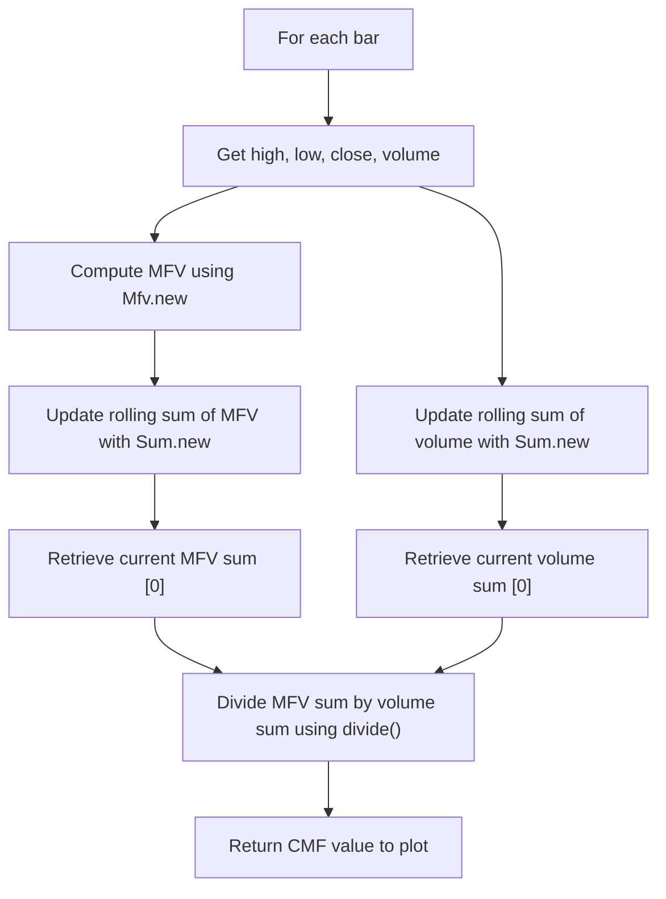

# Chaikin Money Flow (CMF) - Built-in Indicator Guide

> Computes Chaikin Money Flow (CMF) as the ratio of sum of Money Flow Volume to total volume over a given period.

| | |
| --- | --- |
| **Language** | Indie Script v5 |
| **Platform** | [TakeProfit](https://takeprofit.com) |
| **Category** | Volume |
| **Type** | Built-in indicator |
| **Author** | TakeProfit |
| **License** | MIT |
| **Documentation** | [Built-in indicators](https://takeprofit.com/docs/indie/Code-examples/built-in-indicators#chaikin-money-flow) |
| **Source file** | [Chaikin Money Flow.indie5](Chaikin%20Money%20Flow.indie5) |

## Overview

Chaikin Money Flow (CMF) measures the amount of buying or selling pressure over a fixed lookback period by combining price action and volume. It is commonly used to confirm trends, spot divergences, or identify overbought/oversold conditions. The indicator draws a line that oscillates around a zero level.

On the chart, a green line represents the CMF value. Values above zero indicate net accumulation (buying pressure), while values below zero indicate net distribution (selling pressure). Crossings of the zero line can signal a shift in the balance of power between buyers and sellers.

## How it works

1. For each bar, compute the Money Flow Volume (MFV) using the proprietary Mfv algorithm.
2. Create a rolling sum of the MFV series over `length` bars using `Sum.new(Mfv.new(), length)`. The current value is obtained with [0].
3. Create a rolling sum of the raw volume series over the same `length` bars using `Sum.new(self.volume, length)`.
4. Divide the sum of MFVs by the sum of volumes using the `divide` function, which safely handles zero denominators and returns NaN when volume sum is zero.
5. The result is returned as a single numeric value plotted as a line, updated on each bar.

## Mathematical model

$$
\text{MFV}_t = \frac{(\text{close}_t - \text{low}_t) - (\text{high}_t - \text{close}_t)}{\text{high}_t - \text{low}_t} \times \text{volume}_t
$$

$$
\text{CMF}_t = \frac{\sum_{i=t-\text{length}+1}^{t} \text{MFV}_i}{\sum_{i=t-\text{length}+1}^{t} \text{volume}_i}
$$

## Logic flow



## Parameters

| Parameter | Type | Default | Range | Description |
| --- | --- | --- | --- | --- |
| `length` | int | 20 | ≥ 1 | Length |

## Code walkthrough

### Indicator declaration and parameters

Lines 7-11 of [Chaikin Money Flow.indie5](Chaikin%20Money%20Flow.indie5):

```python
@indicator('CMF', format=format.PRICE)  # Chaikin Money Flow
@param.int('length', default=20, min=1, title='Length')
@level(0, line_color=color.GRAY, title='Zero')
@plot.line(color=color.GREEN, title='MF')
def Main(self, length):
```

The indicator is named 'CMF' with a PRICE format (uses price data). A user-configurable integer parameter 'length' defaults to 20 with a minimum of 1. A zero line is drawn in gray and the CMF line is plotted in green.

### Money Flow Volume sum

Lines 12-12 of [Chaikin Money Flow.indie5](Chaikin%20Money%20Flow.indie5):

```python
    mfv_sum = Sum.new(Mfv.new(), length)[0]
```

Creates a rolling sum of the Money Flow Volume (MFV) series over the specified length. The series of MFV is generated by `Mfv.new()`, which computes the per-bar MFV internally. `Sum.new(...)` returns a sliding sum series; `[0]` accesses the sum for the current bar.

### Volume sum and division

Lines 13-14 of [Chaikin Money Flow.indie5](Chaikin%20Money%20Flow.indie5):

```python
    vol_sum = Sum.new(self.volume, length)[0]
    return divide(mfv_sum, vol_sum)
```

Similarly, a rolling sum of the raw volume series (`self.volume`) is computed over the same length. The CMF value is the safety‑divided sum of MFVs by sum of volumes using the `divide` function, which safely handles zero denominators. This single value is returned and plotted.

## Reading the chart

- **Green line**: The CMF value, oscillating around zero.
- **Zero line (gray)**: Reference level. Values > 0 indicate net accumulation (buying pressure), values < 0 indicate net distribution (selling pressure).
- **Crossovers**: A move from below to above zero can signal the start of accumulation; a move from above to below zero can signal distribution.
- **Divergence**: If price makes a new high but CMF fails to exceed its previous high, selling pressure may be increasing (bearish divergence). The opposite applies for bullish divergence.

## Implementation notes

- The `Mfv` algorithm used internally may have specific handling for equal high/low (flat bar). The standard CMF formula would produce NaN for such bars, but platform behavior depends on the Mfv implementation.
- The `divide` function ensures that when volume sum is zero (e.g., no trades during the lookback), the output is handled safely.
- The Sum objects maintain state across bars; no manual loop or accumulation is needed.
- The indicator uses only the current bar's data and does not repaint because sums are based on closed bars.

## FAQ

**What is Chaikin Money Flow measuring?**

CMF measures the amount of volume flowing into or out of a security over a set period by combining price action (close relative to high/low range) with volume. It helps assess the strength of buying or selling pressure.

**How do I interpret a zero line crossing?**

When CMF crosses above zero, it suggests net accumulation (buyers are in control). A cross below zero suggests net distribution (sellers are in control). These signals are often used as trend confirmation.

**Can I change the lookback period?**

Yes, the 'length' parameter can be adjusted in the indicator settings. A shorter period makes CMF more sensitive to price changes, while a longer period smooths out noise. The default is 20 bars.

## Full source code

Indie Script v5, the built-in indicator as shipped with TakeProfit. Add it from the indicators menu or copy the code into the platform's script editor.

```python
# indie:lang_version = 5
from indie import indicator, format, param, level, color, plot
from indie.algorithms import Sum, Mfv
from indie.math import divide


@indicator('CMF', format=format.PRICE)  # Chaikin Money Flow
@param.int('length', default=20, min=1, title='Length')
@level(0, line_color=color.GRAY, title='Zero')
@plot.line(color=color.GREEN, title='MF')
def Main(self, length):
    mfv_sum = Sum.new(Mfv.new(), length)[0]
    vol_sum = Sum.new(self.volume, length)[0]
    return divide(mfv_sum, vol_sum)
```
