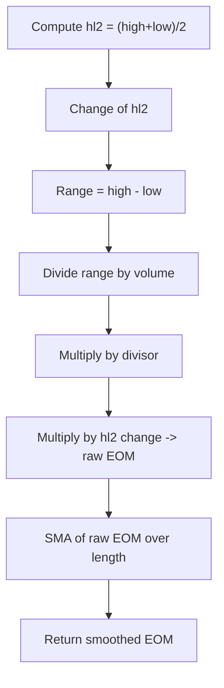

# Ease of Movement (EOM) - Built-in Indicator Guide

> Combines price movement and volume to show how easily price changes per unit of volume.

| | |
| --- | --- |
| **Language** | Indie Script v5 |
| **Platform** | [TakeProfit](https://takeprofit.com) |
| **Category** | Volume |
| **Type** | Built-in indicator |
| **Author** | TakeProfit |
| **License** | MIT |
| **Documentation** | [Built-in indicators](https://takeprofit.com/docs/indie/Code-examples/built-in-indicators#ease-of-movement) |
| **Source file** | [Ease of Movement.indie5](Ease%20of%20Movement.indie5) |

## Overview

Ease of Movement (EOM) measures the relationship between price change and volume, indicating how easily the price moves through the market. A high EOM value suggests that price can move with relatively low volume (easy movement), while a low or negative value suggests that significant volume is required to move price (hard movement).

The indicator plots a single green line oscillating around zero. Positive values indicate upward ease of movement, negative values indicate downward ease. A smoothed version (SMA) is displayed to reduce noise. It is typically used to confirm trends or spot divergences.

## How it works

1. Compute hl2 (typical price) as (high + low)/2, using the built-in self.hl2.
2. Calculate the change in hl2 from the previous bar using Change().
3. Divide the high-low range by volume to get the displacement per unit volume.
4. Multiply the displacement per volume by the divisor (default 10000) to scale the result.
5. Multiply by the hl2 change to get the raw EOM value for the current bar.
6. Smooth the raw EOM over the specified length using a simple moving average (SMA).
7. Return the smoothed value as the single plot line.

## Mathematical model

$$
\text{EOM} = \text{divisor} \times \frac{(\text{hl2} - \text{hl2}[-1]) \times (\text{high} - \text{low})}{\text{volume}}
$$

$$
\text{EOM}_{\text{smooth}} = \text{SMA}(\text{EOM}, \text{length})
$$

## Logic flow



## Parameters

| Parameter | Type | Default | Range | Description |
| --- | --- | --- | --- | --- |
| `length` | int | 14 | ≥ 1 |  |
| `divisor` | int | 10000 | ≥ 1 |  |

## Code walkthrough

### Imports and decorators

Lines 2-4 of [Ease of Movement.indie5](Ease%20of%20Movement.indie5):

```python
from indie import indicator, format, param, plot, color, MutSeriesF
from indie.algorithms import Change, Sma
from indie.math import divide
```

MutSeriesF tracks mutable series for state between bars. Change and Sma are built-in algorithms. divide wraps division with NaN handling. The @indicator decorator names the indicator 'EOM' and sets the format to VOLUME (units are in volume space). @param.int defines user-configurable length and divisor, with sensible defaults.

### Core computation line

Lines 12-12 of [Ease of Movement.indie5](Ease%20of%20Movement.indie5):

```python
    eom = divisor * Change.new(self.hl2)[0] * divide(self.high[0] - self.low[0], self.volume[0])
```

This single line calculates the raw EOM: divisor * change in hl2 * (range / volume). The division uses divide() to avoid division by zero issues. self.hl2 is a built-in series equal to (high+low)/2. All series are accessed with [0] for the current bar value.

### Smoothing and output

Lines 13-13 of [Ease of Movement.indie5](Ease%20of%20Movement.indie5):

```python
    return Sma.new(MutSeriesF.new(eom), length)[0]
```

The raw EOM value is wrapped in a MutSeriesF to maintain a series over time, then smoothed with a simple moving average of the specified length. The return value is plotted as a single green line (configured by the @plot.line decorator on line 10).

## Reading the chart

- A single green line plotted on a separate scale.
- Positive values indicate that price is rising with relatively low volume (upward ease).
- Negative values indicate that price is falling with relatively low volume (downward ease).
- Values near zero suggest that price movement is difficult (requires large volume).
- The line is a smoothed SMA of raw EOM; the raw EOM can be quite noisy, so the crossing of the zero line is often used as a signal.
- Divergences between EOM and price may indicate weakening trends.

## Implementation notes

- The divisor parameter scales the output; the default 10000 is arbitrary and may need adjustment depending on the asset's price and volume magnitude.
- The divide function handles cases where volume is zero by returning NaN, which prevents division by zero errors.
- The indicator does not repaint; the SMA uses only past values, so historical values remain fixed.

## FAQ

**What does the divisor parameter do?**

The divisor scales the raw EOM value to a more readable range. The default 10000 works for many stocks and indices, but you may need to increase it for very high-volume assets or decrease it for low-volume ones.

**How is the EOM indicator different from volume-weighted indicators?**

EOM specifically measures the ease of price movement per unit of volume, while volume-weighted indicators (e.g., VWAP, MFI) incorporate volume as a weighting factor for price. EOM's formula directly relates volume to the price range.

**Can I change the smoothing length after adding the indicator?**

Yes, the length parameter can be adjusted in the settings. A higher value produces a smoother line but reacts slower to price changes. The divisor can also be changed without affecting the shape, only the scale.

## Full source code

Indie Script v5, the built-in indicator as shipped with TakeProfit. Add it from the indicators menu or copy the code into the platform's script editor.

```python
# indie:lang_version = 5
from indie import indicator, format, param, plot, color, MutSeriesF
from indie.algorithms import Change, Sma
from indie.math import divide


@indicator('EOM', format=format.VOLUME)  # Ease of Movement
@param.int('length', default=14, min=1)
@param.int('divisor', default=10000, min=1)
@plot.line(color=color.GREEN)
def Main(self, length, divisor):
    eom = divisor * Change.new(self.hl2)[0] * divide(self.high[0] - self.low[0], self.volume[0])
    return Sma.new(MutSeriesF.new(eom), length)[0]
```
