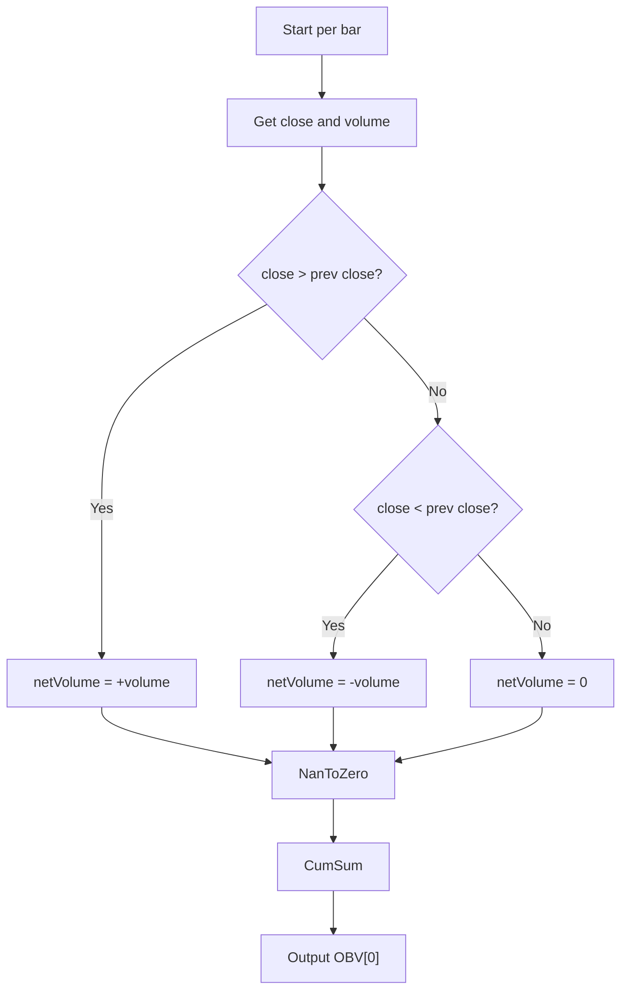

# On Balance Volume (OBV) - Built-in Indicator Guide

> Cumulative volume indicator that adds or subtracts volume based on price direction.

| | |
| --- | --- |
| **Language** | Indie Script v5 |
| **Platform** | [TakeProfit](https://takeprofit.com) |
| **Category** | Volume |
| **Type** | Built-in indicator |
| **Author** | TakeProfit |
| **License** | MIT |
| **Documentation** | [Built-in indicators](https://takeprofit.com/docs/indie/Code-examples/built-in-indicators#on-balance-volume) |
| **Source file** | [On Balance Volume.indie5](On%20Balance%20Volume.indie5) |

## Overview

On Balance Volume (OBV) is a cumulative volume indicator that measures buying and selling pressure by adding or subtracting each bar's volume based on whether the close price is higher or lower than the previous close. It is used to confirm price trends or detect divergences that may signal reversals.

The indicator plots a single blue line on the chart. When OBV rises, it suggests that volume is heavier on up bars, indicating accumulation. When OBV falls, it suggests distribution. Divergences between OBV and price can warn of weakening trends.

## How it works

1. Compute the net volume for the current bar: positive if close > previous close, negative if close < previous close, zero otherwise.
2. Convert any NaN values (e.g., on the first bar) to zero using NanToZero.
3. Accumulate the net volume over all bars using a cumulative sum (CumSum).
4. Output the current cumulative value as the OBV line.

## Mathematical model

$$
\text{OBV}_t = \sum_{i=1}^{t} \text{volume}_i \cdot \text{sign}(\text{close}_i - \text{close}_{i-1})
$$

where sign returns +1, -1, or 0.

## Logic flow



## Code walkthrough

### Imports

Lines 2-3 of [On Balance Volume.indie5](On%20Balance%20Volume.indie5):

```python
from indie import indicator, format, plot, color
from indie.algorithms import CumSum, NanToZero, NetVolume
```

Imports the necessary decorators and algorithmic building blocks. CumSum performs a running total, NanToZero replaces NaN with zero, and NetVolume computes signed volume based on close direction.

### Indicator and plot decorators

Lines 6-7 of [On Balance Volume.indie5](On%20Balance%20Volume.indie5):

```python
@indicator('OBV', format=format.VOLUME)  # On Balance Volume
@plot.line(color=color.BLUE)
```

The @indicator decorator sets the name 'OBV' and the format to VOLUME (so the y-axis is labeled appropriately). The @plot.line decorator specifies that the output will be drawn as a blue line on the chart.

### Main function – one-liner logic

Lines 8-9 of [On Balance Volume.indie5](On%20Balance%20Volume.indie5):

```python
def Main(self):
    return CumSum.new(NanToZero.new(NetVolume.new(self.close)))[0]
```

The Main function returns the current bar's OBV value by chaining three algorithms: NetVolume computes the signed volume, NanToZero ensures the first bar is not NaN, and CumSum accumulates the series. The [0] index retrieves the value for the current bar.

## Reading the chart

- The blue line represents the cumulative sum of signed volume.
- Rising OBV indicates that volume on up bars dominates, suggesting accumulation.
- Falling OBV indicates that volume on down bars dominates, suggesting distribution.
- Divergences: if price makes a new high but OBV fails to confirm (lower high), it may signal a bearish reversal. Conversely, if price makes a new low but OBV forms a higher low, it may signal a bullish reversal.
- The absolute value of OBV is arbitrary; only the direction and relative changes matter.

## Implementation notes

- The indicator uses built-in algorithms (NetVolume, NanToZero, CumSum) which handle edge cases like the first bar automatically.
- No smoothing or moving average is applied; the raw cumulative OBV is plotted.
- The indicator does not repaint because it only uses current bar close and volume, which are known at bar close.
- Volume must be available in the data; the indicator will not work on tick charts or non-volume-based series.

## FAQ

**Can I add a moving average to smooth the OBV line?**

The current code does not include smoothing. You can modify the script by wrapping the output with a moving average algorithm, e.g., Sma.new(...)[0].

**What does the OBV value represent?**

The OBV value is a cumulative total. Its absolute number is not meaningful; only the trend and relative changes compared to price are used for analysis.

**Does OBV work on intraday timeframes?**

Yes, OBV works on any timeframe that provides volume data. However, the cumulative nature means the value will differ across timeframes; focus on the shape and divergences rather than the number.

## Full source code

Indie Script v5, the built-in indicator as shipped with TakeProfit. Add it from the indicators menu or copy the code into the platform's script editor.

```python
# indie:lang_version = 5
from indie import indicator, format, plot, color
from indie.algorithms import CumSum, NanToZero, NetVolume


@indicator('OBV', format=format.VOLUME)  # On Balance Volume
@plot.line(color=color.BLUE)
def Main(self):
    return CumSum.new(NanToZero.new(NetVolume.new(self.close)))[0]
    # TODO: implement smoothing when display.none is supported
```
