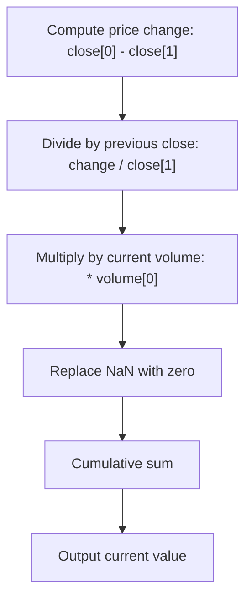

# Price Volume Trend (PVT) - Built-in Indicator Guide

> Cumulative sum of volume-weighted price change, measuring money flow.

| | |
| --- | --- |
| **Language** | Indie Script v5 |
| **Platform** | [TakeProfit](https://takeprofit.com) |
| **Category** | Volume |
| **Type** | Built-in indicator |
| **Author** | TakeProfit |
| **License** | MIT |
| **Documentation** | [Built-in indicators](https://takeprofit.com/docs/indie/Code-examples/built-in-indicators#price-volume-trend) |
| **Source file** | [Price Volume Trend.indie5](Price%20Volume%20Trend.indie5) |

## Overview

The Price Volume Trend (PVT) is a momentum-based indicator that combines price and volume to measure the cumulative flow of money into or out of an asset. It is used to confirm trends and detect divergences. A rising PVT suggests accumulation (buying pressure), while a falling PVT suggests distribution (selling pressure).

The indicator plots a single blue line on a separate scale. It is computed as the cumulative sum of the per-bar relative price change multiplied by volume. The line moves in the direction of the trend when volume confirms price movement.

## How it works

1. Calculate the price change: current close minus previous close.
2. Divide the price change by the previous close to get the relative change.
3. Multiply the relative change by the current volume.
4. Replace any NaN values with zero using NanToZero.
5. Compute the cumulative sum of the resulting series using CumSum.
6. Output the current cumulative sum value for plotting.

## Mathematical model

$$
\text{PVT} = \sum_{t=1}^{n} \left( \frac{\text{close}_t - \text{close}_{t-1}}{\text{close}_{t-1}} \times \text{volume}_t \right)
$$

## Logic flow



## Code walkthrough

### Decorators and metadata

Lines 7-8 of [Price Volume Trend.indie5](Price%20Volume%20Trend.indie5):

```python
@indicator('PVT', format=format.VOLUME)  # Price Volume Trend
@plot.line(color=color.BLUE)
```

The @indicator decorator sets the short name 'PVT' and the format to VOLUME, which affects the default scale and axis label. The @plot.line decorator specifies that the output will be drawn as a blue line on the chart.

### Core computation in one line

Lines 10-11 of [Price Volume Trend.indie5](Price%20Volume%20Trend.indie5):

```python
    return CumSum.new(NanToZero.new(MutSeriesF.new(
        divide(Change.new(self.close)[0], self.close[1]) * self.volume[0])))[0]
```

The Main function returns a single value computed by chaining several algorithms. Change.new(self.close) produces the series of price changes. The [0] index gets the current bar's change, which is then divided by the previous close (self.close[1]) and multiplied by current volume (self.volume[0]). The result is wrapped in MutSeriesF to create a mutable series, then NanToZero replaces any NaN values, and CumSum computes the running total. The final [0] extracts the current cumulative value for plotting.

## Reading the chart

- The blue line rises when price increases, with the move amplified by volume, indicating accumulation.
- The line falls when price decreases, with the move amplified by volume, indicating distribution.
- Divergence between PVT and price (e.g., price making new highs while PVT fails to) can signal a potential reversal.
- The absolute value of PVT is not meaningful; only the direction and relative changes matter.

## Implementation notes

- The indicator uses the previous bar's close (self.close[1]), so it cannot compute a value on the very first bar; NanToZero ensures the first value is zero.
- CumSum resets when the symbol or timeframe changes, as it is a new instance of the algorithm.
- The formula is similar to On-Balance Volume (OBV) but uses percentage price change instead of simple direction, making it more sensitive to large price moves.

## FAQ

**What does PVT measure?**

PVT measures the cumulative flow of money by weighting volume with the percentage change in price. It helps confirm trends and identify divergences.

**How is PVT different from OBV?**

OBV adds or subtracts the full volume based on whether price closes higher or lower. PVT uses the relative price change, so large price moves have a greater impact on the indicator.

**Can I use PVT for divergence trading?**

Yes. A divergence between PVT and price (e.g., price making a higher high while PVT makes a lower high) can indicate weakening momentum and a possible reversal.

## Full source code

Indie Script v5, the built-in indicator as shipped with TakeProfit. Add it from the indicators menu or copy the code into the platform's script editor.

```python
# indie:lang_version = 5
from indie import indicator, format, plot, color, MutSeriesF
from indie.algorithms import CumSum, NanToZero, Change
from indie.math import divide


@indicator('PVT', format=format.VOLUME)  # Price Volume Trend
@plot.line(color=color.BLUE)
def Main(self):
    return CumSum.new(NanToZero.new(MutSeriesF.new(
        divide(Change.new(self.close)[0], self.close[1]) * self.volume[0])))[0]
```
